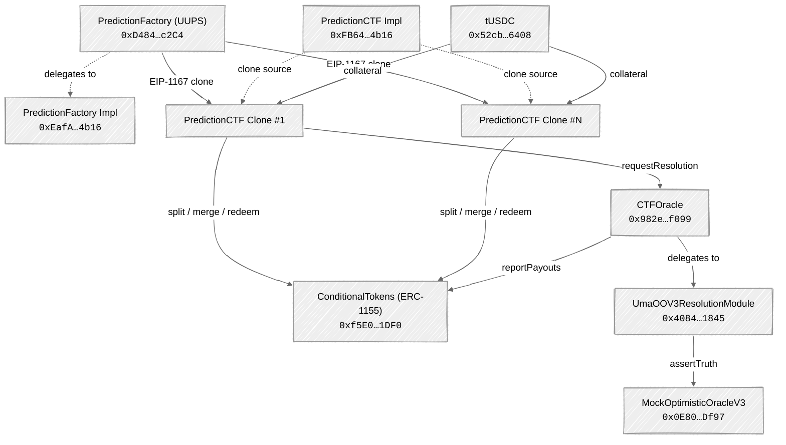

## Arbitrum Sepolia (Testnet)

<Info>
All PrometheX V2 contracts are deployed on **Arbitrum Sepolia** (testnet). Mainnet deployment on **Arbitrum One** is planned after staging validation and audit completion.
</Info>

### Core Contracts

| Contract | Address | Type | Status |
|----------|---------|------|--------|
| ConditionalTokens (ERC-1155) | [`0xf5E0891F0f5ba4C2b6034720b444eb79926e1DF0`](https://sepolia.arbiscan.io/address/0xf5E0891F0f5ba4C2b6034720b444eb79926e1DF0) | Singleton | Active |
| PredictionFactory (Proxy) | [`0xD4840C6aAF2e098e6B736e28c3B87DfD7b84c2C4`](https://sepolia.arbiscan.io/address/0xD4840C6aAF2e098e6B736e28c3B87DfD7b84c2C4) | UUPS Proxy | Active |
| PredictionFactory (Impl) | [`0xEafAF606fFC04fED313324679f58d60Ced7F0E97`](https://sepolia.arbiscan.io/address/0xEafAF606fFC04fED313324679f58d60Ced7F0E97) | Implementation | Active |
| PredictionCTF (Impl) | [`0xFB642D912f23BA19150d968104d4D988FA054b16`](https://sepolia.arbiscan.io/address/0xFB642D912f23BA19150d968104d4D988FA054b16) | EIP-1167 source | Active |

### Oracle & Resolution

| Contract | Address | Status |
|----------|---------|--------|
| CTFOracle | [`0x982e18db6837D55297c39926dE86ae560cd96f99`](https://sepolia.arbiscan.io/address/0x982e18db6837D55297c39926dE86ae560cd96f99) | Active |
| UmaOOV3ResolutionModule | [`0x4084526855cf8e6604623506dAB46A9d53941845`](https://sepolia.arbiscan.io/address/0x4084526855cf8e6604623506dAB46A9d53941845) | Active |
| MockOptimisticOracleV3 | [`0x0E80Ffb6D75C21b015c872923D7A6cD3e6B1Df97`](https://sepolia.arbiscan.io/address/0x0E80Ffb6D75C21b015c872923D7A6cD3e6B1Df97) | Active (testnet only) |

### Token Contracts

| Token | Address | Decimals | Notes |
|-------|---------|:--------:|-------|
| tUSDC (Test USDC) | [`0x52cb113e383c654fB78Ff56615ce3719193C6408`](https://sepolia.arbiscan.io/address/0x52cb113e383c654fB78Ff56615ce3719193C6408) | 6 | Faucet-mintable test token |

### Infrastructure (External)

| Contract | Address | Purpose |
|----------|---------|---------|
| ERC-4337 EntryPoint | [`0x5FF137D4b0FDCD49DcA30c7CF57E578a026d2789`](https://sepolia.arbiscan.io/address/0x5FF137D4b0FDCD49DcA30c7CF57E578a026d2789) | Account abstraction entry point (v0.6) |
| Multicall3 | [`0xcA11bde05977b3631167028862bE2a173976CA11`](https://sepolia.arbiscan.io/address/0xcA11bde05977b3631167028862bE2a173976CA11) | Batch contract reads |

### Network Details

| Property | Value |
|----------|-------|
| Chain | Arbitrum Sepolia |
| Chain ID | `421614` |
| RPC | `https://sepolia-rollup.arbitrum.io/rpc` |
| Block Explorer | [sepolia.arbiscan.io](https://sepolia.arbiscan.io/) |
| Native Token | ETH (Sepolia) |

<Accordion title="Add Arbitrum Sepolia to MetaMask">
```json
{
  "chainId": "0x66EEE",
  "chainName": "Arbitrum Sepolia",
  "rpcUrls": ["https://sepolia-rollup.arbitrum.io/rpc"],
  "nativeCurrency": { "name": "ETH", "symbol": "ETH", "decimals": 18 },
  "blockExplorerUrls": ["https://sepolia.arbiscan.io"]
}
```
</Accordion>

---

## Arbitrum One (Mainnet)

<Warning>
Mainnet deployment has **not yet occurred**. The addresses below are external references only. PrometheX contracts will be deployed to Arbitrum One after staging validation and audit completion.
</Warning>

### PrometheX Contracts (Planned)

| Contract | Address | Status |
|----------|---------|--------|
| PredictionFactory (Proxy) | — | Not deployed |
| ConditionalTokens | — | Not deployed |
| CTFOracle | — | Not deployed |
| CTFSettlement | — | Not deployed |

### External Contracts (Live)

| Contract | Address | Purpose |
|----------|---------|---------|
| USDC (Native) | [`0xaf88d065e77c8cC2239327C5EDb3A432268e5831`](https://arbiscan.io/address/0xaf88d065e77c8cC2239327C5EDb3A432268e5831) | Base token for production markets |
| UMA OptimisticOracleV3 | [`0xa6147867264374F324524E30C02C331cF28aa879`](https://arbiscan.io/address/0xa6147867264374F324524E30C02C331cF28aa879) | Production dispute resolution |
| ERC-4337 EntryPoint | [`0x5FF137D4b0FDCD49DcA30c7CF57E578a026d2789`](https://arbiscan.io/address/0x5FF137D4b0FDCD49DcA30c7CF57E578a026d2789) | Account abstraction entry point (v0.6) |
| Multicall3 | [`0xcA11bde05977b3631167028862bE2a173976CA11`](https://arbiscan.io/address/0xcA11bde05977b3631167028862bE2a173976CA11) | Batch contract reads |

### Network Details

| Property | Value |
|----------|-------|
| Chain | Arbitrum One |
| Chain ID | `42161` |
| RPC | `https://arb1.arbitrum.io/rpc` |
| Block Explorer | [arbiscan.io](https://arbiscan.io/) |
| Native Token | ETH |

---

## Using Addresses in Code

<CodeGroup>

```typescript viem
import { getAddress } from "viem";

export const ADDRESSES = {
  arbitrumSepolia: {
    conditionalTokens: getAddress("0xf5E0891F0f5ba4C2b6034720b444eb79926e1DF0"),
    predictionFactory: getAddress("0xD4840C6aAF2e098e6B736e28c3B87DfD7b84c2C4"),
    predictionFactoryImpl: getAddress("0xEafAF606fFC04fED313324679f58d60Ced7F0E97"),
    predictionCTFImpl: getAddress("0xFB642D912f23BA19150d968104d4D988FA054b16"),
    ctfOracle: getAddress("0x982e18db6837D55297c39926dE86ae560cd96f99"),
    umaResolutionModule: getAddress("0x4084526855cf8e6604623506dAB46A9d53941845"),
    mockOracleV3: getAddress("0x0E80Ffb6D75C21b015c872923D7A6cD3e6B1Df97"),
    tUSDC: getAddress("0x52cb113e383c654fB78Ff56615ce3719193C6408"),
    entryPoint: getAddress("0x5FF137D4b0FDCD49DcA30c7CF57E578a026d2789"),
  },
  arbitrumOne: {
    // Not deployed yet — planned after staging validation
    usdc: getAddress("0xaf88d065e77c8cC2239327C5EDb3A432268e5831"),
    oracleV3: getAddress("0xa6147867264374F324524E30C02C331cF28aa879"),
    entryPoint: getAddress("0x5FF137D4b0FDCD49DcA30c7CF57E578a026d2789"),
  },
} as const;
```

```typescript ethers.js
import { ethers } from "ethers";

export const ADDRESSES = {
  arbitrumSepolia: {
    conditionalTokens: ethers.getAddress("0xf5E0891F0f5ba4C2b6034720b444eb79926e1DF0"),
    predictionFactory: ethers.getAddress("0xD4840C6aAF2e098e6B736e28c3B87DfD7b84c2C4"),
    predictionFactoryImpl: ethers.getAddress("0xEafAF606fFC04fED313324679f58d60Ced7F0E97"),
    predictionCTFImpl: ethers.getAddress("0xFB642D912f23BA19150d968104d4D988FA054b16"),
    ctfOracle: ethers.getAddress("0x982e18db6837D55297c39926dE86ae560cd96f99"),
    umaResolutionModule: ethers.getAddress("0x4084526855cf8e6604623506dAB46A9d53941845"),
    mockOracleV3: ethers.getAddress("0x0E80Ffb6D75C21b015c872923D7A6cD3e6B1Df97"),
    tUSDC: ethers.getAddress("0x52cb113e383c654fB78Ff56615ce3719193C6408"),
    entryPoint: ethers.getAddress("0x5FF137D4b0FDCD49DcA30c7CF57E578a026d2789"),
  },
  arbitrumOne: {
    // Not deployed yet — planned after staging validation
    usdc: ethers.getAddress("0xaf88d065e77c8cC2239327C5EDb3A432268e5831"),
    oracleV3: ethers.getAddress("0xa6147867264374F324524E30C02C331cF28aa879"),
    entryPoint: ethers.getAddress("0x5FF137D4b0FDCD49DcA30c7CF57E578a026d2789"),
  },
};
```

</CodeGroup>

---

## Contract Architecture Reference

The following diagram shows how V2 contracts relate to each other on Arbitrum Sepolia, annotated with deployed addresses.



---

## Verifying Contracts

All V2 contracts are verified on Arbiscan. You can inspect source code, read contract state, and interact with write functions directly on the block explorer.

<Steps>
  <Step title="Navigate to Arbiscan">
    Open the contract address link from the tables above (e.g., [PredictionFactory on Arbiscan](https://sepolia.arbiscan.io/address/0xD4840C6aAF2e098e6B736e28c3B87DfD7b84c2C4)).
  </Step>
  <Step title="Check the Contract tab">
    Click the **Contract** tab to view verified Solidity source code. For proxy contracts, click **Read as Proxy** or **Write as Proxy** to interact with the implementation ABI.
  </Step>
  <Step title="Verify implementation (proxy contracts)">
    For the PredictionFactory UUPS proxy, Arbiscan should automatically detect the implementation at `0xEafAF606fFC04fED313324679f58d60Ced7F0E97`. If not, use the "Is this a proxy?" verification feature.
  </Step>
</Steps>

<Tip>
For PredictionCTF clones deployed via EIP-1167, the clone bytecode points to the implementation at `0xFB642D912f23BA19150d968104d4D988FA054b16`. Arbiscan may detect this automatically — if not, you can verify the implementation address by reading the clone's bytecode (it contains the implementation address as a literal).
</Tip>

---

## Next Steps

<CardGroup cols={1}>
  <Card title="Contract Overview" icon="sitemap" href="/contracts/overview">
    Architecture, contract hierarchy, market lifecycle, and APMM pricing.
  </Card>
</CardGroup>
