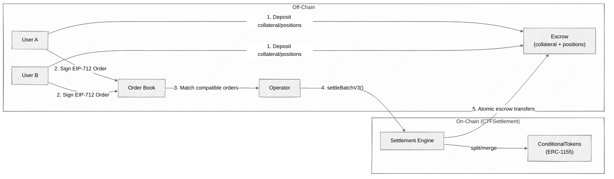
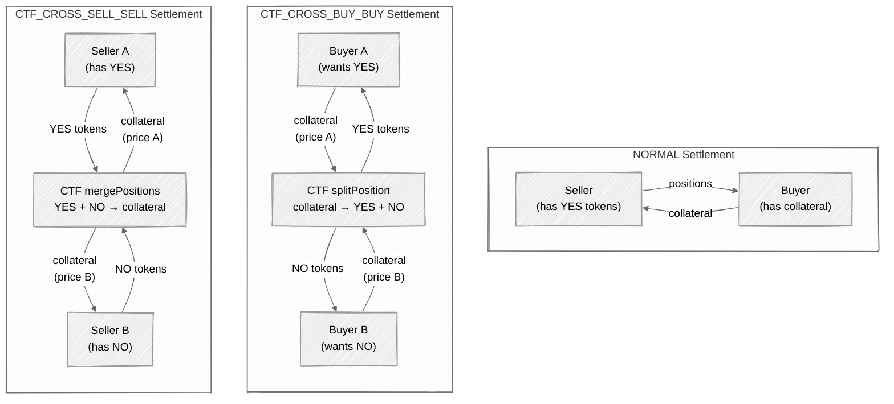

## Overview

`CTFSettlement` is the **Central Limit Order Book (CLOB)** for single-market binary trading on PrometheX. It implements a hybrid model where order matching happens off-chain for performance, while settlement executes atomically on-chain for security.

<CardGroup cols={2}>
  <Card title="Off-Chain Orders" icon="signature">
    Users sign EIP-712 typed orders off-chain. No gas cost until settlement.
  </Card>
  <Card title="On-Chain Escrow" icon="vault">
    Collateral and position tokens are held in the contract's escrow. Non-custodial — withdraw anytime.
  </Card>
  <Card title="Operator Matching" icon="arrows-left-right">
    A trusted operator matches compatible orders and submits settlement batches on-chain.
  </Card>
  <Card title="Partial Fills" icon="chart-pie">
    Orders support partial fills via cumulative `filledAmount` tracking. No wasted liquidity.
  </Card>
</CardGroup>

`CTFSettlement` is a singleton contract inheriting `ERC1155Holder`, `Ownable2Step`, `Pausable`, `ReentrancyGuard`, and `EIP712`.

---

## Architecture



<Steps>
  <Step title="Deposit">
    Users deposit collateral (ERC-20) or position tokens (ERC-1155) into CTFSettlement escrow.
  </Step>
  <Step title="Sign Orders">
    Users create and sign EIP-712 typed `Order` structs off-chain. Each order specifies market, token, price, size, and side.
  </Step>
  <Step title="Match">
    The operator's matching engine finds compatible order pairs off-chain — buy/sell at the same price, or cross-orders where prices sum to 10,000 bps.
  </Step>
  <Step title="Settle">
    The operator submits `settleBatchV3(MatchedOrder[])` on-chain. Up to 256 matched orders per batch.
  </Step>
  <Step title="Execute">
    CTFSettlement verifies both signatures, validates order compatibility, checks escrow balances, and atomically transfers collateral/positions between the parties.
  </Step>
</Steps>

---

## EIP-712 Order Structure

Every CLOB order is an EIP-712 typed struct signed by the maker. The contract verifies this signature on-chain during settlement.

```
Order(bytes32 marketId, bytes32 conditionId, uint256 tokenId, uint256 priceBps,
      uint256 size, uint8 side, address maker, uint256 nonce, uint256 expiry, uint256 salt)
```

| Field | Type | Description |
|-------|------|-------------|
| `marketId` | `bytes32` | Unique market identifier (from PredictionFactory or NegRiskRegistry) |
| `conditionId` | `bytes32` | CTF condition ID — `keccak256(oracle, questionId, outcomeSlotCount)` |
| `tokenId` | `uint256` | ERC-1155 position ID for the outcome token being traded |
| `priceBps` | `uint256` | Price in basis points (1–9999). E.g., 5000 = $0.50 per token |
| `size` | `uint256` | Number of outcome tokens to trade |
| `side` | `uint8` | `0` = BUY, `1` = SELL |
| `maker` | `address` | Signer of this order — must match the recovered EIP-712 signature |
| `nonce` | `uint256` | Must equal the maker's current `userNonces[maker]` value |
| `expiry` | `uint256` | Unix timestamp after which the order is invalid. `0` = no expiry |
| `salt` | `uint256` | Random value for uniqueness and per-order cancellation |

<Info>
The EIP-712 domain uses name `"CTFSettlement"` and version `"1"`. Use `domainSeparator()` to retrieve the domain separator for off-chain signing.
</Info>

---

## Settlement Types

CTFSettlement supports three settlement mechanics, determined by the `SettlementType` enum:

### 1. NORMAL — Standard Buy/Sell

One side sells positions, the other buys with collateral. The most common settlement type.

- **Maker**: SELL side — position tokens deducted from escrow
- **Taker**: BUY side — collateral deducted, position tokens credited
- **Price constraint**: `makerPriceBps == takerPriceBps`

### 2. CTF_CROSS_BUY_BUY — Both Buying Opposite Outcomes

Both parties want to buy, but for opposite outcome tokens. The contract uses CTF `splitPosition` to create both token types from collateral.

- **Both sides**: BUY — collateral deducted from each party proportional to their price
- **Price constraint**: `makerPriceBps + takerPriceBps == 10,000` (prices must be complementary)
- **Mechanism**: Collateral is split into a full set of outcome tokens via `ConditionalTokens.splitPosition()`, then distributed

### 3. CTF_CROSS_SELL_SELL — Both Selling Opposite Outcomes

Both parties want to sell opposite outcome tokens. The contract uses CTF `mergePositions` to convert positions back to collateral.

- **Both sides**: SELL — position tokens deducted from each party
- **Price constraint**: `makerPriceBps + takerPriceBps == 10,000`
- **Mechanism**: Opposite position tokens are merged back into collateral via `ConditionalTokens.mergePositions()`, then distributed proportionally



<Tip>
Cross-settlement types are capital-efficient: instead of requiring a counterparty with the exact opposite position, two buyers (or two sellers) of complementary outcomes can be matched directly.
</Tip>

---

## Escrow Model

Users must deposit funds into the CTFSettlement escrow before their orders can be settled. Deposits and withdrawals are permissionless — users maintain full custody until settlement executes.

### Deposit Functions

| Function | Description |
|----------|-------------|
| `depositCollateral(uint256 amount)` | Deposit collateral (ERC-20) into your escrow balance |
| `depositCollateralFor(address user, uint256 amount)` | Deposit collateral on behalf of another address |
| `depositPosition(uint256 positionId, uint256 amount)` | Deposit ERC-1155 position tokens into escrow |
| `depositPositionFor(address user, uint256 positionId, uint256 amount)` | Deposit position tokens on behalf of another address |

### Withdraw Functions

| Function | Description |
|----------|-------------|
| `withdrawCollateral(uint256 amount)` | Withdraw collateral from escrow back to your wallet |
| `withdrawPosition(uint256 positionId, uint256 amount)` | Withdraw position tokens from escrow |

### Read Functions

| Function | Description |
|----------|-------------|
| `collateralBalance(address user)` | User's escrowed collateral (in token units) |
| `positionBalance(address user, uint256 positionId)` | User's escrowed position token balance |

<Warning>
Deposits are blocked when the contract is globally paused. Withdrawals are always available regardless of pause state — this ensures users can always reclaim their funds.
</Warning>

### Code Examples

<CodeGroup>
```typescript viem
import { parseUnits, getContract } from "viem";

const TUSDC = "0x52cb113e383c654fB78Ff56615ce3719193C6408";
const CTF_SETTLEMENT = "0xYourCTFSettlementAddress"; // Replace with deployed address

// 1. Approve collateral
const approveTx = await walletClient.writeContract({
  address: TUSDC,
  abi: [
    {
      name: "approve",
      type: "function",
      inputs: [
        { name: "spender", type: "address" },
        { name: "amount", type: "uint256" },
      ],
      outputs: [{ type: "bool" }],
      stateMutability: "nonpayable",
    },
  ],
  functionName: "approve",
  args: [CTF_SETTLEMENT, parseUnits("100", 6)],
});

// 2. Deposit collateral into CLOB escrow
const depositTx = await walletClient.writeContract({
  address: CTF_SETTLEMENT,
  abi: [
    {
      name: "depositCollateral",
      type: "function",
      inputs: [{ name: "amount", type: "uint256" }],
      outputs: [],
      stateMutability: "nonpayable",
    },
  ],
  functionName: "depositCollateral",
  args: [parseUnits("100", 6)], // 100 tUSDC
});

// 3. Check escrow balance
const balance = await publicClient.readContract({
  address: CTF_SETTLEMENT,
  abi: [
    {
      name: "collateralBalance",
      type: "function",
      inputs: [{ name: "user", type: "address" }],
      outputs: [{ type: "uint256" }],
      stateMutability: "view",
    },
  ],
  functionName: "collateralBalance",
  args: [walletClient.account.address],
});

console.log("Escrowed collateral:", balance);
```

```typescript ethers.js
import { ethers } from "ethers";

const TUSDC = "0x52cb113e383c654fB78Ff56615ce3719193C6408";
const CTF_SETTLEMENT = "0xYourCTFSettlementAddress"; // Replace with deployed address

const provider = new ethers.JsonRpcProvider("https://sepolia-rollup.arbitrum.io/rpc");
const signer = new ethers.Wallet(privateKey, provider);

// 1. Approve collateral
const tusdc = new ethers.Contract(
  TUSDC,
  ["function approve(address spender, uint256 amount) returns (bool)"],
  signer
);
await tusdc.approve(CTF_SETTLEMENT, ethers.parseUnits("100", 6));

// 2. Deposit collateral into CLOB escrow
const settlement = new ethers.Contract(
  CTF_SETTLEMENT,
  [
    "function depositCollateral(uint256 amount)",
    "function collateralBalance(address user) view returns (uint256)",
  ],
  signer
);
await settlement.depositCollateral(ethers.parseUnits("100", 6));

// 3. Check escrow balance
const balance = await settlement.collateralBalance(signer.address);
console.log("Escrowed collateral:", balance);
```
</CodeGroup>

---

## EIP-712 Order Signing

Orders are signed off-chain using EIP-712 typed data. The operator collects signed orders and matches them.

<CodeGroup>
```typescript viem
import { parseUnits } from "viem";

const CTF_SETTLEMENT = "0xYourCTFSettlementAddress";
const CHAIN_ID = 421614; // Arbitrum Sepolia

// Build the EIP-712 domain
const domain = {
  name: "CTFSettlement",
  version: "1",
  chainId: CHAIN_ID,
  verifyingContract: CTF_SETTLEMENT,
} as const;

// Order type definition
const types = {
  Order: [
    { name: "marketId", type: "bytes32" },
    { name: "conditionId", type: "bytes32" },
    { name: "tokenId", type: "uint256" },
    { name: "priceBps", type: "uint256" },
    { name: "size", type: "uint256" },
    { name: "side", type: "uint8" },
    { name: "maker", type: "address" },
    { name: "nonce", type: "uint256" },
    { name: "expiry", type: "uint256" },
    { name: "salt", type: "uint256" },
  ],
} as const;

// Create the order
const order = {
  marketId: "0x...",       // Your market ID
  conditionId: "0x...",    // CTF condition ID
  tokenId: 12345n,         // ERC-1155 position token ID
  priceBps: 5500n,         // 55% ($0.55)
  size: parseUnits("10", 6), // 10 tokens
  side: 0,                 // 0 = BUY, 1 = SELL
  maker: walletClient.account.address,
  nonce: 0n,               // Must match userNonces[maker]
  expiry: BigInt(Math.floor(Date.now() / 1000) + 3600), // 1 hour
  salt: BigInt(Math.floor(Math.random() * 1e18)),
};

// Sign the order
const signature = await walletClient.signTypedData({
  domain,
  types,
  primaryType: "Order",
  message: order,
});

// Submit { order, signature } to the off-chain order book API
```

```typescript ethers.js
import { ethers } from "ethers";

const CTF_SETTLEMENT = "0xYourCTFSettlementAddress";
const CHAIN_ID = 421614;

const provider = new ethers.JsonRpcProvider("https://sepolia-rollup.arbitrum.io/rpc");
const signer = new ethers.Wallet(privateKey, provider);

// EIP-712 domain
const domain = {
  name: "CTFSettlement",
  version: "1",
  chainId: CHAIN_ID,
  verifyingContract: CTF_SETTLEMENT,
};

// Order type
const types = {
  Order: [
    { name: "marketId", type: "bytes32" },
    { name: "conditionId", type: "bytes32" },
    { name: "tokenId", type: "uint256" },
    { name: "priceBps", type: "uint256" },
    { name: "size", type: "uint256" },
    { name: "side", type: "uint8" },
    { name: "maker", type: "address" },
    { name: "nonce", type: "uint256" },
    { name: "expiry", type: "uint256" },
    { name: "salt", type: "uint256" },
  ],
};

// Build the order
const order = {
  marketId: "0x...",
  conditionId: "0x...",
  tokenId: 12345n,
  priceBps: 5500n,
  size: ethers.parseUnits("10", 6),
  side: 0, // BUY
  maker: signer.address,
  nonce: 0n,
  expiry: BigInt(Math.floor(Date.now() / 1000) + 3600),
  salt: BigInt(Math.floor(Math.random() * 1e18)),
};

// Sign
const signature = await signer.signTypedData(domain, types, order);

// Submit { order, signature } to the off-chain order book API
```
</CodeGroup>

---

## Operator Role

The operator is a single trusted address authorized to execute matched settlement batches.

| Function | Caller | Description |
|----------|--------|-------------|
| `settleBatchV3(MatchedOrder[] calldata matches)` | Operator only | Execute up to 256 matched order pairs atomically |
| `setOperator(address _operator)` | Owner only | Update the operator address |

### Trust Model

- The **operator** matches orders off-chain and calls `settleBatchV3()` on-chain
- Both the **maker** and **taker** must have signed their respective orders via EIP-712
- The operator's own signature is **not** required — only the makers' signatures are verified
- The operator can only settle against funds already deposited in escrow

<Warning>
**Trusted operator risk**: A compromised operator key can match arbitrary orders against deposited escrow balances — for example, filling a user's sell order at an unfavorable price. Mitigations:

- Operator key is managed via HSM (Hardware Security Module) in production
- Owner can call `pause()` immediately to halt all settlement
- Per-market pause via `pauseMarket()` for targeted response
- Users can always `withdrawCollateral()` / `withdrawPosition()` to exit the escrow
</Warning>

---

## Fee Configuration

### Constants

| Constant | Value | Description |
|----------|-------|-------------|
| `COLLATERAL_SCALE` | `1e8` | Internal precision multiplier — ensures multi-fill aggregation is lossless |
| `MAX_FEE_BPS` | `500` | Maximum fee: 5% (500 basis points) |
| `BPS_DENOMINATOR` | `10,000` | 10,000 basis points = 100% |

### Fee Management Functions

| Function | Description |
|----------|-------------|
| `setCLOBFeeConfig(uint256 makerFeeBps, address feeRecipient)` | Set global fee (maker-only, taker fee = 0) |
| `setCLOBFeeConfigV2(uint256 makerFeeBps, uint256 takerFeeBps, address feeRecipient)` | Set global maker + taker fees |
| `setMarketCLOBFeeConfig(bytes32 marketId, uint256 makerFeeBps, uint256 takerFeeBps, address feeRecipient)` | Per-market fee override |
| `clearMarketCLOBFeeConfig(bytes32 marketId)` | Remove per-market override, fall back to global |

<Info>
Fee resolution follows a **2-tier cascade**: if a per-market fee config exists, it takes priority. Otherwise, the global config applies. Both maker and taker fees are independently configurable.
</Info>

### Fee Calculation

For a fill of `size` tokens at `priceBps`:

```
grossCollateral = size * priceBps * (COLLATERAL_SCALE / BPS_DENOMINATOR)
makerFee        = size * priceBps * makerFeeBps
takerFee        = size * priceBps * takerFeeBps
```

All calculations use the internal `COLLATERAL_SCALE` precision to prevent rounding errors across partial fills.

---

## Per-Market Pause

CTFSettlement supports independent pause controls at two levels:

| Function | Scope | Effect |
|----------|-------|--------|
| `pause()` | Global | Halts all deposits and settlement across every market |
| `unpause()` | Global | Resumes normal operation |
| `pauseMarket(bytes32 marketId)` | Single market | Blocks CLOB settlement for one market only |
| `unpauseMarket(bytes32 marketId)` | Single market | Resumes settlement for that market |

<Tip>
Per-market pause is independent of the APMM pool. Pausing a market's CLOB does **not** affect its APMM trading on `PredictionCTF`, and vice versa.
</Tip>

---

## Order Management

### Nonce Increment

```solidity
function incrementNonce() external whenNotPaused
```

Increments the caller's `userNonces` counter. **All pending V3 orders signed with the old nonce become invalid immediately.** This is the nuclear option for cancelling all outstanding orders at once.

### Per-Order Cancellation

```solidity
function cancelOrder(uint256 salt) external whenNotPaused
function cancelOrders(uint256[] calldata salts) external whenNotPaused
```

Cancel specific orders by their `salt` value without invalidating other pending orders. `cancelOrders` accepts up to 256 salts per call.

---

## Security

<AccordionGroup>
  <Accordion title="Replay Protection">
    Each order is uniquely identified by its EIP-712 hash (derived from all fields including `salt`). The `filledAmount` mapping tracks cumulative fill size per order hash. Once `filledAmount[hash] == order.size`, the order is fully consumed. Combined with the nonce check, this prevents any replay.
  </Accordion>

  <Accordion title="Partial Fills">
    Orders support partial fills. The `filledAmount[orderHash]` accumulates across multiple settlement batches. The fill size in each `MatchedOrder` is validated against both the maker's and taker's remaining order capacity:
    ```
    filledAmount[orderHash] + fillSize <= order.size
    ```
  </Accordion>

  <Accordion title="Salt-Based Cancellation">
    Each order includes a random `salt`. Users can cancel a specific order via `cancelOrder(salt)` without affecting other pending orders. This is more surgical than `incrementNonce()`, which invalidates everything.
  </Accordion>

  <Accordion title="Resolution Guard">
    Before every settlement, CTFSettlement checks:
    ```
    ctf.payoutDenominator(conditionId) > 0  →  revert MarketResolved()
    ```
    Once the oracle reports payouts for a condition, no further CLOB settlement is possible for that market. This prevents post-resolution trading.
  </Accordion>

  <Accordion title="On-Chain Market Status Check">
    Settlement also validates the market's on-chain status via the NegRiskRegistry:
    ```
    registry.getMarketConfig(marketId).status == MarketStatus.Active
    ```
    Only markets with `Active` status can be settled. This provides an additional layer of protection beyond the CTF-level resolution check.
  </Accordion>

  <Accordion title="Reentrancy & Pause Guards">
    All state-changing functions are protected by `ReentrancyGuard`. Settlement and deposits require `whenNotPaused`. Withdrawals are always available.
  </Accordion>
</AccordionGroup>

---

## Read Escrow Balances

<CodeGroup>
```typescript viem
import { formatUnits } from "viem";

const CTF_SETTLEMENT = "0xYourCTFSettlementAddress";
const CTF = "0xf5E0891F0f5ba4C2b6034720b444eb79926e1DF0";

// Read collateral balance
const collateral = await publicClient.readContract({
  address: CTF_SETTLEMENT,
  abi: [
    {
      name: "collateralBalance",
      type: "function",
      inputs: [{ name: "user", type: "address" }],
      outputs: [{ type: "uint256" }],
      stateMutability: "view",
    },
  ],
  functionName: "collateralBalance",
  args: [userAddress],
});
console.log("Collateral:", formatUnits(collateral, 6), "tUSDC");

// Read position balance
const positions = await publicClient.readContract({
  address: CTF_SETTLEMENT,
  abi: [
    {
      name: "positionBalance",
      type: "function",
      inputs: [
        { name: "user", type: "address" },
        { name: "positionId", type: "uint256" },
      ],
      outputs: [{ type: "uint256" }],
      stateMutability: "view",
    },
  ],
  functionName: "positionBalance",
  args: [userAddress, yesTokenId],
});
console.log("YES position:", positions);
```

```typescript ethers.js
import { ethers } from "ethers";

const CTF_SETTLEMENT = "0xYourCTFSettlementAddress";

const provider = new ethers.JsonRpcProvider("https://sepolia-rollup.arbitrum.io/rpc");
const settlement = new ethers.Contract(
  CTF_SETTLEMENT,
  [
    "function collateralBalance(address user) view returns (uint256)",
    "function positionBalance(address user, uint256 positionId) view returns (uint256)",
  ],
  provider
);

// Read collateral balance
const collateral = await settlement.collateralBalance(userAddress);
console.log("Collateral:", ethers.formatUnits(collateral, 6), "tUSDC");

// Read position balance
const positions = await settlement.positionBalance(userAddress, yesTokenId);
console.log("YES position:", positions);
```
</CodeGroup>
