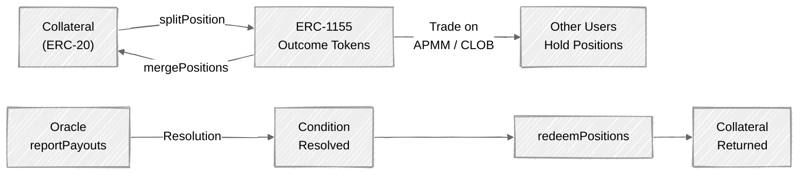

## Overview

The **ConditionalTokens** contract is the asset layer for all PrometheX markets. It implements the [Gnosis Conditional Token Framework (CTF)](https://docs.gnosis.io/conditionaltokens/) — an ERC-1155 standard where each prediction market outcome is represented as a fungible token.

Key characteristics:

- **ERC-1155 positions** — Each outcome in a market is a distinct ERC-1155 token ID. Users hold, trade, and redeem these tokens.
- **Singleton contract** — A single ConditionalTokens instance is shared by all markets across the platform.
- **Gnosis-compatible** — Ported from the original Gnosis CTF (Solidity 0.5) to Solidity 0.8.28 while preserving the original ID computation scheme for ecosystem interoperability.
- **Permissionless core** — Anyone can split, merge, and redeem positions. The oracle role (who can report payouts) is determined at condition preparation time.

<Info>
  For the full Gnosis CTF specification, see the [official Gnosis CTF documentation](https://docs.gnosis.io/conditionaltokens/).
  PrometheX preserves all ID computation logic, including the BN254 elliptic curve arithmetic for collection IDs.
</Info>

## How It Works

The lifecycle of a conditional token position follows this flow:



### Step-by-step

<Steps>
  <Step title="Prepare Condition">
    An oracle address, question ID, and outcome count are registered on-chain via `prepareCondition()`. This is typically called by the CTFOracle contract during market creation.
  </Step>
  <Step title="Split Collateral into Positions">
    A user locks ERC-20 collateral and receives a full set of ERC-1155 outcome tokens via `splitPosition()`. For a binary market (Yes/No), splitting 100 USDC produces 100 Yes tokens + 100 No tokens.
  </Step>
  <Step title="Trade Positions">
    Outcome tokens can be traded through two channels:
    - **APMM pools** (PredictionCTF) — The pool holds CTF positions and swaps them using a weighted constant-product pricing formula.
    - **CLOB** (CTFSettlement) — An off-chain order book with on-chain escrow. Positions are deposited into the settlement contract and matched by an operator.
  </Step>
  <Step title="Oracle Reports Payouts">
    After the real-world event resolves, the oracle calls `reportPayouts()` to set the payout vector. For a binary market where "Yes" wins: `[1, 0]`.
  </Step>
  <Step title="Redeem Positions">
    Token holders call `redeemPositions()` to burn their outcome tokens and receive collateral proportional to the reported payouts. Winning tokens redeem at full value; losing tokens redeem at zero.
  </Step>
</Steps>

## Core Operations

### prepareCondition

```solidity
function prepareCondition(
    address oracle,
    bytes32 questionId,
    uint256 outcomeSlotCount
) external
```

Registers a new condition on the CTF contract. This must be called before any split/merge/redeem operations for that condition.

- `oracle` — The address authorized to call `reportPayouts` for this condition. In PrometheX, this is always the [CTFOracle](/contracts/resolution/overview) contract.
- `questionId` — An opaque identifier for the question being asked.
- `outcomeSlotCount` — Number of possible outcomes (must be between 2 and 256).

<Note>
  `prepareCondition` is typically called by the CTFOracle during market creation via `PredictionFactory.createEvent()`. You generally do not need to call this directly.
</Note>

### splitPosition

```solidity
function splitPosition(
    IERC20 collateralToken,
    bytes32 parentCollectionId,
    bytes32 conditionId,
    uint256[] calldata partition,
    uint256 amount
) external
```

Locks collateral and mints a full set of outcome tokens.

- `collateralToken` — The ERC-20 token used as collateral (e.g., tUSDC).
- `parentCollectionId` — Use `bytes32(0)` for a root-level split from raw collateral. Non-zero values enable nested conditional positions.
- `conditionId` — The condition to split on (derived from oracle + questionId + outcomeSlotCount).
- `partition` — Array of index sets defining the split. For a binary market: `[1, 2]` (outcome 0 alone, outcome 1 alone).
- `amount` — Amount of collateral to lock. Each outcome position receives this amount.

<Warning>
  The caller must approve the ConditionalTokens contract to spend `amount` of the collateral token before calling `splitPosition`. Use the [CTFRouter](/contracts/router) for a single-transaction experience.
</Warning>

### mergePositions

```solidity
function mergePositions(
    IERC20 collateralToken,
    bytes32 parentCollectionId,
    bytes32 conditionId,
    uint256[] calldata partition,
    uint256 amount
) external
```

Burns a complete set of outcome tokens and returns the underlying collateral. This is the inverse of `splitPosition`.

- The caller must hold at least `amount` of **every** position in the partition.
- The partition must be identical to the one used when splitting.
- Returns `amount` of collateral to the caller.

### redeemPositions

```solidity
function redeemPositions(
    IERC20 collateralToken,
    bytes32 parentCollectionId,
    bytes32 conditionId,
    uint256[] calldata indexSets
) external
```

After resolution, burns outcome tokens and pays out collateral proportional to the oracle-reported payouts.

- `indexSets` — Array of index sets to redeem. For a binary market, pass `[1, 2]` to redeem both Yes and No positions (only winning positions have value).
- The payout for each position is: `balance * payoutNumerator / payoutDenominator`.
- Automatically burns the caller's entire balance for each position.

<Tip>
  You can call `redeemPositions` with all index sets even if you only hold winning tokens. Positions with zero balance are skipped at no extra cost.
</Tip>

### reportPayouts

```solidity
function reportPayouts(
    bytes32 questionId,
    uint256[] calldata payouts
) external
```

Called by the oracle to report the outcome of a condition. The `conditionId` is derived from `msg.sender` (the oracle), the `questionId`, and the length of the `payouts` array.

- `payouts` — Array of payout numerators per outcome slot. For a binary market where "Yes" wins: `[1, 0]`. For a 50/50 split: `[1, 1]`.
- The payout denominator is the sum of all numerators.
- Can only be called once per condition.

<Warning>
  `reportPayouts` is permissionless — the caller becomes the oracle for the derived `conditionId`. Security relies on the fact that market conditions are prepared with the CTFOracle address, so only payouts reported by CTFOracle affect market positions.
</Warning>

## ID Computation

Three deterministic identifiers form the backbone of the CTF system. All IDs can be pre-computed off-chain.

<AccordionGroup>
  <Accordion title="conditionId">
    Identifies a specific question tied to a specific oracle.

    ```
    conditionId = keccak256(abi.encodePacked(oracle, questionId, outcomeSlotCount))
    ```

    - `oracle` — The address authorized to resolve this condition (CTFOracle in PrometheX).
    - `questionId` — Unique question identifier.
    - `outcomeSlotCount` — Number of outcome slots.
  </Accordion>

  <Accordion title="collectionId">
    Identifies a specific outcome (or set of outcomes) within a condition.

    ```
    collectionId = BN254_EC_ADD(parentCollectionId, hash(conditionId, indexSet))
    ```

    Uses BN254 elliptic curve point addition (EVM precompiles at addresses `0x05` and `0x06`) to ensure that different condition/indexSet combinations always produce distinct IDs. This design enables composable nested conditional positions.

    For root-level positions (no parent), `parentCollectionId = bytes32(0)`.
  </Accordion>

  <Accordion title="positionId">
    The ERC-1155 token ID used in all balance and transfer operations.

    ```
    positionId = uint256(keccak256(abi.encodePacked(collateralToken, collectionId)))
    ```

    Binds a specific collateral token to a specific outcome collection.
  </Accordion>
</AccordionGroup>

<Note>
  All three IDs are deterministic and can be computed off-chain without any contract calls. This is useful for pre-computing token IDs in your frontend or indexer.
</Note>

## Relationship with PredictionCTF

PredictionCTF (the APMM pool contract) is the primary trading venue for CTF positions:

- Each PredictionCTF pool is deployed as an EIP-1167 minimal proxy and is an **ERC1155Holder** — it can receive and hold CTF position tokens.
- When a user **buys** an outcome through the APMM, the pool internally splits collateral into positions and swaps them via the weighted constant-product pricing formula.
- When a user **sells** an outcome, the pool receives the position tokens back and merges or rebalances.
- After resolution (oracle reports payouts), users redeem their positions **directly from ConditionalTokens** — the pool is no longer involved.

## Code Examples

### Split Position

<CodeGroup>

```typescript viem
import { getContract, parseUnits } from "viem";
import { publicClient, walletClient, account } from "./client";

const CTF_ADDRESS = "0xf5E0891F0f5ba4C2b6034720b444eb79926e1DF0";
const TUSDC_ADDRESS = "0x52cb113e383c654fB78Ff56615ce3719193C6408";

// 1. Approve collateral
const tusdc = getContract({
  address: TUSDC_ADDRESS,
  abi: [
    {
      name: "approve",
      type: "function",
      inputs: [
        { name: "spender", type: "address" },
        { name: "amount", type: "uint256" },
      ],
      outputs: [{ type: "bool" }],
      stateMutability: "nonpayable",
    },
  ],
  client: walletClient,
});

const amount = parseUnits("100", 6); // 100 USDC (6 decimals)
await tusdc.write.approve([CTF_ADDRESS, amount]);

// 2. Split position
const ctf = getContract({
  address: CTF_ADDRESS,
  abi: conditionalTokensAbi,
  client: walletClient,
});

const conditionId = "0x..."; // Your condition ID
const partition = [1n, 2n]; // Binary: [Yes, No]

await ctf.write.splitPosition([
  TUSDC_ADDRESS,
  "0x0000000000000000000000000000000000000000000000000000000000000000", // parentCollectionId
  conditionId,
  partition,
  amount,
]);
```

```typescript ethers.js
import { ethers } from "ethers";

const CTF_ADDRESS = "0xf5E0891F0f5ba4C2b6034720b444eb79926e1DF0";
const TUSDC_ADDRESS = "0x52cb113e383c654fB78Ff56615ce3719193C6408";

const signer = await provider.getSigner();

// 1. Approve collateral
const tusdc = new ethers.Contract(
  TUSDC_ADDRESS,
  ["function approve(address spender, uint256 amount) returns (bool)"],
  signer
);

const amount = ethers.parseUnits("100", 6); // 100 USDC (6 decimals)
await tusdc.approve(CTF_ADDRESS, amount);

// 2. Split position
const ctf = new ethers.Contract(CTF_ADDRESS, conditionalTokensAbi, signer);

const conditionId = "0x..."; // Your condition ID
const partition = [1n, 2n]; // Binary: [Yes, No]

await ctf.splitPosition(
  TUSDC_ADDRESS,
  ethers.ZeroHash, // parentCollectionId
  conditionId,
  partition,
  amount
);
```

</CodeGroup>

### Merge Positions

<CodeGroup>

```typescript viem
import { getContract, parseUnits } from "viem";

const CTF_ADDRESS = "0xf5E0891F0f5ba4C2b6034720b444eb79926e1DF0";
const TUSDC_ADDRESS = "0x52cb113e383c654fB78Ff56615ce3719193C6408";

const ctf = getContract({
  address: CTF_ADDRESS,
  abi: conditionalTokensAbi,
  client: walletClient,
});

const conditionId = "0x...";
const partition = [1n, 2n];
const amount = parseUnits("50", 6); // Merge 50 of each position

// Caller must hold >= amount of EVERY position in the partition
await ctf.write.mergePositions([
  TUSDC_ADDRESS,
  "0x0000000000000000000000000000000000000000000000000000000000000000",
  conditionId,
  partition,
  amount,
]);
// 50 USDC is returned to the caller
```

```typescript ethers.js
import { ethers } from "ethers";

const CTF_ADDRESS = "0xf5E0891F0f5ba4C2b6034720b444eb79926e1DF0";
const TUSDC_ADDRESS = "0x52cb113e383c654fB78Ff56615ce3719193C6408";

const signer = await provider.getSigner();
const ctf = new ethers.Contract(CTF_ADDRESS, conditionalTokensAbi, signer);

const conditionId = "0x...";
const partition = [1n, 2n];
const amount = ethers.parseUnits("50", 6);

// Caller must hold >= amount of EVERY position in the partition
await ctf.mergePositions(
  TUSDC_ADDRESS,
  ethers.ZeroHash,
  conditionId,
  partition,
  amount
);
// 50 USDC is returned to the caller
```

</CodeGroup>

### Redeem After Resolution

<CodeGroup>

```typescript viem
import { getContract } from "viem";

const CTF_ADDRESS = "0xf5E0891F0f5ba4C2b6034720b444eb79926e1DF0";
const TUSDC_ADDRESS = "0x52cb113e383c654fB78Ff56615ce3719193C6408";

const ctf = getContract({
  address: CTF_ADDRESS,
  abi: conditionalTokensAbi,
  client: walletClient,
});

const conditionId = "0x...";
const indexSets = [1n, 2n]; // Redeem both Yes and No positions

// Burns all held positions and returns collateral for winning outcomes
await ctf.write.redeemPositions([
  TUSDC_ADDRESS,
  "0x0000000000000000000000000000000000000000000000000000000000000000",
  conditionId,
  indexSets,
]);
```

```typescript ethers.js
import { ethers } from "ethers";

const CTF_ADDRESS = "0xf5E0891F0f5ba4C2b6034720b444eb79926e1DF0";
const TUSDC_ADDRESS = "0x52cb113e383c654fB78Ff56615ce3719193C6408";

const signer = await provider.getSigner();
const ctf = new ethers.Contract(CTF_ADDRESS, conditionalTokensAbi, signer);

const conditionId = "0x...";
const indexSets = [1n, 2n]; // Redeem both Yes and No positions

// Burns all held positions and returns collateral for winning outcomes
await ctf.redeemPositions(
  TUSDC_ADDRESS,
  ethers.ZeroHash,
  conditionId,
  indexSets
);
```

</CodeGroup>

### Check Position Balance

<CodeGroup>

```typescript viem
import { getContract } from "viem";

const CTF_ADDRESS = "0xf5E0891F0f5ba4C2b6034720b444eb79926e1DF0";

const ctf = getContract({
  address: CTF_ADDRESS,
  abi: conditionalTokensAbi,
  client: publicClient,
});

const userAddress = "0x...";
const positionId = 123456n; // ERC-1155 token ID

const balance = await ctf.read.balanceOf([userAddress, positionId]);
console.log(`Position balance: ${balance}`);
```

```typescript ethers.js
import { ethers } from "ethers";

const CTF_ADDRESS = "0xf5E0891F0f5ba4C2b6034720b444eb79926e1DF0";

const ctf = new ethers.Contract(
  CTF_ADDRESS,
  ["function balanceOf(address account, uint256 id) view returns (uint256)"],
  provider
);

const userAddress = "0x...";
const positionId = 123456n; // ERC-1155 token ID

const balance = await ctf.balanceOf(userAddress, positionId);
console.log(`Position balance: ${balance}`);
```

</CodeGroup>

### Compute Position ID Off-Chain

<CodeGroup>

```typescript viem
import { keccak256, encodePacked, getAddress } from "viem";

const CTF_ADDRESS = "0xf5E0891F0f5ba4C2b6034720b444eb79926e1DF0";
const TUSDC_ADDRESS = "0x52cb113e383c654fB78Ff56615ce3719193C6408";

// 1. Compute conditionId
const oracleAddress = "0x982e18db6837D55297c39926dE86ae560cd96f99"; // CTFOracle
const questionId = "0x...";
const outcomeSlotCount = 2;

const conditionId = keccak256(
  encodePacked(
    ["address", "bytes32", "uint256"],
    [oracleAddress, questionId, BigInt(outcomeSlotCount)]
  )
);

// 2. Compute collectionId (on-chain call required due to BN254 EC math)
const ctf = getContract({
  address: CTF_ADDRESS,
  abi: conditionalTokensAbi,
  client: publicClient,
});

const collectionIdYes = await ctf.read.getCollectionId([
  "0x0000000000000000000000000000000000000000000000000000000000000000",
  conditionId,
  1n, // indexSet for outcome 0 (Yes)
]);

// 3. Compute positionId (pure keccak256, no contract call needed)
const positionIdYes = BigInt(
  keccak256(
    encodePacked(
      ["address", "bytes32"],
      [TUSDC_ADDRESS, collectionIdYes]
    )
  )
);

console.log("Yes position token ID:", positionIdYes);
```

```typescript ethers.js
import { ethers } from "ethers";

const CTF_ADDRESS = "0xf5E0891F0f5ba4C2b6034720b444eb79926e1DF0";
const TUSDC_ADDRESS = "0x52cb113e383c654fB78Ff56615ce3719193C6408";

// 1. Compute conditionId
const oracleAddress = "0x982e18db6837D55297c39926dE86ae560cd96f99"; // CTFOracle
const questionId = "0x...";
const outcomeSlotCount = 2;

const conditionId = ethers.solidityPackedKeccak256(
  ["address", "bytes32", "uint256"],
  [oracleAddress, questionId, outcomeSlotCount]
);

// 2. Compute collectionId (on-chain call required due to BN254 EC math)
const ctf = new ethers.Contract(CTF_ADDRESS, conditionalTokensAbi, provider);

const collectionIdYes = await ctf.getCollectionId(
  ethers.ZeroHash,
  conditionId,
  1n // indexSet for outcome 0 (Yes)
);

// 3. Compute positionId (pure keccak256, no contract call needed)
const positionIdYes = BigInt(
  ethers.solidityPackedKeccak256(
    ["address", "bytes32"],
    [TUSDC_ADDRESS, collectionIdYes]
  )
);

console.log("Yes position token ID:", positionIdYes);
```

</CodeGroup>

<Note>
  `conditionId` and `positionId` are pure `keccak256` hashes and can be computed entirely off-chain. However, `collectionId` uses BN254 elliptic curve point addition (EVM precompiles), so it requires an on-chain `view` call to `getCollectionId()`.
</Note>
