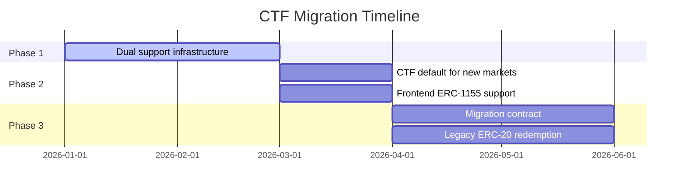

## Overview

PrometheX is migrating from per-outcome **ERC-20 Option tokens** to the **Gnosis Conditional Token Framework (CTF)** — an ERC-1155 multi-token standard purpose-built for prediction markets. This migration unlocks ecosystem composability with Polymarket, Gnosis, and other CTF-compatible platforms.

<Info>
**Target timeline:** CTF migration is planned for completion by end of Q1 2026. Existing markets on ERC-20 Option tokens will continue to function and be claimable. New markets will use CTF after the migration.
</Info>

---

## Why CTF?

### Current Architecture (ERC-20)

Each prediction market deploys **N separate ERC-20 contracts** (one per outcome) via EIP-1167 clones:

```
Market: "Will ETH reach $5k?"
├── Option #0 (Yes) — 0xABC...  (ERC-20 clone)
└── Option #1 (No)  — 0xDEF...  (ERC-20 clone)
```

### Future Architecture (CTF / ERC-1155)

All outcomes across all markets are represented as **token IDs** within a single `ConditionalTokens` contract:

```
ConditionalTokens (0x...)
├── tokenId(conditionId, indexSet=0b01) → "Yes" for Market A
├── tokenId(conditionId, indexSet=0b10) → "No" for Market A
├── tokenId(conditionId, indexSet=0b01) → "Yes" for Market B
└── ...
```

### Comparison

| Feature | ERC-20 Options | CTF (ERC-1155) |
|---------|:-------------:|:--------------:|
| Contracts per market | N (one per outcome) | 0 (shared CTF contract) |
| Deployment gas | ~$0.01 per outcome clone | None (pre-deployed) |
| Ecosystem compatibility | PrometheX only | Polymarket, Gnosis, Azuro, etc. |
| Position splitting/merging | Not supported | Native `splitPosition` / `mergePositions` |
| Batch transfers | No | Yes (`safeBatchTransferFrom`) |
| Secondary market | Per-token DEX listings | Unified ERC-1155 marketplace |
| Orderbook compatibility | Limited | Polymarket CLOB compatible |

---

## What Is the Conditional Token Framework?

The CTF, created by Gnosis, defines a standard for tokenizing conditional outcomes:

1. **Conditions** — A question with N outcomes, identified by `conditionId = keccak256(oracle, questionId, outcomeSlotCount)`
2. **Positions** — Collateral locked against specific outcome slots, identified by `positionId = keccak256(collateral, conditionId, indexSet)`
3. **Index Sets** — Bitmask representing which outcomes a position covers (e.g., `0b01` = outcome 0, `0b10` = outcome 1)

### Key CTF Operations

```solidity
interface IConditionalTokens {
    /// @notice Tokenize collateral into conditional outcome tokens
    function splitPosition(
        IERC20 collateralToken,
        bytes32 parentCollectionId,
        bytes32 conditionId,
        uint256[] calldata partition,
        uint256 amount
    ) external;

    /// @notice Merge outcome tokens back into collateral
    function mergePositions(
        IERC20 collateralToken,
        bytes32 parentCollectionId,
        bytes32 conditionId,
        uint256[] calldata partition,
        uint256 amount
    ) external;

    /// @notice Redeem resolved positions for collateral
    function redeemPositions(
        IERC20 collateralToken,
        bytes32 parentCollectionId,
        bytes32 conditionId,
        uint256[] calldata indexSets
    ) external;

    /// @notice Report the outcome of a condition
    function reportPayouts(
        bytes32 questionId,
        uint256[] calldata payouts
    ) external;
}
```

---

## Migration Plan

### Phase 1: Dual Support (Current → Q1 2026)

- Existing ERC-20 markets continue to operate unchanged
- New deployment infrastructure for CTF-based markets prepared
- `PredictionFactory` updated to support both modes

### Phase 2: CTF Default (Q1 2026)

- New markets created with CTF by default
- ERC-20 option creation deprecated in factory
- Frontend updated to read ERC-1155 balances

### Phase 3: Legacy Redemption (Q2 2026)

- Migration contract deployed for converting ERC-20 positions to CTF positions
- Legacy markets can still be claimed via original `claimAll()`
- ERC-20 Option implementation preserved for backward compatibility



---

## What Changes for Developers

### Contract Interactions

<Tabs>
  <Tab title="Before (ERC-20)">
```typescript
// Get option token address
const yesToken = await market.getOption(0);

// Read balance (ERC-20)
const balance = await erc20.balanceOf(yesToken, user);

// Transfer
await erc20.transfer(yesToken, recipient, amount);
```
  </Tab>
  <Tab title="After (CTF / ERC-1155)">
```typescript
// Compute position ID
const conditionId = keccak256(oracle, questionId, outcomeCount);
const collectionId = keccak256(conditionId, indexSet);
const positionId = keccak256(collateral, collectionId);

// Read balance (ERC-1155)
const balance = await ctf.balanceOf(user, positionId);

// Batch balance check
const balances = await ctf.balanceOfBatch(
  [user, user],
  [yesPositionId, noPositionId]
);

// Transfer
await ctf.safeTransferFrom(sender, recipient, positionId, amount, "0x");
```
  </Tab>
</Tabs>

### Prediction Contract Changes

| Function | ERC-20 Version | CTF Version |
|----------|---------------|-------------|
| `deposit()` | Mints ERC-20 Option tokens | Calls `CTF.splitPosition()` |
| `withdraw()` | Burns ERC-20 Option tokens | Calls `CTF.mergePositions()` |
| `claimAll()` | Burns winning ERC-20 tokens | Calls `CTF.redeemPositions()` |
| `getOption(i)` | Returns ERC-20 clone address | Returns CTF address + position ID |

### Event Changes

| Current Event | CTF Event |
|--------------|-----------|
| `Transfer(from, to, amount)` per Option | `TransferSingle(operator, from, to, id, value)` on CTF |
| Multiple contracts to monitor | Single CTF contract to monitor |

---

## Migration Contract (Planned)

For users holding ERC-20 Option tokens from pre-CTF markets, a migration contract will allow 1:1 conversion:

```solidity
/// @title OptionMigrator
/// @notice Converts legacy ERC-20 Option tokens to CTF positions
contract OptionMigrator {
    IConditionalTokens public immutable ctf;

    /// @notice Migrate ERC-20 option tokens to CTF positions
    /// @param market     Legacy Prediction market address
    /// @param optionIndex  Which option to migrate
    /// @param amount     Amount to migrate
    function migrate(
        address market,
        uint256 optionIndex,
        uint256 amount
    ) external {
        // 1. Burn ERC-20 option tokens from msg.sender
        // 2. Split equivalent collateral into CTF position
        // 3. Transfer CTF tokens to msg.sender
    }
}
```

<Note>
Migration is **optional**. Legacy ERC-20 option tokens remain valid and claimable on their original markets. Migration is only needed if you want to use CTF-specific features (splitting, merging, Polymarket compatibility).
</Note>

---

## FAQ

<AccordionGroup>
  <Accordion title="Will my existing positions be affected?">
    No. Existing ERC-20 option positions remain valid. Markets already created will continue to use ERC-20 Option tokens for their entire lifecycle. You can still trade and claim as normal.
  </Accordion>
  <Accordion title="Do I need to migrate my tokens?">
    Only if you want CTF-specific features. Legacy tokens are fully functional for claiming and trading on PrometheX.
  </Accordion>
  <Accordion title="Will the APMM formula change?">
    No. The APMM invariant and pricing remain identical. Only the token standard used for outcome positions changes.
  </Accordion>
  <Accordion title="Is CTF compatible with Polymarket?">
    Yes. The Gnosis CTF is the same token standard used by Polymarket. Once migrated, PrometheX positions can interoperate with CTF-compatible platforms and orderbooks.
  </Accordion>
  <Accordion title="What about LP tokens?">
    LP tokens (the Prediction contract's own ERC-20) are **not affected** by the CTF migration. LP tokens represent pool shares, not outcome positions.
  </Accordion>
</AccordionGroup>
