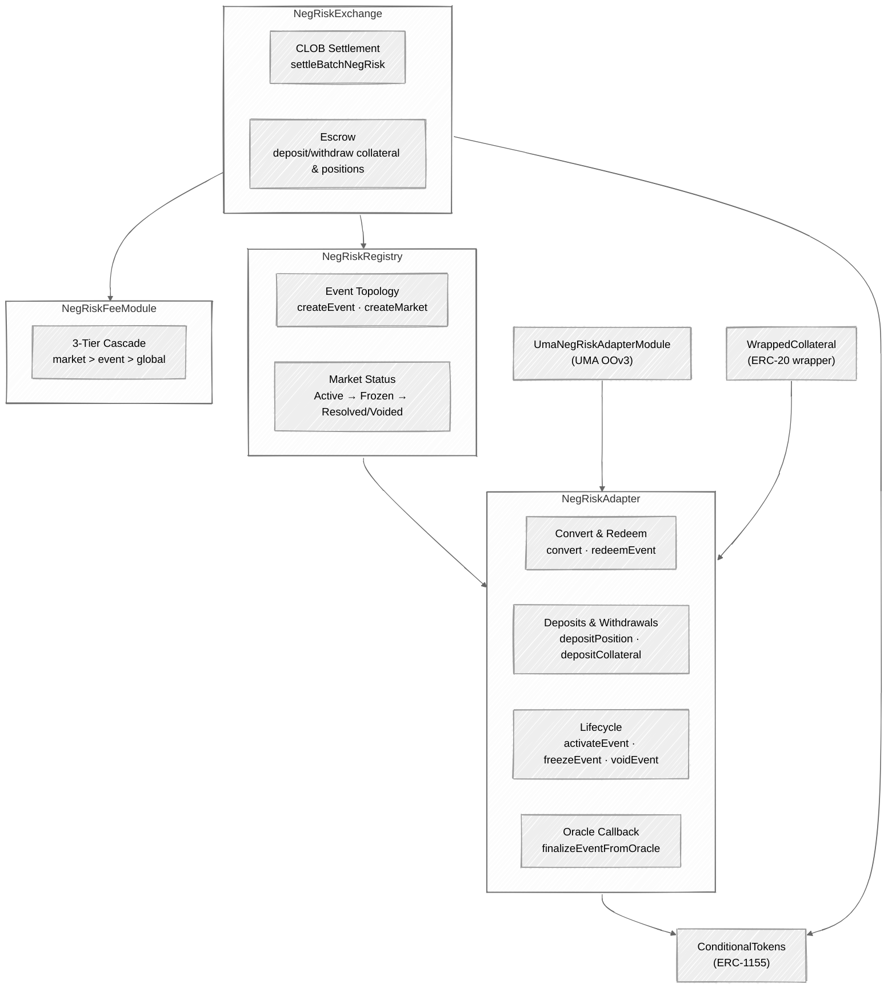
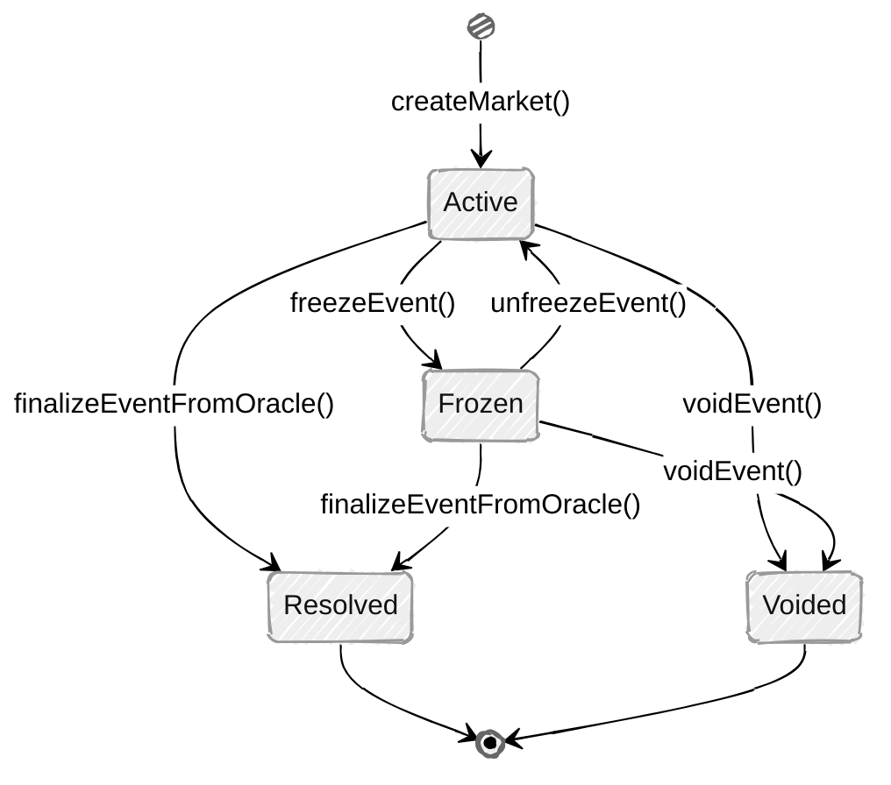
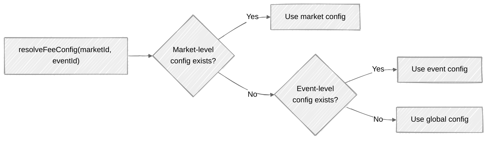
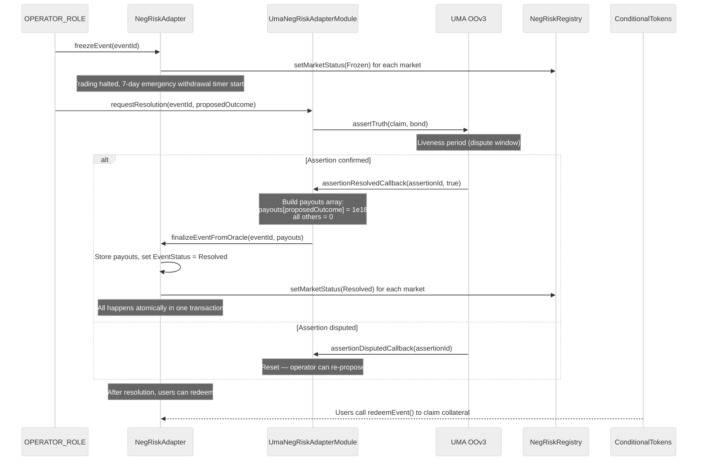

## Overview

NegRisk is PrometheX's multi-outcome market architecture. It represents N conceptual outcomes (e.g., 5 election candidates) as **N independent binary markets** under a single event. This is the same topology used by Polymarket for multi-outcome events.

<Info>
NegRisk is designed for events where outcome probabilities are correlated — e.g., "Who will win the election?" with 5 candidates. Each candidate gets a binary Yes/No market, but the YES prices across all candidates should sum to ~100%. NegRisk enables **cross-outcome position conversion** at 1:1, maintaining this price coherence.
</Info>

<CardGroup cols={2}>
  <Card title="N Binary Markets" icon="layer-group">
    Each conceptual outcome gets its own binary (Yes/No) market. All share one event ID and collateral pool.
  </Card>
  <Card title="1:1 Convert" icon="repeat">
    Swap YES_A for YES_B at 1:1 via the NegRiskAdapter, using pre-funded convert liquidity.
  </Card>
  <Card title="Atomic Resolution" icon="bolt">
    Oracle callback finalizes all sub-markets in a single transaction — no partial resolution states.
  </Card>
  <Card title="3-Tier Fees" icon="sliders">
    Fee cascade: market-level overrides event-level overrides global. Most specific config wins.
  </Card>
</CardGroup>

### Core Contracts

| Contract | Responsibility |
|----------|---------------|
| `NegRiskRegistry` | Event/market topology, lifecycle status transitions |
| `NegRiskAdapter` | Convert, redeem, deposit/withdraw, freeze, oracle finalization |
| `NegRiskExchange` | CLOB settlement for NegRisk positions (EIP-712 operator-signed fills) |
| `NegRiskFeeModule` | 3-tier fee cascade (market > event > global) |
| `WrappedCollateral` | 1:1 ERC-20 wrapper to prevent fee-on-transfer accounting issues |

---

## Architecture



---

## NegRiskRegistry

The registry manages event-market topology and lifecycle status. It is the source of truth for which markets belong to which event and their current status.

### Event Creation

<Steps>
  <Step title="Create Event">
    `createEventWithNumOutcomes()` registers a new event with its collateral token, oracle module, and number of conceptual outcomes (`numOutcomes`). Each sub-market is always binary (`outcomeSlotCount = 2`).
  </Step>
  <Step title="Add Markets">
    `createMarket()` adds binary markets to the event, one per conceptual outcome. Each market gets a `conditionId` and pair of `tokenIds` (YES token, NO token). Up to `MAX_MARKETS_PER_EVENT = 256` markets.
  </Step>
  <Step title="Activate">
    Once all `numOutcomes` markets are registered, the NegRiskAdapter can `activateEvent()` to enable trading.
  </Step>
</Steps>

### Market Status Machine



| Status | Trading | Resolution | Redeem |
|--------|:-------:|:----------:|:------:|
| **Active** | Allowed | Proposable | — |
| **Frozen** | Blocked | Proposable | — |
| **Resolved** | — | Terminal | Allowed (payout ratio) |
| **Voided** | — | Terminal | Allowed (50/50) |

### Key Functions

| Function | Access | Description |
|----------|--------|-------------|
| `createEvent(...)` / `createEventWithNumOutcomes(...)` | `OPERATOR_ROLE` | Register a new event |
| `createMarket(bytes32 eventId, bytes32 marketId, bytes32 conditionId, uint256[] tokenIds)` | `OPERATOR_ROLE` | Add a binary market to an event |
| `setMarketStatus(bytes32 marketId, MarketStatus status)` | `OPERATOR_ROLE` | Transition market status |
| `getEventConfig(bytes32 eventId)` | Public (view) | Retrieve event configuration |
| `getMarketConfig(bytes32 marketId)` | Public (view) | Retrieve market configuration |
| `getEventMarkets(bytes32 eventId)` | Public (view) | List all markets in an event |
| `isEventToken(bytes32 eventId, uint256 tokenId)` | Public (view) | Check if a token belongs to an event |

---

## NegRiskAdapter

The adapter is the core orchestrator for NegRisk operations: position conversion, redemption, collateral management, event lifecycle, and oracle finalization.

### Convert — Cross-Outcome Position Swap

```solidity
function convert(
    bytes32 eventId,
    uint256 tokenIn,
    uint256 tokenOut,
    uint256 amountIn,
    uint256 minOut,
    uint256 deadline
) external returns (uint256 amountOut)
```

Swaps one outcome's position token for another within the same event at **1:1 ratio**. For example, swap YES_Candidate_A for YES_Candidate_B. This draws from pre-funded convert liquidity held by the adapter.

**Requirements**:
- Event must be `Active`
- Both tokens must belong to the same event
- Sufficient convert liquidity for `tokenOut`
- `amountOut >= minOut` (slippage protection)
- `block.timestamp <= deadline`

### Redeem — Post-Resolution Payout

```solidity
function redeemEvent(
    bytes32 eventId,
    address account,
    uint256[] calldata tokenIds,
    uint256[] calldata amounts,
    uint256 minPayout,
    address recipient
) external returns (uint256 payout)
```

After an event is `Resolved` or `Voided`, token holders redeem their positions for collateral:
- **Resolved**: Payout based on the stored payout ratio per outcome. YES tokens pay `amount * ratio / 1e18`. NO tokens pay `amount * (1e18 - ratio) / 1e18`.
- **Voided**: Every token (YES or NO) pays `amount / 2` (50/50 split).

### Event Lifecycle

| Function | Access | Description |
|----------|--------|-------------|
| `activateEvent(bytes32 eventId)` | `OPERATOR_ROLE` | Activate event (requires all markets registered) |
| `freezeEvent(bytes32 eventId)` | `OPERATOR_ROLE` | Freeze event — halts trading, starts emergency withdrawal timer |
| `unfreezeEvent(bytes32 eventId)` | `OPERATOR_ROLE` | Unfreeze — returns to Active |
| `voidEvent(bytes32 eventId)` | `OPERATOR_ROLE` | Void event — all positions redeemable at 50/50 |
| `finalizeEventFromOracle(bytes32 eventId, uint256[] payouts)` | Oracle module only | Finalize with payout ratios (must sum to `1e18`) |

### Deposit & Withdrawal

| Function | Access | Description |
|----------|--------|-------------|
| `depositPosition(bytes32 eventId, uint256 tokenId, uint256 amount)` | Public | Deposit outcome tokens into adapter |
| `withdrawPosition(bytes32 eventId, uint256 tokenId, uint256 amount, address to)` | `OPERATOR_ROLE` | Operator-managed position withdrawal |
| `depositCollateral(bytes32 eventId, uint256 amount)` | Public | Deposit collateral into event payout pool |
| `withdrawCollateral(bytes32 eventId, uint256 amount, address to)` | `OPERATOR_ROLE` | Operator-managed collateral withdrawal |
| `emergencyWithdrawPosition(bytes32 eventId, uint256 tokenId, uint256 amount)` | Public | Self-service withdrawal after freeze delay |

### Convert Liquidity Management

| Function | Access | Description |
|----------|--------|-------------|
| `addConvertLiquidity(bytes32 eventId, uint256 tokenId, uint256 amount)` | `OPERATOR_ROLE` | Deposit tokens as convert liquidity pool |
| `removeConvertLiquidity(bytes32 eventId, uint256 tokenId, uint256 amount)` | `OPERATOR_ROLE` | Withdraw from convert liquidity pool |

<Note>
**FREEZE_WITHDRAWAL_DELAY = 7 days** — After an event is frozen, users must wait 7 days before they can call `emergencyWithdrawPosition()` to self-withdraw their deposited positions without operator intervention. This gives the operator time to resolve or void the event normally.
</Note>

---

## WrappedCollateral

A minimal 1:1 ERC-20 wrapper around the collateral token. It exists to prevent fee-on-transfer issues in NegRisk accounting — the adapter needs exact balance tracking, which deflationary or fee-on-transfer tokens would break.

```solidity
function deposit(uint256 amount) external   // Wrap: transfer collateral in, mint wrapped tokens
function withdraw(uint256 amount) external  // Unwrap: burn wrapped tokens, transfer collateral out
function decimals() public view returns (uint8) // Inherits decimals from underlying
```

<Tip>
WrappedCollateral explicitly reverts on fee-on-transfer tokens by checking `balanceOf` before and after the transfer. Standard ERC-20 tokens like USDC work as expected.
</Tip>

---

## NegRiskExchange

The NegRisk CLOB settlement contract. Unlike `CTFSettlement` where individual makers sign their orders, `NegRiskExchange` uses an **operator-signed batch** model for higher throughput.

### EIP-712 Fill Structure

```
Fill(bytes32 eventId, bytes32 marketId, address maker, address taker, uint256 tokenId,
     uint256 size, uint256 priceBps, uint256 nonce, uint256 deadline)
```

| Field | Type | Description |
|-------|------|-------------|
| `eventId` | `bytes32` | NegRisk event identifier |
| `marketId` | `bytes32` | Specific binary market within the event |
| `maker` | `address` | Position seller |
| `taker` | `address` | Position buyer (pays collateral) |
| `tokenId` | `uint256` | ERC-1155 position token being traded |
| `size` | `uint256` | Number of tokens to transfer |
| `priceBps` | `uint256` | Price in basis points (0–10,000) |
| `nonce` | `uint256` | Single-use nonce for replay protection |
| `deadline` | `uint256` | Unix timestamp expiry |

### Trust Model Difference

<Warning>
**NegRiskExchange** has a different trust model than CTFSettlement:

- In **CTFSettlement**: both maker and taker sign their own EIP-712 orders. The operator submits but does not sign.
- In **NegRiskExchange**: the **operator** signs the entire batch of fills. Individual makers/takers do **not** sign. Users consent to trading by depositing funds into the exchange.

This means a compromised operator key has greater impact on NegRiskExchange — it can execute arbitrary fills without any user signature. Mitigation: operator key managed via HSM, owner can `pause()` immediately, users can withdraw at any time.
</Warning>

### Settlement

```solidity
function settleBatchNegRisk(Fill[] calldata fills, bytes calldata signature) external
```

The operator constructs an array of `Fill` structs, signs the batch hash via EIP-712, and submits it on-chain. For each fill:

1. Verify nonce is unused and deadline has not passed
2. Validate market exists, is NegRisk, and is Active
3. Check local pause state (event-level and market-level)
4. Verify token belongs to the market
5. Calculate fee via `NegRiskFeeModule.resolveFeeConfig()`
6. Transfer position tokens: maker → taker
7. Transfer collateral: taker → maker (minus fees)

### 3-Tier Pause

NegRiskExchange supports three independent pause levels:

| Level | Functions | Effect |
|-------|-----------|--------|
| **Global** | `pause()` / `unpause()` | Halts all deposits and settlement |
| **Per-Event** | `pauseEvent(eventId)` / `unpauseEvent(eventId)` | Blocks settlement for all markets in an event |
| **Per-Market** | `pauseMarket(marketId)` / `unpauseMarket(marketId)` | Blocks settlement for a single market |

### Escrow Functions

| Function | Description |
|----------|-------------|
| `depositCollateral(uint256 amount)` | Deposit collateral into exchange escrow |
| `depositCollateralFor(address user, uint256 amount)` | Deposit on behalf of another address |
| `withdrawCollateral(uint256 amount)` | Withdraw collateral from escrow |
| `depositPosition(uint256 tokenId, uint256 amount)` | Deposit ERC-1155 position tokens |
| `depositPositionFor(address user, uint256 tokenId, uint256 amount)` | Deposit positions for another address |
| `withdrawPosition(uint256 tokenId, uint256 amount)` | Withdraw position tokens |

---

## NegRiskFeeModule

A standalone fee configuration contract implementing a **3-tier cascade**. The most specific configuration wins.



| Tier | Function | Scope |
|------|----------|-------|
| **Global** | `setGlobalFeeConfig(makerFeeBps, takerFeeBps, recipient)` | Default for all markets |
| **Event** | `setEventFeeConfig(eventId, makerFeeBps, takerFeeBps, recipient)` | Override for all markets in an event |
| **Market** | `setMarketFeeConfig(marketId, makerFeeBps, takerFeeBps, recipient)` | Override for a single market |

All fee functions require `OPERATOR_ROLE`. Maximum fee is `MAX_FEE_BPS = 500` (5%) for both maker and taker independently.

Clear functions (`clearEventFeeConfig`, `clearMarketFeeConfig`) remove overrides, causing the next tier up to take effect.

---

## Resolution Flow

The full NegRisk resolution lifecycle from freeze to payout:



<Info>
Resolution atomicity is a key invariant: `assertionResolvedCallback` → `finalizeEventFromOracle` → `setMarketStatus(Resolved)` for every sub-market all execute in a **single transaction**. There is no intermediate state where some markets are resolved and others are not.
</Info>

---

## Code Examples

### Convert Position (Swap YES_A for YES_B)

<CodeGroup>
```typescript viem
import { getContract } from "viem";

const NEGRISK_ADAPTER = "0xYourNegRiskAdapterAddress";
const CTF = "0xf5E0891F0f5ba4C2b6034720b444eb79926e1DF0";

const adapterAbi = [
  {
    name: "convert",
    type: "function",
    inputs: [
      { name: "eventId", type: "bytes32" },
      { name: "tokenIn", type: "uint256" },
      { name: "tokenOut", type: "uint256" },
      { name: "amountIn", type: "uint256" },
      { name: "minOut", type: "uint256" },
      { name: "deadline", type: "uint256" },
    ],
    outputs: [{ name: "amountOut", type: "uint256" }],
    stateMutability: "nonpayable",
  },
] as const;

// 1. Approve CTF tokens for the adapter (ERC-1155 setApprovalForAll)
await walletClient.writeContract({
  address: CTF,
  abi: [
    {
      name: "setApprovalForAll",
      type: "function",
      inputs: [
        { name: "operator", type: "address" },
        { name: "approved", type: "bool" },
      ],
      outputs: [],
      stateMutability: "nonpayable",
    },
  ],
  functionName: "setApprovalForAll",
  args: [NEGRISK_ADAPTER, true],
});

// 2. Convert: swap YES_CandidateA for YES_CandidateB
const eventId = "0x..."; // Your event ID
const yesTokenA = 12345n; // YES token ID for Candidate A
const yesTokenB = 67890n; // YES token ID for Candidate B
const amount = 1000n;
const deadline = BigInt(Math.floor(Date.now() / 1000) + 300); // 5 minutes

const tx = await walletClient.writeContract({
  address: NEGRISK_ADAPTER,
  abi: adapterAbi,
  functionName: "convert",
  args: [eventId, yesTokenA, yesTokenB, amount, amount, deadline],
});
```

```typescript ethers.js
import { ethers } from "ethers";

const NEGRISK_ADAPTER = "0xYourNegRiskAdapterAddress";
const CTF = "0xf5E0891F0f5ba4C2b6034720b444eb79926e1DF0";

const provider = new ethers.JsonRpcProvider("https://sepolia-rollup.arbitrum.io/rpc");
const signer = new ethers.Wallet(privateKey, provider);

// 1. Approve CTF tokens for the adapter
const ctf = new ethers.Contract(
  CTF,
  ["function setApprovalForAll(address operator, bool approved)"],
  signer
);
await ctf.setApprovalForAll(NEGRISK_ADAPTER, true);

// 2. Convert: swap YES_CandidateA for YES_CandidateB
const adapter = new ethers.Contract(
  NEGRISK_ADAPTER,
  [
    "function convert(bytes32 eventId, uint256 tokenIn, uint256 tokenOut, uint256 amountIn, uint256 minOut, uint256 deadline) returns (uint256)",
  ],
  signer
);

const eventId = "0x...";
const yesTokenA = 12345n;
const yesTokenB = 67890n;
const amount = 1000n;
const deadline = BigInt(Math.floor(Date.now() / 1000) + 300);

const tx = await adapter.convert(eventId, yesTokenA, yesTokenB, amount, amount, deadline);
await tx.wait();
```
</CodeGroup>

### Redeem After Resolution

<CodeGroup>
```typescript viem
const NEGRISK_ADAPTER = "0xYourNegRiskAdapterAddress";

const redeemAbi = [
  {
    name: "redeemEvent",
    type: "function",
    inputs: [
      { name: "eventId", type: "bytes32" },
      { name: "account", type: "address" },
      { name: "tokenIds", type: "uint256[]" },
      { name: "amounts", type: "uint256[]" },
      { name: "minPayout", type: "uint256" },
      { name: "recipient", type: "address" },
    ],
    outputs: [{ name: "payout", type: "uint256" }],
    stateMutability: "nonpayable",
  },
] as const;

const eventId = "0x...";
const userAddress = walletClient.account.address;

// Redeem winning YES tokens after resolution
const tx = await walletClient.writeContract({
  address: NEGRISK_ADAPTER,
  abi: redeemAbi,
  functionName: "redeemEvent",
  args: [
    eventId,
    userAddress,         // account (must be msg.sender)
    [winningYesTokenId], // token IDs to redeem
    [1000n],             // amounts
    900n,                // minPayout (slippage guard)
    userAddress,         // recipient for collateral
  ],
});
```

```typescript ethers.js
import { ethers } from "ethers";

const NEGRISK_ADAPTER = "0xYourNegRiskAdapterAddress";

const provider = new ethers.JsonRpcProvider("https://sepolia-rollup.arbitrum.io/rpc");
const signer = new ethers.Wallet(privateKey, provider);

const adapter = new ethers.Contract(
  NEGRISK_ADAPTER,
  [
    "function redeemEvent(bytes32 eventId, address account, uint256[] tokenIds, uint256[] amounts, uint256 minPayout, address recipient) returns (uint256)",
  ],
  signer
);

const eventId = "0x...";

// Redeem winning YES tokens after resolution
const tx = await adapter.redeemEvent(
  eventId,
  signer.address,        // account
  [winningYesTokenId],   // token IDs
  [1000n],               // amounts
  900n,                  // minPayout
  signer.address         // recipient
);
await tx.wait();
```
</CodeGroup>

### Deposit into NegRisk Exchange

<CodeGroup>
```typescript viem
import { parseUnits } from "viem";

const NEGRISK_EXCHANGE = "0xYourNegRiskExchangeAddress";
const TUSDC = "0x52cb113e383c654fB78Ff56615ce3719193C6408";

// 1. Approve collateral
await walletClient.writeContract({
  address: TUSDC,
  abi: [
    {
      name: "approve",
      type: "function",
      inputs: [
        { name: "spender", type: "address" },
        { name: "amount", type: "uint256" },
      ],
      outputs: [{ type: "bool" }],
      stateMutability: "nonpayable",
    },
  ],
  functionName: "approve",
  args: [NEGRISK_EXCHANGE, parseUnits("500", 6)],
});

// 2. Deposit collateral for CLOB trading
await walletClient.writeContract({
  address: NEGRISK_EXCHANGE,
  abi: [
    {
      name: "depositCollateral",
      type: "function",
      inputs: [{ name: "amount", type: "uint256" }],
      outputs: [],
      stateMutability: "nonpayable",
    },
  ],
  functionName: "depositCollateral",
  args: [parseUnits("500", 6)], // 500 tUSDC
});

// 3. Check balance
const balance = await publicClient.readContract({
  address: NEGRISK_EXCHANGE,
  abi: [
    {
      name: "collateralBalance",
      type: "function",
      inputs: [{ name: "user", type: "address" }],
      outputs: [{ type: "uint256" }],
      stateMutability: "view",
    },
  ],
  functionName: "collateralBalance",
  args: [walletClient.account.address],
});
```

```typescript ethers.js
import { ethers } from "ethers";

const NEGRISK_EXCHANGE = "0xYourNegRiskExchangeAddress";
const TUSDC = "0x52cb113e383c654fB78Ff56615ce3719193C6408";

const provider = new ethers.JsonRpcProvider("https://sepolia-rollup.arbitrum.io/rpc");
const signer = new ethers.Wallet(privateKey, provider);

// 1. Approve collateral
const tusdc = new ethers.Contract(
  TUSDC,
  ["function approve(address spender, uint256 amount) returns (bool)"],
  signer
);
await tusdc.approve(NEGRISK_EXCHANGE, ethers.parseUnits("500", 6));

// 2. Deposit collateral
const exchange = new ethers.Contract(
  NEGRISK_EXCHANGE,
  [
    "function depositCollateral(uint256 amount)",
    "function collateralBalance(address user) view returns (uint256)",
  ],
  signer
);
await exchange.depositCollateral(ethers.parseUnits("500", 6));

// 3. Check balance
const balance = await exchange.collateralBalance(signer.address);
console.log("Exchange balance:", ethers.formatUnits(balance, 6), "tUSDC");
```
</CodeGroup>

---

## Key Invariants

<AccordionGroup>
  <Accordion title="Payout Constraint">
    The `payouts` array passed to `finalizeEventFromOracle()` must have length `numOutcomes` and sum to exactly `1e18`. This ensures total payout conservation — the winning outcome(s) receive the full collateral pool.
  </Accordion>

  <Accordion title="Resolution Atomicity">
    When UMA confirms an assertion, `assertionResolvedCallback` → `finalizeEventFromOracle` → `setMarketStatus(Resolved)` for every sub-market all execute in a single transaction. There is no state where some markets within an event are resolved while others are not.
  </Accordion>

  <Accordion title="Convert Conservation">
    `convert()` operates at exactly 1:1. The adapter's convert liquidity for `tokenIn` increases by the same amount that `tokenOut` decreases. No tokens are created or destroyed.
  </Accordion>

  <Accordion title="Fee Cap">
    `MAX_FEE_BPS = 500` (5%) is enforced at the `NegRiskFeeModule` level for both maker and taker fees independently. This is a hard cap that cannot be overridden.
  </Accordion>

  <Accordion title="Multi-Option Completeness">
    The adapter requires all `numOutcomes` markets to be registered before activation. `activateEvent()` will revert with `IncompleteMultiOptionEvent` if `registry.getMarketCount(eventId) != numOutcomes`.
  </Accordion>
</AccordionGroup>
