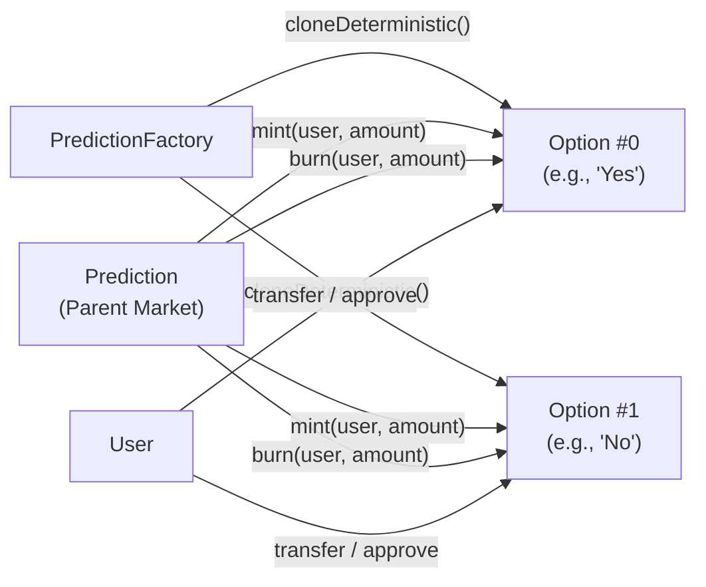

## Overview

`Option` is a minimal ERC-20 token representing a single outcome in a prediction market. Each `Prediction` market deploys one `Option` clone per outcome (e.g., "Yes" and "No" for a binary market). Option tokens are **minted** when users buy via `deposit()` and **burned** when users sell via `withdraw()` or redeem via `claimAll()`.

<Warning>
Option tokens are **not freely mintable**. Only the parent `Prediction` contract can call `mint()` and `burn()`. Any direct call from an external address will revert.
</Warning>

---

## Architecture



Each Option is an [EIP-1167](https://eips.ethereum.org/EIPS/eip-1167) minimal proxy clone, deployed alongside its parent market by the `PredictionFactory`.

---

## Interface

### `initialize`

Called once by the factory during market creation.

```solidity
/// @notice Initialize the option token
/// @param _name    Token name (e.g., "ETH $5k Yes")
/// @param _symbol  Token symbol (e.g., "YES")
/// @param _market  Parent Prediction contract (sole mint/burn authority)
function initialize(
    string calldata _name,
    string calldata _symbol,
    address _market
) external initializer
```

### `mint`

```solidity
/// @notice Mint option tokens to a user
/// @param to      Recipient address
/// @param amount  Token amount (base token decimals)
/// @dev Only callable by the parent Prediction contract
function mint(address to, uint256 amount) external onlyMarket
```

### `burn`

```solidity
/// @notice Burn option tokens from a user
/// @param from    Token holder address
/// @param amount  Token amount to burn
/// @dev Only callable by the parent Prediction contract
function burn(address from, uint256 amount) external onlyMarket
```

### `market`

```solidity
/// @notice Returns the parent Prediction contract address
function market() external view returns (address)
```

### Standard ERC-20

All standard ERC-20 functions are available — `transfer`, `approve`, `transferFrom`, `balanceOf`, `allowance`, `totalSupply`, `name`, `symbol`, `decimals`.

Option tokens use the **same decimal precision** as the market's base token (e.g., 6 for USDC).

---

## Inheritance

```solidity
contract Option is ERC20Upgradeable {
    address public market;

    modifier onlyMarket() {
        require(msg.sender == market, "Option: caller is not market");
        _;
    }

    function initialize(
        string calldata _name,
        string calldata _symbol,
        address _market
    ) external initializer {
        __ERC20_init(_name, _symbol);
        market = _market;
    }

    function mint(address to, uint256 amount) external onlyMarket {
        _mint(to, amount);
    }

    function burn(address from, uint256 amount) external onlyMarket {
        _burn(from, amount);
    }
}
```

---

## Events

Option tokens emit the standard ERC-20 events:

```solidity
event Transfer(address indexed from, address indexed to, uint256 value);
event Approval(address indexed owner, address indexed spender, uint256 value);
```

Mint operations emit `Transfer(address(0), to, amount)`. Burn operations emit `Transfer(from, address(0), amount)`.

---

## Token Lifecycle

| Phase | Action | Option Token Effect |
|-------|--------|-------------------|
| **Buy** | User calls `prediction.deposit()` | `mint(user, received)` |
| **Sell** | User calls `prediction.withdraw()` | `burn(user, amount)` |
| **Trade** | User transfers on secondary market | Standard ERC-20 `transfer` |
| **Claim** | User calls `prediction.claimAll()` | `burn(user, balance)` for winning tokens |
| **Market Ends** | Losing tokens | Worthless (no burn needed; balance stays but has no redemption value) |

---

## Code Examples

### Read Option Balances

<CodeGroup>

```typescript viem
import { erc20Abi } from "viem";

const MARKET = "0x...";

// Get option token addresses from the market
const yesToken = await publicClient.readContract({
  address: MARKET,
  abi: predictionAbi,
  functionName: "getOption",
  args: [0n],
});

const noToken = await publicClient.readContract({
  address: MARKET,
  abi: predictionAbi,
  functionName: "getOption",
  args: [1n],
});

// Read balances
const yesBalance = await publicClient.readContract({
  address: yesToken,
  abi: erc20Abi,
  functionName: "balanceOf",
  args: [userAddress],
});

console.log("Yes tokens:", formatUnits(yesBalance, 6));
```

```typescript ethers.js
const yesToken = await market.getOption(0);
const noToken = await market.getOption(1);

const yes = new ethers.Contract(yesToken, erc20Abi, provider);
const no = new ethers.Contract(noToken, erc20Abi, provider);

const yesBalance = await yes.balanceOf(userAddress);
const noBalance = await no.balanceOf(userAddress);

console.log("Yes tokens:", ethers.formatUnits(yesBalance, 6));
console.log("No tokens:", ethers.formatUnits(noBalance, 6));
```

</CodeGroup>

### Transfer Option Tokens

Option tokens are standard ERC-20 — they can be freely transferred, approved, and used in DeFi protocols.

<CodeGroup>

```typescript viem
await walletClient.writeContract({
  address: yesToken,
  abi: erc20Abi,
  functionName: "transfer",
  args: [recipientAddress, parseUnits("50", 6)],
});
```

```typescript ethers.js
const tx = await yes.transfer(recipientAddress, ethers.parseUnits("50", 6));
await tx.wait();
```

</CodeGroup>

---

## CTF Migration

<Info>
PrometheX is migrating from individual ERC-20 Option tokens to the **Gnosis Conditional Token Framework (CTF)** using ERC-1155 multi-tokens. See the [CTF Migration Plan](/contracts/ctf-migration) for full details.
</Info>

### What Changes

| Aspect | Current (ERC-20) | Future (CTF / ERC-1155) |
|--------|------------------|-------------------------|
| Token standard | ERC-20 (one contract per outcome) | ERC-1155 (single contract, multiple token IDs) |
| Deployment cost | One clone per outcome | Shared CTF contract |
| Composability | Limited | Compatible with Polymarket, Gnosis ecosystem |
| Position splitting | Not supported | Native split/merge via CTF |
| Secondary markets | Per-token DEX listings | Unified marketplace |

### Developer Impact

- `getOption(index)` will return the CTF contract address for all options
- Token IDs will encode the market condition and outcome index
- `balanceOf(address, tokenId)` replaces per-contract `balanceOf(address)`
- Existing ERC-20 option tokens will be redeemable for CTF equivalents during migration
