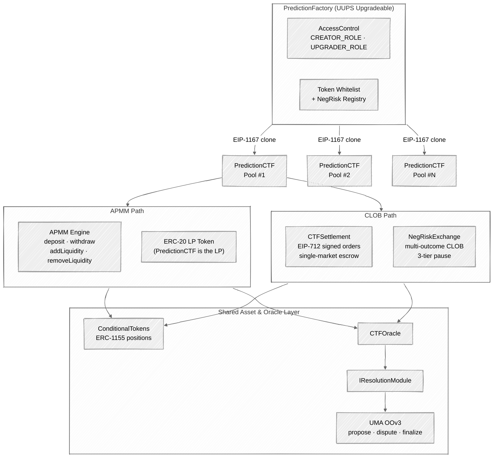
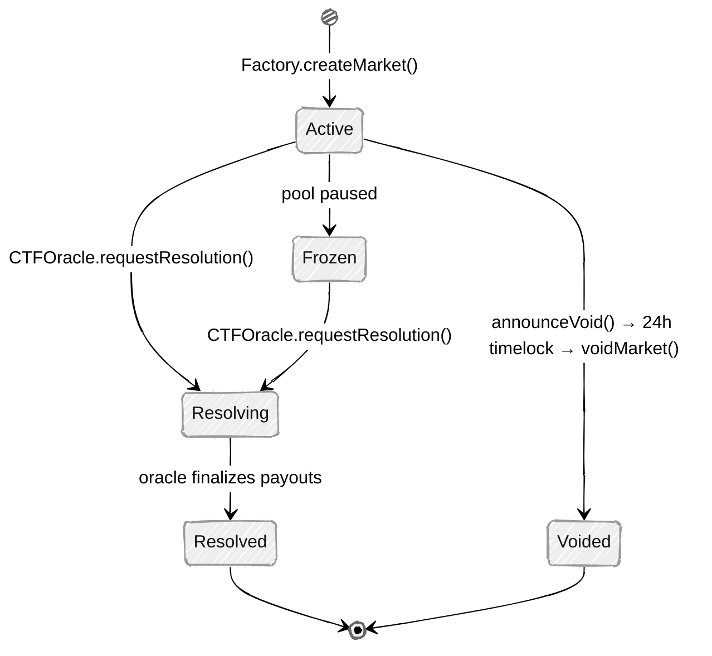

## Quick Reference

<CardGroup cols={3}>
  <Card title="PredictionFactory" icon="industry" href="/contracts/overview#contract-hierarchy">
    UUPS upgradeable factory. Creates events, deploys PredictionCTF clones, manages roles and token whitelist.
  </Card>
  <Card title="PredictionCTF" icon="chart-mixed" href="/contracts/prediction-ctf">
    APMM pool with ERC-20 LP tokens. Buy/sell outcome tokens via weighted constant-product pricing.
  </Card>
  <Card title="ConditionalTokens" icon="coins" href="/contracts/conditional-tokens">
    Gnosis CTF ERC-1155 asset layer. Split, merge, and redeem conditional position tokens.
  </Card>
  <Card title="CTFOracle" icon="scale-balanced" href="/contracts/resolution/overview">
    Oracle coordinator. Routes resolution requests to pluggable IResolutionModule implementations.
  </Card>
  <Card title="CTFSettlement" icon="arrows-left-right" href="/contracts/clob-settlement">
    CLOB escrow with EIP-712 signed orders. Three settlement types for order-book trading.
  </Card>
  <Card title="Deployed Addresses" icon="map-pin" href="/contracts/addresses">
    All contract addresses on Arbitrum Sepolia.
  </Card>
</CardGroup>

---

## Architecture

PrometheX V2 follows a **factory-clone** pattern built on the Gnosis Conditional Token Framework. A single UUPS-upgradeable `PredictionFactory` deploys EIP-1167 minimal-proxy clones of `PredictionCTF` for every new market. Two parallel trading channels — **APMM** (automated pool-based) and **CLOB** (order-book) — share a common ERC-1155 asset layer and modular oracle infrastructure.



### Key Design Decisions

| Decision | Rationale |
|----------|-----------|
| **EIP-1167 minimal-proxy clones** | Orders of magnitude cheaper than full contract deployments (~$0.01 vs. ~$5+ per market) |
| **UUPS upgradeable factory** | V2 uses UUPS (not TransparentUpgradeable) — simpler proxy pattern with upgrade logic in the implementation |
| **Dual trading channels (APMM + CLOB)** | APMM provides continuous automated pricing; CLOB enables tighter spreads and professional market-making |
| **Gnosis CTF ERC-1155** | Industry-standard conditional token layer, interoperable with Polymarket and the broader CTF ecosystem |
| **Pluggable resolution via CTFOracle** | Markets can use UMA oracle, manual fallback, or custom `IResolutionModule` implementations without changing core logic |
| **ERC-20 LP tokens on PredictionCTF** | The PredictionCTF contract itself is the LP token — composable with DeFi protocols |

---

## Contract Hierarchy

| Contract | Pattern | Proxy | Inherits |
|----------|---------|-------|----------|
| `PredictionFactory` | Singleton | UUPS Proxy | `AccessControlUpgradeable`, `ReentrancyGuard` |
| `PredictionCTF` | Clone (EIP-1167) | Not upgradeable | `ERC20Upgradeable`, `ERC1155Holder`, `Ownable2StepUpgradeable`, `PausableUpgradeable`, `ReentrancyGuard` |
| `ConditionalTokens` | Singleton | None | `ERC1155` |
| `CTFOracle` | Singleton | None | `Ownable2Step` |
| `CTFSettlement` | Singleton | None | `ERC1155Holder`, `Ownable2Step`, `Pausable`, `ReentrancyGuard`, `EIP712` |
| `CTFRouter` | Singleton | None | `ERC1155Holder`, `Ownable`, `ReentrancyGuard` |
| `IResolutionModule` | Interface | — | — |
| `UmaOOV3ResolutionModule` | Singleton | None | `IResolutionModule`, `OOv3CallbackRecipient` |
| `NegRiskRegistry` | Singleton | None | `AccessControl` |
| `NegRiskAdapter` | Singleton | None | `AccessControl`, `ERC1155Holder`, `ReentrancyGuard` |
| `NegRiskExchange` | Singleton | None | `ERC1155Holder`, `Ownable2Step`, `Pausable`, `ReentrancyGuard`, `EIP712` |

<Note>
PredictionCTF uses OpenZeppelin Upgradeable base contracts (e.g., `ERC20Upgradeable`) for the `initialize()` pattern required by EIP-1167 clones, but the clones themselves are **not** upgradeable. Only the PredictionFactory proxy supports UUPS upgrades.
</Note>

---

## Market Lifecycle

Every prediction market transitions through a strict state machine managed by the PredictionFactory, CTFOracle, and PredictionCTF contracts.



### State vs. Operations

| State | APMM | CLOB | Resolution | Redeem |
|-------|:----:|:----:|:----------:|:------:|
| **Active** | Allowed | Allowed | Proposable | — |
| **Frozen** | Blocked | Blocked | Proposable | — |
| **Resolving** | Closed | Restricted | UMA dispute window | — |
| **Resolved** | — | — | Terminal | Allowed |
| **Voided** | — | — | Terminal | Allowed (equal payout) |

<Tip>
The **Voided** state requires a 24-hour timelock: `announceVoid()` starts the timer, and `voidMarket()` can only execute after the delay expires. This protects liquidity providers from abrupt market cancellation.
</Tip>

---

## APMM Pricing (Summary)

The Automated Prediction Market Maker uses a **weighted constant-product** invariant, implemented in `PredictionCTF` with SD59x18 fixed-point arithmetic via the `APMMMath` library:

```
∏ rᵢʷⁱ = k
```

Where `rᵢ` is the reserve of outcome `i`, `wᵢ` is its weight, and `k` is the invariant constant. The instantaneous price of outcome `i` is:

```
Priceᵢ = wᵢ · (∑ rⱼ) / rᵢ
```

Prices always sum to 1 and directly represent outcome probabilities. For a deep dive into the math and implementation, see [PredictionCTF](/contracts/prediction-ctf).

---

## Further Reading

<CardGroup cols={2}>
  <Card title="PredictionCTF" icon="chart-mixed" href="/contracts/prediction-ctf">
    APMM pool mechanics, LP operations, and pricing implementation.
  </Card>
  <Card title="ConditionalTokens" icon="coins" href="/contracts/conditional-tokens">
    ERC-1155 positions: split, merge, redeem, and ID computation.
  </Card>
  <Card title="Oracle & Resolution" icon="scale-balanced" href="/contracts/resolution/overview">
    CTFOracle coordinator and UMA Optimistic Oracle integration.
  </Card>
  <Card title="CLOB Settlement" icon="arrows-left-right" href="/contracts/clob-settlement">
    EIP-712 order signing, settlement types, and escrow mechanics.
  </Card>
  <Card title="NegRisk" icon="layer-group" href="/contracts/negrisk">
    Multi-outcome events via correlated binary markets.
  </Card>
  <Card title="Deployed Addresses" icon="map-pin" href="/contracts/addresses">
    All V2 contract addresses on Arbitrum Sepolia.
  </Card>
</CardGroup>
