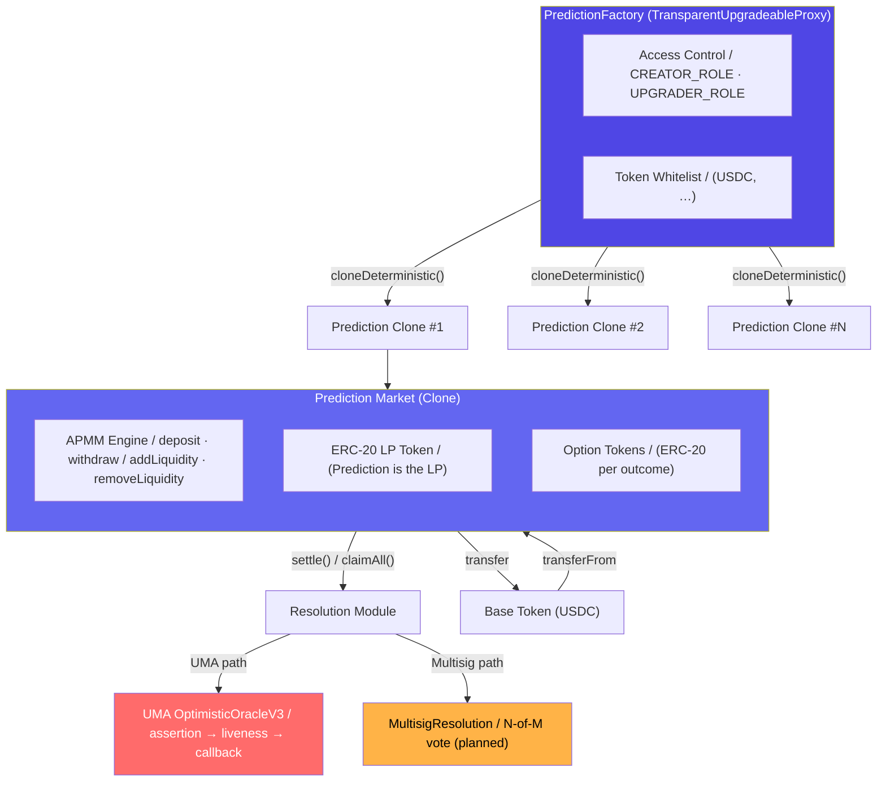
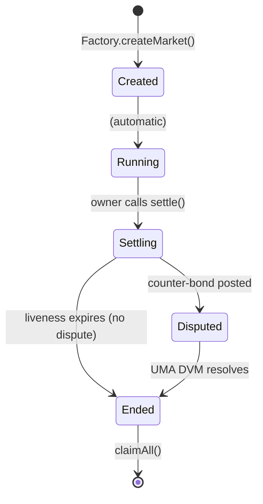

## Quick Reference

<CardGroup cols={3}>
  <Card title="PredictionFactory" icon="industry" href="/contracts/prediction-factory">
    Creates markets via `Clones.cloneDeterministic`. Manages token whitelist, roles, and upgrades.
  </Card>
  <Card title="Prediction" icon="chart-mixed" href="/contracts/prediction">
    APMM core — deposit, withdraw, add/remove liquidity, settle, and claim.
  </Card>
  <Card title="Option" icon="coins" href="/contracts/option">
    ERC-20 outcome tokens minted/burned exclusively by the parent Prediction contract.
  </Card>
  <Card title="Resolution Modules" icon="scale-balanced" href="/contracts/resolution/overview">
    Pluggable resolution: UMA Optimistic Oracle, Multisig, or custom modules.
  </Card>
  <Card title="Security" icon="shield-halved" href="/contracts/security">
    Access control roles, proxy upgrade process, and oracle security model.
  </Card>
  <Card title="Deployed Addresses" icon="map-pin" href="/contracts/addresses">
    All contract addresses on Arbitrum Sepolia and Arbitrum One.
  </Card>
</CardGroup>

---

## Architecture

PrometheX follows a **factory-clone** pattern. A single upgradeable `PredictionFactory` deploys minimal-proxy clones of the `Prediction` implementation for every new market. Each `Prediction` clone manages its own set of `Option` ERC-20 tokens and delegates outcome verification to a pluggable **resolution module**.



### Key Design Decisions

| Decision | Rationale |
|----------|-----------|
| **Minimal-proxy clones** | Orders of magnitude cheaper than deploying full contracts (~\$0.01 vs. ~\$5+ per market) |
| **Upgradeable factory** | New market logic can be rolled out without redeploying existing clones |
| **APMM invariant** | Constant-product pricing adapted for multi-outcome markets ensures automated, continuous pricing |
| **Pluggable resolution** | Markets can use UMA oracle, multisig, or custom modules without changing core logic |
| **ERC-20 LP tokens** | The Prediction contract itself is the LP token — composable with DeFi protocols |

---

## Contract Hierarchy

| Contract | Pattern | Proxy | Inherits |
|----------|---------|-------|----------|
| `PredictionFactory` | Singleton | `TransparentUpgradeableProxy` | `AccessControlUpgradeable`, `UUPSUpgradeable` |
| `Prediction` | Clone (EIP-1167) | Minimal proxy | `ERC20Upgradeable`, `Ownable2StepUpgradeable`, `ReentrancyGuardUpgradeable` |
| `Option` | Clone (EIP-1167) | Minimal proxy | `ERC20Upgradeable` |
| `IResolutionModule` | Interface | — | — |
| `UMAResolution` | Singleton | — | `IResolutionModule`, `OptimisticOracleV3CallbackRecipientInterface` |
| `MultisigResolution` | Singleton | — | `IResolutionModule` |

---

## Market Lifecycle

Every prediction market transitions through a strict state machine:



| State | Trading | LP Ops | Claims | Trigger |
|-------|:-------:|:------:|:------:|---------|
| **Created** | — | — | — | Market deployed |
| **Running** | Yes | Yes | — | Automatic on creation |
| **Settling** | — | — | — | `settle(optionIndex)` |
| **Disputed** | — | — | — | UMA dispute raised |
| **Ended** | — | — | Yes | Oracle callback or DVM vote |

---

## APMM Pricing (Summary)

The Automated Prediction Market Maker uses a **weighted constant-product** invariant:

```
∏ rᵢʷⁱ = k
```

Where `rᵢ` is the reserve of option `i`, `wᵢ` is its weight, and `k` is the invariant constant. The instantaneous price of option `i` is:

```
Priceᵢ = wᵢ · (∑ rⱼ) / rᵢ
```

For a deep dive, see [APMM Mathematics](/concepts/apmm). For implementation details, see [Prediction Contract](/contracts/prediction).

---

## Further Reading

<CardGroup cols={2}>
  <Card title="Prediction Factory" icon="industry" href="/contracts/prediction-factory">
    Factory deployment, roles, and upgrade mechanics.
  </Card>
  <Card title="Prediction Contract" icon="chart-mixed" href="/contracts/prediction">
    Full function reference with APMM math and code examples.
  </Card>
  <Card title="Option Token" icon="coins" href="/contracts/option">
    ERC-20 option tokens and CTF migration path.
  </Card>
  <Card title="Resolution Modules" icon="scale-balanced" href="/contracts/resolution/overview">
    UMA Oracle, Multisig, and the `IResolutionModule` interface.
  </Card>
  <Card title="CTF Migration" icon="arrow-right-arrow-left" href="/contracts/ctf-migration">
    ERC-20 to Gnosis Conditional Token Framework migration plan.
  </Card>
  <Card title="Security Model" icon="shield-halved" href="/contracts/security">
    Access control, upgrade governance, and threat model.
  </Card>
  <Card title="Audit Reports" icon="file-shield" href="/contracts/audit-reports">
    Audit history, planned audits, and responsible disclosure.
  </Card>
  <Card title="Deployed Addresses" icon="map-pin" href="/contracts/addresses">
    Live contract addresses on Arbitrum Sepolia and One.
  </Card>
</CardGroup>
