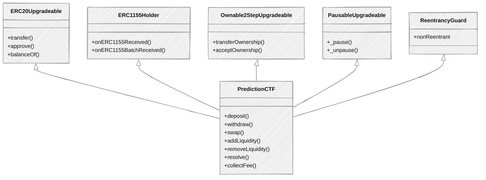
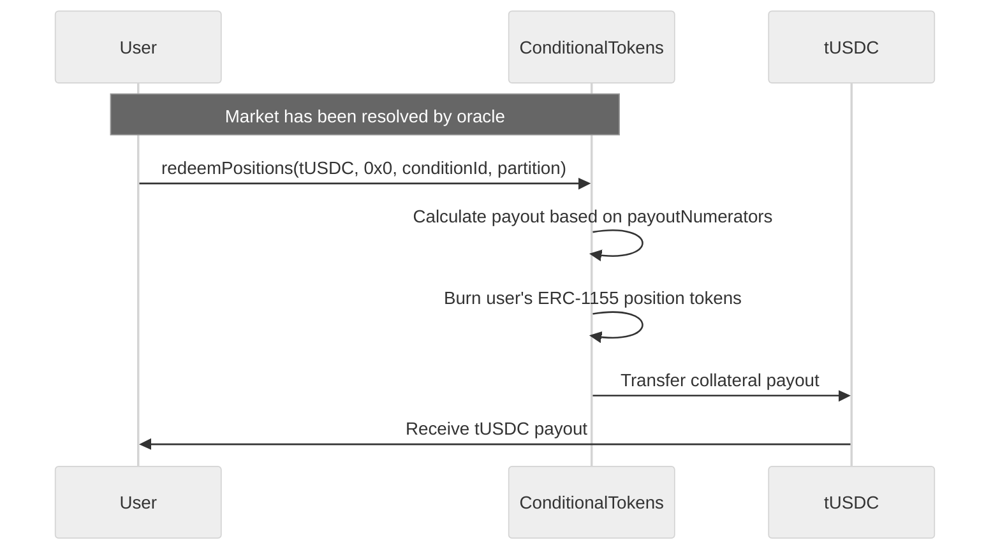

## Overview

`PredictionCTF` is the core APMM (Automated Prediction Market Maker) pool contract in PrometheX V2. Each instance is an **EIP-1167 minimal proxy clone** deployed by [`PredictionFactory`](/contracts/overview), making market creation extremely gas-efficient.

Key differences from the V1 `Prediction` contract:

- Uses **Gnosis CTF ERC-1155 conditional tokens** instead of ERC-20 Option tokens
- The contract itself is an **ERC-20 LP token** (symbol `ACTF`)
- After resolution, users redeem via `ConditionalTokens.redeemPositions()` — there is no `claimAll()` on the pool
- Fee distribution uses a **reward-per-share accumulator** model (similar to MasterChef)
- Flash-loan protection via `lastDepositBlock` tracking

<Info>
Although `PredictionCTF` inherits from `Upgradeable` base contracts, minimal proxies **cannot be upgraded**. The "Upgradeable" suffix exists solely because clone proxies require `initialize()` instead of constructors. A BeaconProxy migration is planned for future versions.
</Info>

---

## Inheritance

```solidity
contract PredictionCTF is
    ERC20Upgradeable,           // LP token (symbol: ACTF)
    ERC1155Holder,              // Hold CTF position tokens
    Ownable2StepUpgradeable,    // Two-step ownership transfer
    PausableUpgradeable,        // Emergency pause
    ReentrancyGuard             // Reentrancy protection
```



---

## State

### Status Enum

Unlike V1 (which had `Created`, `Running`, `Settling`, `Disputed`, `Ended`), V2 uses only two states:

```solidity
enum Status {
    Running,  // Trading and LP operations allowed
    Ended     // Market resolved or voided — only removeLiquidity allowed
}
```

### Key Storage Variables

| Variable | Type | Description |
|----------|------|-------------|
| `ctf` | `IConditionalTokens` | ConditionalTokens contract address |
| `conditionId` | `bytes32` | Gnosis CTF condition identifier |
| `positionIds` | `uint256[]` | ERC-1155 token IDs for each outcome |
| `partition` | `uint256[]` | Index sets defining outcome slots |
| `collateralToken` | `IERC20` | Base token (e.g., tUSDC) |
| `factor` | `SD59x18` | Decimal-scaling factor: `1e18 * 10^(18 - decimals)` |
| `state.weights` | `SD59x18[]` | APMM weight per outcome (sum to 1.0 for equal-weight) |
| `state.reserves` | `SD59x18[]` | APMM reserve per outcome (SD59x18 fixed-point) |
| `state.fee` | `uint256` | Trading fee in basis points (max 500 = 5%) |
| `state.rewardPerShare` | `uint256` | Fee accumulator per LP token |
| `status` | `Status` | Current market status |
| `assertTime` | `uint256` | Market expiry timestamp (deadline for trading) |
| `lastDepositBlock` | `mapping(address => uint256)` | Flash-loan protection tracker |
| `voidAnnouncedAt` | `uint256` | Timestamp when void was announced (0 if not announced) |
| `userInfo` | `mapping(address => UserInfo)` | Per-user fee tracking (amount, debt, claimable) |

### Constants

| Constant | Value | Description |
|----------|-------|-------------|
| `VOID_TIMELOCK` | `24 hours` | Delay between `announceVoid()` and `voidMarket()` |
| `DEAD_SHARES` | `1000` | LP tokens minted to `0xdead` on first deposit (inflation attack protection) |
| `MAX_FEE_BPS` | `500` | Maximum fee cap (5%) |
| `REWARD_PRECISION` | `1e20` | Scaling factor for reward-per-share accumulator |
| `BPS_DENOMINATOR` | `10_000` | Basis points denominator |

---

## Functions

### Trading

<Steps>
  <Step title="deposit — Buy Outcome Tokens">
    ```solidity
    function deposit(
        uint256 optionOut,     // Index of the outcome to buy (0 = Yes, 1 = No)
        uint256 delta,         // Amount of collateral to spend
        uint256 minReceive,    // Minimum outcome tokens to receive (slippage protection)
        uint256 deadline       // Transaction deadline timestamp
    ) public nonReentrant whenNotPaused returns (uint256 _out)
    ```

    Buys CTF position tokens with collateral. The collateral is split into CTF positions via `ConditionalTokens.splitPosition()`, then the APMM invariant determines how many outcome tokens the user receives.

    **Flow**: Transfer collateral in -> APMM price calculation -> split into CTF positions -> transfer outcome tokens to user.

    <Warning>
    Requires prior ERC-20 approval of `collateralToken` to the PredictionCTF pool address.
    </Warning>
  </Step>

  <Step title="withdraw — Sell Outcome Tokens">
    ```solidity
    function withdraw(
        uint256 optionIn,      // Index of the outcome to sell
        uint256 delta,         // Amount of outcome tokens to sell
        uint256 minReceive,    // Minimum collateral to receive (slippage protection)
        uint256 deadline       // Transaction deadline timestamp
    ) public nonReentrant whenNotPaused returns (uint256 _out)
    ```

    Sells CTF position tokens back for collateral. The pool receives position tokens, merges CTF positions back into collateral via `ConditionalTokens.mergePositions()`, and transfers collateral to the user.

    <Warning>
    Requires prior ERC-1155 `setApprovalForAll` on the ConditionalTokens contract, approving the PredictionCTF pool address.
    </Warning>
  </Step>

  <Step title="swap — Swap Between Outcomes">
    ```solidity
    function swap(
        uint256 optionOut,     // Index of the outcome to buy
        uint256 optionIn,      // Index of the outcome to sell
        uint256 delta,         // Amount of optionIn tokens to sell
        uint256 minReceive,    // Minimum optionOut tokens to receive
        uint256 deadline       // Transaction deadline timestamp
    ) public nonReentrant whenNotPaused returns (uint256 _out)
    ```

    Swaps between CTF positions in a single transaction (e.g., Yes to No). Internally performs a withdraw + deposit with a single state write for gas efficiency. Both withdraw and deposit fees are applied.
  </Step>
</Steps>

<AccordionGroup>
  <Accordion title="APMM Math Walkthrough — Buy (deposit)">
    When a user buys outcome `i` with `delta` collateral:

    1. **Fee deduction**: `netDelta = delta * (1 - fee / 10000)`
    2. **Add to reserves**: All reserves increase by `rawDelta` (collateral splits into all positions)
    3. **Compute output**: Using the weighted product invariant, solve for the amount of outcome `i` tokens:
       ```
       For each j != i:  new_rj = (rj + netDelta) * factor
       product = ∏ (new_rj)^wj / ∏ (rj * factor)^wj
       output_i = ri * factor - product^(1/wi)
       actual_out = output_i / factor + rawDelta
       ```
    4. **Remove from reserve**: `reserves[i] -= output`
    5. **CTF operations**: Split collateral into positions, merge back fee portion, transfer output tokens to user
  </Accordion>

  <Accordion title="APMM Math Walkthrough — Sell (withdraw)">
    When a user sells `delta` of outcome `i`:

    1. **Add to reserve**: `reserves[i] += delta`
    2. **Newton solver**: Compute how much collateral can be merged out using the `getAmountsOut` Newton iteration
    3. **Merge positions**: Reduce all reserves by output amount, merge CTF positions into collateral
    4. **Fee deduction**: `fee = output * fee / 10000`, `payout = output - fee`
    5. **Transfer**: Send collateral to user
  </Accordion>
</AccordionGroup>

### Liquidity

```solidity
function addLiquidity(
    uint256 liquidity,     // Amount of collateral to add
    address to,            // Recipient of LP tokens
    uint256 minReceive     // Minimum LP tokens to receive
) public nonReentrant whenNotPaused
```

Provides liquidity to the APMM pool. Collateral is split into CTF positions and deposited into the pool reserves. LP tokens are minted proportionally based on the invariant change.

<Note>
`addLiquidity` is restricted to **binary markets only** (2 outcomes). Multi-outcome pools have static liquidity after creation.
</Note>

```solidity
function removeLiquidity(
    uint256 liquidity,     // Amount of LP tokens to burn
    uint256 minReceive     // Minimum collateral to receive
) public nonReentrant
```

Withdraws liquidity from the pool. The LP receives a pro-rata share of reserves. Positions are merged back into collateral where possible; any excess (imbalanced) positions are transferred as raw ERC-1155 tokens.

**Behavior by status:**
- **Running** (binary only): Pro-rata reserve withdrawal with weight rebalancing
- **Ended**: Pro-rata withdrawal of all remaining positions (no weight rebalancing)

### Resolution

```solidity
function resolve() external
```

Marks the market as `Ended`. This is **permissionless** — anyone can call it once the CTF condition has been resolved by the oracle (`ctf.payoutDenominator(conditionId) > 0`). After resolution, users redeem their positions directly on `ConditionalTokens.redeemPositions()`.

### Void

```solidity
function announceVoid() external    // Owner only — starts 24h timelock
function voidMarket() external      // Owner only — executes void after timelock
```

The void mechanism allows the market owner to cancel a market with a mandatory 24-hour delay:

1. Owner calls `announceVoid()` — records `voidAnnouncedAt` timestamp
2. After 24 hours, owner calls `voidMarket()` — sets status to `Ended`
3. LPs can then `removeLiquidity()` to exit with their pro-rata share

<Warning>
Void does not resolve the CTF condition. LPs receive their share of raw CTF positions (which can later be redeemed if the condition is resolved with equal payouts, or merged back into collateral).
</Warning>

### Admin

```solidity
function pause() external     // Owner only — pauses deposit, withdraw, swap, addLiquidity
function unpause() external   // Owner only — resumes operations
function setFee(uint256 newFee) external  // Owner only — update fee (max 500 bps)
```

### Fee Distribution

```solidity
function collectFee() public nonReentrant
function pendingReward(address user) public view returns (uint256)
```

Trading fees are accumulated in a `rewardPerShare` accumulator (MasterChef-style). LP holders can call `collectFee()` to claim their share of accumulated fees in collateral tokens. The `pendingReward` view function shows unclaimed fees for a given address.

<Note>
`collectFee()` enforces flash-loan protection: it reverts if called in the same block as `addLiquidity`.
</Note>

### View Functions

| Function | Signature | Description |
|----------|-----------|-------------|
| `price` | `price(uint256 option) → uint256` | APMM spot price for an outcome (18-decimal) |
| `getAmountOut` | `getAmountOut(uint256 optionOut, uint256 delta) → SD59x18` | Quote: tokens out for a given deposit |
| `getAmountsOut` | `getAmountsOut(SD59x18[] x) → SD59x18` | Quote: collateral out for selling a basket of positions |
| `weights` | `weights(uint256 index) → SD59x18` | Weight for outcome at index |
| `reserves` | `reserves(uint256 index) → SD59x18` | Reserve for outcome at index |
| `getPositionId` | `getPositionId(uint256 index) → uint256` | ERC-1155 token ID for outcome at index |
| `getTokenId` | `getTokenId(uint256 index) → uint256` | Alias for `getPositionId` |
| `getPartition` | `getPartition() → uint256[]` | Index set partition array |
| `numOutcomes` | `numOutcomes() → uint256` | Number of outcomes |
| `pendingReward` | `pendingReward(address user) → uint256` | Unclaimed fee rewards for a user |
| `decimals` | `decimals() → uint8` | LP token decimals (matches collateral) |

---

## Events

```solidity
// Emitted on addLiquidity
event LiquidityAdded(
    address user,             // Caller who provided collateral
    address to,               // Recipient of LP tokens
    uint256 amount,           // Collateral amount deposited
    uint256 lpAmount          // LP tokens minted
);

// Emitted on removeLiquidity
event LiquidityRemoved(
    address user,             // LP token holder
    uint256 amount,           // Collateral returned (merged positions)
    uint256 lpAmount,         // LP tokens burned
    uint256[] excessPositions // Excess CTF tokens per outcome (imbalanced)
);

// Emitted on deposit (buy)
event Deposited(
    address user,             // Buyer
    uint256 optionOut,        // Outcome index purchased
    uint256 amountIn,         // Collateral spent
    uint256 amountOut         // Outcome tokens received
);

// Emitted on withdraw (sell)
event Withdrawn(
    address user,             // Seller
    uint256 optionIn,         // Outcome index sold
    uint256 amountIn,         // Outcome tokens sold
    uint256 amountOut         // Collateral received (after fee)
);

// Emitted on swap
event Swapped(
    address user,             // Swapper
    uint256 optionIn,         // Outcome index sold
    uint256 optionOut,        // Outcome index bought
    uint256 amountIn,         // Tokens sold
    uint256 amountOut         // Tokens received
);

// Emitted when market transitions to Ended via resolve()
event MarketResolved();

// Emitted when market is voided via voidMarket()
event MarketVoided();

// Emitted on announceVoid()
event VoidAnnounced(uint256 timestamp);

// Emitted on setFee()
event FeeSet(uint256 oldFee, uint256 newFee);

// Emitted on collectFee()
event FeeCollected(address indexed collector, uint256 amount);
```

---

## APMM Pricing

PredictionCTF uses a **weighted constant-product** invariant adapted for prediction markets:

### Invariant

```
∏ rᵢʷⁱ = k
```

Where `rᵢ` is the reserve of outcome `i`, `wᵢ` is its weight, and `k` is the invariant constant preserved across trades.

### Spot Price

```
Priceᵢ = 1 / ∑ⱼ (wⱼ / wᵢ) · (rᵢ / rⱼ)
```

Prices are normalized to sum to 1.0 (probabilities), scaled by the `factor` for tokens with fewer than 18 decimals.

### Binary Market Example

Consider a Yes/No market with equal weights (0.5/0.5) and initial reserves of 1000 tUSDC each:

| State | Reserve Yes | Reserve No | Price Yes | Price No |
|-------|------------|-----------|-----------|----------|
| Initial | 1000 | 1000 | 0.50 | 0.50 |
| Buy 100 Yes | 918.2 | 1100 | 0.545 | 0.455 |
| Buy 200 more Yes | 783.5 | 1300 | 0.624 | 0.376 |

As users buy "Yes", the Yes reserve decreases and its price increases — reflecting higher implied probability.

### Fee Mechanics

Fees are deducted **before** the APMM calculation:

1. **On deposit (buy)**: `netDelta = rawDelta * (1 - fee/10000)`. The APMM calculates output using `netDelta` but adds `rawDelta` to reserves.
2. **On withdraw (sell)**: Fee is deducted from the collateral output. `payout = output - (output * fee / 10000)`.
3. **Fee accumulation**: Fees are converted to collateral and added to `rewardPerShare`. LP holders claim proportionally via `collectFee()`.

---

## Code Examples

### Contract Setup

<CodeGroup>
```typescript viem
import { createPublicClient, createWalletClient, http, parseAbi } from "viem";
import { arbitrumSepolia } from "viem/chains";
import { privateKeyToAccount } from "viem/accounts";

const POOL = "0x..."; // PredictionCTF pool address for a specific market
const CTF = "0xf5E0891F0f5ba4C2b6034720b444eb79926e1DF0";
const TUSDC = "0x52cb113e383c654fB78Ff56615ce3719193C6408";

const publicClient = createPublicClient({
  chain: arbitrumSepolia,
  transport: http(),
});

const account = privateKeyToAccount("0x...");
const walletClient = createWalletClient({
  account,
  chain: arbitrumSepolia,
  transport: http(),
});
```

```typescript ethers.js
import { ethers } from "ethers";

const POOL = "0x..."; // PredictionCTF pool address for a specific market
const CTF = "0xf5E0891F0f5ba4C2b6034720b444eb79926e1DF0";
const TUSDC = "0x52cb113e383c654fB78Ff56615ce3719193C6408";

const provider = new ethers.JsonRpcProvider(
  "https://sepolia-rollup.arbitrum.io/rpc"
);
const signer = new ethers.Wallet("0x...", provider);
```
</CodeGroup>

### 1. Buy Outcome Tokens

Approve tUSDC, then call `deposit` on the PredictionCTF pool.

<CodeGroup>
```typescript viem
import { parseUnits } from "viem";

const amount = parseUnits("100", 6); // 100 tUSDC
const optionOut = 0; // 0 = Yes
const minReceive = parseUnits("90", 18); // slippage tolerance
const deadline = BigInt(Math.floor(Date.now() / 1000) + 3600); // 1 hour

// Step 1: Approve tUSDC to the pool
const approveHash = await walletClient.writeContract({
  address: TUSDC,
  abi: parseAbi(["function approve(address,uint256) returns (bool)"]),
  functionName: "approve",
  args: [POOL, amount],
});
await publicClient.waitForTransactionReceipt({ hash: approveHash });

// Step 2: Buy outcome tokens
const depositHash = await walletClient.writeContract({
  address: POOL,
  abi: predictionCTFAbi,
  functionName: "deposit",
  args: [optionOut, amount, minReceive, deadline],
});
const receipt = await publicClient.waitForTransactionReceipt({
  hash: depositHash,
});
console.log("Bought outcome tokens:", receipt.transactionHash);
```

```typescript ethers.js
import { parseUnits } from "ethers";

const amount = parseUnits("100", 6); // 100 tUSDC
const optionOut = 0; // 0 = Yes
const minReceive = parseUnits("90", 18); // slippage tolerance
const deadline = BigInt(Math.floor(Date.now() / 1000) + 3600);

// Step 1: Approve tUSDC to the pool
const tusdc = new ethers.Contract(
  TUSDC,
  ["function approve(address,uint256) returns (bool)"],
  signer
);
const approveTx = await tusdc.approve(POOL, amount);
await approveTx.wait();

// Step 2: Buy outcome tokens
const pool = new ethers.Contract(POOL, predictionCTFAbi, signer);
const depositTx = await pool.deposit(optionOut, amount, minReceive, deadline);
const receipt = await depositTx.wait();
console.log("Bought outcome tokens:", receipt.hash);
```
</CodeGroup>

### 2. Sell Outcome Tokens

Approve CTF ERC-1155 tokens, then call `withdraw`.

<CodeGroup>
```typescript viem
const optionIn = 0; // Sell Yes tokens
const sellAmount = parseUnits("50", 18); // 50 outcome tokens
const minCollateral = parseUnits("40", 6); // min tUSDC to receive
const deadline = BigInt(Math.floor(Date.now() / 1000) + 3600);

// Step 1: Approve ERC-1155 (one-time per pool)
const approveHash = await walletClient.writeContract({
  address: CTF,
  abi: parseAbi([
    "function setApprovalForAll(address,bool)",
  ]),
  functionName: "setApprovalForAll",
  args: [POOL, true],
});
await publicClient.waitForTransactionReceipt({ hash: approveHash });

// Step 2: Sell outcome tokens
const withdrawHash = await walletClient.writeContract({
  address: POOL,
  abi: predictionCTFAbi,
  functionName: "withdraw",
  args: [optionIn, sellAmount, minCollateral, deadline],
});
const receipt = await publicClient.waitForTransactionReceipt({
  hash: withdrawHash,
});
console.log("Sold outcome tokens:", receipt.transactionHash);
```

```typescript ethers.js
const optionIn = 0; // Sell Yes tokens
const sellAmount = parseUnits("50", 18);
const minCollateral = parseUnits("40", 6);
const deadline = BigInt(Math.floor(Date.now() / 1000) + 3600);

// Step 1: Approve ERC-1155 (one-time per pool)
const ctf = new ethers.Contract(
  CTF,
  ["function setApprovalForAll(address,bool)"],
  signer
);
const approveTx = await ctf.setApprovalForAll(POOL, true);
await approveTx.wait();

// Step 2: Sell outcome tokens
const pool = new ethers.Contract(POOL, predictionCTFAbi, signer);
const withdrawTx = await pool.withdraw(
  optionIn, sellAmount, minCollateral, deadline
);
const receipt = await withdrawTx.wait();
console.log("Sold outcome tokens:", receipt.hash);
```
</CodeGroup>

### 3. Add Liquidity

<CodeGroup>
```typescript viem
const liquidity = parseUnits("500", 6); // 500 tUSDC
const minLpTokens = 0n; // set appropriate slippage in production

// Step 1: Approve tUSDC
const approveHash = await walletClient.writeContract({
  address: TUSDC,
  abi: parseAbi(["function approve(address,uint256) returns (bool)"]),
  functionName: "approve",
  args: [POOL, liquidity],
});
await publicClient.waitForTransactionReceipt({ hash: approveHash });

// Step 2: Add liquidity (LP tokens sent to your address)
const addHash = await walletClient.writeContract({
  address: POOL,
  abi: predictionCTFAbi,
  functionName: "addLiquidity",
  args: [liquidity, account.address, minLpTokens],
});
const receipt = await publicClient.waitForTransactionReceipt({
  hash: addHash,
});
console.log("Added liquidity:", receipt.transactionHash);
```

```typescript ethers.js
const liquidity = parseUnits("500", 6); // 500 tUSDC
const minLpTokens = 0n;

// Step 1: Approve tUSDC
const tusdc = new ethers.Contract(
  TUSDC,
  ["function approve(address,uint256) returns (bool)"],
  signer
);
const approveTx = await tusdc.approve(POOL, liquidity);
await approveTx.wait();

// Step 2: Add liquidity
const pool = new ethers.Contract(POOL, predictionCTFAbi, signer);
const addTx = await pool.addLiquidity(
  liquidity, await signer.getAddress(), minLpTokens
);
const receipt = await addTx.wait();
console.log("Added liquidity:", receipt.hash);
```
</CodeGroup>

### 4. Read Market State

<CodeGroup>
```typescript viem
// Get prices for all outcomes
const yesPrice = await publicClient.readContract({
  address: POOL,
  abi: predictionCTFAbi,
  functionName: "price",
  args: [0n], // Yes
});

const noPrice = await publicClient.readContract({
  address: POOL,
  abi: predictionCTFAbi,
  functionName: "price",
  args: [1n], // No
});

// Get reserves
const yesReserve = await publicClient.readContract({
  address: POOL,
  abi: predictionCTFAbi,
  functionName: "reserves",
  args: [0n],
});

const noReserve = await publicClient.readContract({
  address: POOL,
  abi: predictionCTFAbi,
  functionName: "reserves",
  args: [1n],
});

// Get number of outcomes
const outcomes = await publicClient.readContract({
  address: POOL,
  abi: predictionCTFAbi,
  functionName: "numOutcomes",
});

console.log(`Yes: ${yesPrice} | No: ${noPrice}`);
console.log(`Reserves — Yes: ${yesReserve} | No: ${noReserve}`);
console.log(`Outcomes: ${outcomes}`);
```

```typescript ethers.js
const pool = new ethers.Contract(POOL, predictionCTFAbi, provider);

// Get prices
const yesPrice = await pool.price(0);
const noPrice = await pool.price(1);

// Get reserves
const yesReserve = await pool.reserves(0);
const noReserve = await pool.reserves(1);

// Get number of outcomes
const outcomes = await pool.numOutcomes();

console.log(`Yes: ${yesPrice} | No: ${noPrice}`);
console.log(`Reserves — Yes: ${yesReserve} | No: ${noReserve}`);
console.log(`Outcomes: ${outcomes}`);
```
</CodeGroup>

### 5. Redeem After Resolution

After the market is resolved, users redeem their winning positions directly on the `ConditionalTokens` contract — **not** on the PredictionCTF pool.



<CodeGroup>
```typescript viem
// After resolution, redeem winning positions via ConditionalTokens
const conditionId = await publicClient.readContract({
  address: POOL,
  abi: predictionCTFAbi,
  functionName: "conditionId",
});

const partition = await publicClient.readContract({
  address: POOL,
  abi: predictionCTFAbi,
  functionName: "getPartition",
});

const redeemHash = await walletClient.writeContract({
  address: CTF,
  abi: conditionalTokensAbi,
  functionName: "redeemPositions",
  args: [
    TUSDC,                // collateralToken
    "0x" + "0".repeat(64), // parentCollectionId (bytes32(0) for root)
    conditionId,          // conditionId
    partition,            // indexSets — e.g., [1, 2] for binary
  ],
});
const receipt = await publicClient.waitForTransactionReceipt({
  hash: redeemHash,
});
console.log("Redeemed positions:", receipt.transactionHash);
```

```typescript ethers.js
const pool = new ethers.Contract(POOL, predictionCTFAbi, provider);
const ctf = new ethers.Contract(CTF, conditionalTokensAbi, signer);

// Read market parameters
const conditionId = await pool.conditionId();
const partition = await pool.getPartition();

// Redeem winning positions
const redeemTx = await ctf.redeemPositions(
  TUSDC,                // collateralToken
  ethers.ZeroHash,      // parentCollectionId (bytes32(0))
  conditionId,          // conditionId
  partition             // indexSets
);
const receipt = await redeemTx.wait();
console.log("Redeemed positions:", receipt.hash);
```
</CodeGroup>

<Tip>
You do not need to know which outcome won. `redeemPositions` automatically calculates payouts based on the oracle-reported `payoutNumerators`. If you hold losing tokens, they are simply burned with zero payout.
</Tip>

---

## Security Considerations

<AccordionGroup>
  <Accordion title="Flash-Loan Protection">
    The `lastDepositBlock` mapping tracks the block number of each user's most recent `addLiquidity` call. The `collectFee()` function reverts if called in the same block (`block.number <= lastDepositBlock[user]`), preventing attackers from flash-loaning collateral, adding liquidity, collecting accumulated fees, and removing liquidity in a single transaction.
  </Accordion>

  <Accordion title="First-Depositor Protection (DEAD_SHARES)">
    On the first `addLiquidity` call (during `initialize`), 1000 LP tokens are minted to the `0xdead` address. This prevents the classic share inflation attack where the first depositor can manipulate the LP token price by donating assets and diluting subsequent depositors.
  </Accordion>

  <Accordion title="Void Timelock">
    Market voiding requires a two-step process with a mandatory 24-hour delay:
    1. `announceVoid()` — sets `voidAnnouncedAt = block.timestamp`
    2. `voidMarket()` — requires `block.timestamp >= voidAnnouncedAt + 24 hours`

    This gives market participants time to react before a market is cancelled.
  </Accordion>

  <Accordion title="Reentrancy Guard">
    All state-changing functions (`deposit`, `withdraw`, `swap`, `addLiquidity`, `removeLiquidity`, `collectFee`) use OpenZeppelin's `ReentrancyGuard` modifier. This prevents reentrancy attacks during ERC-1155 callbacks (`onERC1155Received`).
  </Accordion>

  <Accordion title="Slippage Protection">
    Every trading and liquidity function includes a `minReceive` parameter. Transactions revert with `SlipTooMuch()` if the output falls below this threshold, protecting users from sandwich attacks and front-running.
  </Accordion>

  <Accordion title="Two-Step Ownership">
    Uses `Ownable2StepUpgradeable` — ownership transfer requires the new owner to explicitly call `acceptOwnership()`. This prevents accidental transfers to wrong addresses.
  </Accordion>

  <Accordion title="Fee Cap">
    The maximum trading fee is capped at 500 basis points (5%). The `setFee` function reverts with `FeeTooHigh()` if a higher value is provided.
  </Accordion>

  <Accordion title="Pausable">
    The owner can call `pause()` to immediately halt `deposit`, `withdraw`, `swap`, and `addLiquidity`. The `removeLiquidity` function is intentionally **not** pausable — LPs can always exit. `unpause()` resumes normal operation.
  </Accordion>

  <Accordion title="Fee-on-Transfer Token Rejection">
    Both `addLiquidity` and `deposit` verify that the actual token balance change matches the expected transfer amount. If there is a discrepancy (as with fee-on-transfer tokens), the transaction reverts with `FeeOnTransferNotSupported()`.
  </Accordion>
</AccordionGroup>
