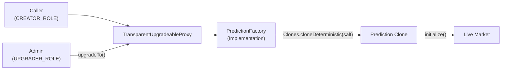

## Overview

`PredictionFactory` is the entry point for creating prediction markets on PrometheX. It is deployed behind an OpenZeppelin `TransparentUpgradeableProxy` and uses `Clones.cloneDeterministic` (EIP-1167) to deploy new `Prediction` market instances at gas costs orders of magnitude lower than full contract deployments.

<Info>
**Deployed at:** [`0x2c3E6717C1CC3787dBf420985188e2562F1aE62B`](https://sepolia.arbiscan.io/address/0x2c3E6717C1CC3787dBf420985188e2562F1aE62B) (Arbitrum Sepolia)
</Info>

---

## Architecture



### How Deterministic Cloning Works

Each market is deployed as an [EIP-1167 minimal proxy](https://eips.ethereum.org/EIPS/eip-1167) — a 45-byte contract that delegates all calls to the `Prediction` implementation. The `salt` parameter ensures deterministic addresses:

```solidity
address clone = Clones.cloneDeterministic(predictionImpl, salt);
```

The clone address can be precomputed off-chain:

```solidity
address predicted = Clones.predictDeterministicAddress(predictionImpl, salt, address(factory));
```

---

## Access Control

`PredictionFactory` uses OpenZeppelin's `AccessControlUpgradeable` with the following roles:

| Role | Constant | Capabilities |
|------|----------|-------------|
| **Default Admin** | `DEFAULT_ADMIN_ROLE` | Grant/revoke all other roles |
| **Creator** | `CREATOR_ROLE` | Call `createMarket()` to deploy new prediction markets |
| **Upgrader** | `UPGRADER_ROLE` | Upgrade the factory implementation via the proxy |

<Warning>
The `DEFAULT_ADMIN_ROLE` holder controls all role assignments. This address should be a multisig or timelock contract in production.
</Warning>

---

## Interface

### `initialize`

Called once after proxy deployment. Sets the implementation addresses and initial admin.

```solidity
function initialize(
    address _predictionImpl,   // Prediction logic contract
    address _optionImpl,       // Option token logic contract
    address _admin             // Initial DEFAULT_ADMIN_ROLE holder
) external initializer
```

### `createMarket`

Deploys a new `Prediction` clone and its associated `Option` tokens.

```solidity
function createMarket(
    string calldata question,          // Human-readable market question
    string[] calldata optionNames,     // Names for each outcome (e.g., ["Yes", "No"])
    uint256[] calldata weights,        // APMM price weights (SD59x18)
    uint256 fee,                       // Trading fee in basis points
    address baseToken,                 // Whitelisted base token (e.g., USDC)
    uint256 initialLiquidity,          // Initial liquidity deposit
    address resolutionModule,          // Resolution module address
    bytes calldata resolutionData      // Module-specific configuration
) external onlyRole(CREATOR_ROLE) returns (address market)
```

**Parameters:**

| Parameter | Type | Description |
|-----------|------|-------------|
| `question` | `string` | Market question text, also used as the UMA assertion claim |
| `optionNames` | `string[]` | Outcome labels; length determines the number of options |
| `weights` | `uint256[]` | Price weights in SD59x18 format; must sum to 1e18 |
| `fee` | `uint256` | Trading fee in basis points (e.g., 200 = 2%) |
| `baseToken` | `address` | Must be in the token whitelist |
| `initialLiquidity` | `uint256` | Seed liquidity in base token units (e.g., 1000e6 for 1000 USDC) |
| `resolutionModule` | `address` | Contract implementing `IResolutionModule` |
| `resolutionData` | `bytes` | ABI-encoded config for the resolution module |

**Returns:** The address of the newly deployed `Prediction` clone.

**Emits:** `MarketCreated(address indexed market, address indexed creator, string question)`

### `setTokenWhitelist`

Add or remove tokens from the approved base-token whitelist.

```solidity
function setTokenWhitelist(address token, bool approved) external onlyRole(DEFAULT_ADMIN_ROLE)
```

### `isTokenWhitelisted`

```solidity
function isTokenWhitelisted(address token) external view returns (bool)
```

### `predictMarketAddress`

Precompute the clone address for a given salt without deploying.

```solidity
function predictMarketAddress(bytes32 salt) external view returns (address)
```

---

## Events

```solidity
event MarketCreated(
    address indexed market,
    address indexed creator,
    string question
);

event TokenWhitelistUpdated(
    address indexed token,
    bool approved
);

event ImplementationUpdated(
    address indexed oldImpl,
    address indexed newImpl
);
```

---

## Upgrade Mechanism

The factory sits behind OpenZeppelin's `TransparentUpgradeableProxy`. Upgrades follow this process:

<Steps>
  <Step title="Propose upgrade">
    A holder of `UPGRADER_ROLE` prepares the new implementation contract and deploys it on-chain.
  </Step>
  <Step title="Upgrade transaction">
    The upgrader calls `upgradeTo(newImplementation)` on the proxy admin. This atomically swaps the implementation pointer.
  </Step>
  <Step title="Verification">
    After upgrade, verify the new implementation via Arbiscan or by calling a version getter.
  </Step>
</Steps>

<Note>
Existing `Prediction` clones are **not** affected by factory upgrades — they delegate to the `Prediction` implementation, not the factory. To upgrade market logic, deploy a new `Prediction` implementation and update the factory's stored implementation address. New markets will use the new logic; existing markets retain their original implementation.
</Note>

---

## Code Examples

### Create a Market

<CodeGroup>

```typescript viem
import { createWalletClient, http, parseUnits, encodeFunctionData } from "viem";
import { arbitrumSepolia } from "viem/chains";
import { factoryAbi } from "./abis/PredictionFactory";

const FACTORY = "0x2c3E6717C1CC3787dBf420985188e2562F1aE62B";
const TUSDC = "0x934E616cA9538397E3f9a12895C40ea2E8C45E48";
const UMA_MODULE = "0xD72b4002c472B7084A5A2D21450Ad8092b8E2FF6";

const client = createWalletClient({
  chain: arbitrumSepolia,
  transport: http(),
  account, // your account
});

// Approve USDC for initial liquidity
await client.writeContract({
  address: TUSDC,
  abi: erc20Abi,
  functionName: "approve",
  args: [FACTORY, parseUnits("1000", 6)],
});

// Create a binary market
const hash = await client.writeContract({
  address: FACTORY,
  abi: factoryAbi,
  functionName: "createMarket",
  args: [
    "Will ETH reach $5,000 by March 2026?", // question
    ["Yes", "No"],                            // optionNames
    [parseUnits("0.5", 18), parseUnits("0.5", 18)], // equal weights
    200n,                                     // 2% fee
    TUSDC,                                    // base token
    parseUnits("1000", 6),                    // 1,000 USDC initial liquidity
    UMA_MODULE,                               // resolution module
    "0x",                                     // no extra resolution data
  ],
});

console.log("Market creation tx:", hash);
```

```typescript ethers.js
import { ethers } from "ethers";
import { PredictionFactory__factory } from "./typechain";

const FACTORY = "0x2c3E6717C1CC3787dBf420985188e2562F1aE62B";
const TUSDC = "0x934E616cA9538397E3f9a12895C40ea2E8C45E48";
const UMA_MODULE = "0xD72b4002c472B7084A5A2D21450Ad8092b8E2FF6";

const provider = new ethers.JsonRpcProvider("https://sepolia-rollup.arbitrum.io/rpc");
const signer = new ethers.Wallet(process.env.PRIVATE_KEY!, provider);

const factory = PredictionFactory__factory.connect(FACTORY, signer);
const usdc = new ethers.Contract(TUSDC, ["function approve(address,uint256)"], signer);

// Approve USDC
await usdc.approve(FACTORY, ethers.parseUnits("1000", 6));

// Create market
const tx = await factory.createMarket(
  "Will ETH reach $5,000 by March 2026?",
  ["Yes", "No"],
  [ethers.parseUnits("0.5", 18), ethers.parseUnits("0.5", 18)],
  200,                                    // 2% fee
  TUSDC,
  ethers.parseUnits("1000", 6),           // 1,000 USDC
  UMA_MODULE,
  "0x",
);

const receipt = await tx.wait();
console.log("Market created at:", receipt?.logs);
```

```solidity Solidity
// SPDX-License-Identifier: MIT
pragma solidity ^0.8.20;

import {IPredictionFactory} from "./interfaces/IPredictionFactory.sol";
import {IERC20} from "@openzeppelin/contracts/token/ERC20/IERC20.sol";

contract MarketCreator {
    IPredictionFactory public immutable factory;
    IERC20 public immutable usdc;

    constructor(address _factory, address _usdc) {
        factory = IPredictionFactory(_factory);
        usdc = IERC20(_usdc);
    }

    function createBinaryMarket(
        string calldata question,
        uint256 initialLiquidity,
        address resolutionModule
    ) external returns (address market) {
        usdc.transferFrom(msg.sender, address(this), initialLiquidity);
        usdc.approve(address(factory), initialLiquidity);

        string[] memory names = new string[](2);
        names[0] = "Yes";
        names[1] = "No";

        uint256[] memory weights = new uint256[](2);
        weights[0] = 0.5e18;
        weights[1] = 0.5e18;

        market = factory.createMarket(
            question,
            names,
            weights,
            200,                    // 2% fee
            address(usdc),
            initialLiquidity,
            resolutionModule,
            ""
        );
    }
}
```

</CodeGroup>

### Predict a Clone Address

<CodeGroup>

```typescript viem
import { readContract } from "viem/actions";

const predictedAddress = await readContract(client, {
  address: FACTORY,
  abi: factoryAbi,
  functionName: "predictMarketAddress",
  args: [salt], // bytes32 salt
});

console.log("Market will deploy at:", predictedAddress);
```

```typescript ethers.js
const predictedAddress = await factory.predictMarketAddress(salt);
console.log("Market will deploy at:", predictedAddress);
```

</CodeGroup>
