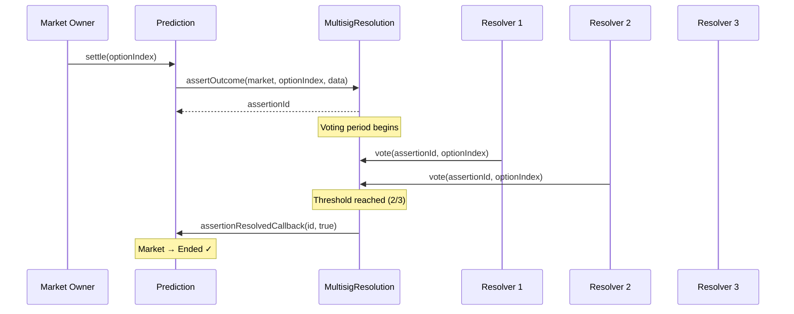

<Warning>
`MultisigResolution` is **in active development** and not yet deployed. This document describes the planned design. Interfaces may change before release.
</Warning>

## Overview

The `MultisigResolution` module enables trusted N-of-M voting for market resolution. Instead of relying on economic bonds and liveness periods (as with [UMA Oracle](/contracts/resolution/uma-oracle)), a predefined group of resolvers votes directly on the winning outcome. Once a threshold of votes is reached, the market settles immediately.

This module is designed for scenarios where decentralized dispute resolution is unnecessary or impractical — private markets, white-label deployments, internal prediction markets, and fast-resolution use cases.

---

## Architecture



---

## Planned Interface

```solidity
// SPDX-License-Identifier: MIT
pragma solidity ^0.8.20;

import {IResolutionModule} from "../IResolutionModule.sol";

/// @title MultisigResolution
/// @notice N-of-M multisig voting for market resolution
/// @dev Implements IResolutionModule
contract MultisigResolution is IResolutionModule {
    struct Config {
        address[] resolvers;    // Authorized voter addresses
        uint256 threshold;      // Minimum votes required (N)
        uint256 votingPeriod;   // Maximum time for voting (seconds)
    }

    struct Assertion {
        address market;
        uint256 proposedOutcome;
        uint256 votingDeadline;
        bool resolved;
        uint256 finalOutcome;
        mapping(address => bool) hasVoted;
        mapping(uint256 => uint256) voteCounts;  // optionIndex => vote count
    }

    /// @notice Configuration per market
    mapping(address => Config) public marketConfigs;

    /// @notice Active assertions
    mapping(bytes32 => Assertion) public assertions;

    /// @notice Assert an outcome — starts the voting period
    function assertOutcome(
        address market,
        uint256 optionIndex,
        bytes calldata data         // ABI-encoded Config for first-time setup
    ) external override returns (bytes32 assertionId);

    /// @notice Cast a vote for an outcome
    /// @param assertionId  The active assertion
    /// @param optionIndex  The outcome to vote for
    /// @dev Caller must be in the resolvers list. Each resolver votes once.
    function vote(
        bytes32 assertionId,
        uint256 optionIndex
    ) external;

    /// @notice Force-resolve after voting period expires
    /// @dev Resolves with the option that has the most votes (plurality)
    function resolveAssertion(bytes32 assertionId) external override;

    function isResolved(bytes32 assertionId) external view override returns (bool);
    function getOutcome(bytes32 assertionId) external view override returns (uint256);
}
```

---

## Configuration

### Parameters

| Parameter | Type | Description | Example |
|-----------|------|-------------|---------|
| `resolvers` | `address[]` | Authorized voter addresses | 5 addresses |
| `threshold` | `uint256` | Minimum votes to resolve (N of M) | 3 |
| `votingPeriod` | `uint256` | Maximum voting window (seconds) | 86400 (24h) |

### Configuration Flow

The multisig config is passed as `resolutionData` when creating a market:

```solidity
bytes memory resolutionData = abi.encode(
    MultisigResolution.Config({
        resolvers: [addr1, addr2, addr3, addr4, addr5],
        threshold: 3,          // 3-of-5
        votingPeriod: 86400    // 24 hours
    })
);

factory.createMarket(
    "Will product X launch by Q2?",
    ["Yes", "No"],
    weights,
    fee,
    baseToken,
    initialLiquidity,
    multisigModuleAddress,
    resolutionData             // Config encoded here
);
```

---

## Resolution Rules

| Rule | Behavior |
|------|----------|
| **Threshold reached** | Market resolves immediately with the threshold outcome |
| **Voting period expires** | Plurality wins (most votes). Ties go to the proposed outcome. |
| **Single resolver votes twice** | Reverts — one vote per resolver |
| **Non-resolver votes** | Reverts — only listed resolvers can vote |
| **Vote for non-existent option** | Reverts — option index must be valid |

---

## Use Cases

<AccordionGroup>
  <Accordion title="Internal company prediction markets">
    A company runs internal prediction markets for project timelines. A panel of 5 senior engineers serves as resolvers (3-of-5 threshold). Markets resolve within hours instead of waiting for oracle liveness periods.
  </Accordion>
  <Accordion title="White-label deployments">
    A partner platform deploys PrometheX markets with their own resolver set. The platform operator controls resolution, accepting the trust assumption for faster UX.
  </Accordion>
  <Accordion title="Sports / event markets with trusted data sources">
    Markets for sporting events use a panel of recognized data providers (e.g., AP, Reuters, ESPN) as resolvers. Results are settled minutes after the event ends.
  </Accordion>
  <Accordion title="Hybrid: Multisig with UMA fallback">
    A market uses multisig as the primary resolution module but can be escalated to UMA Oracle if resolvers fail to reach consensus within the voting period. (Planned feature.)
  </Accordion>
</AccordionGroup>

---

## Comparison with UMA Oracle

| Aspect | MultisigResolution | UMA Oracle |
|--------|-------------------|------------|
| **Speed** | Minutes (once threshold met) | 2h+ (liveness) to days (DVM) |
| **Cost** | Gas only | Bond + potential oracle fees |
| **Trust model** | Trust resolvers (N-of-M) | Trust economic rationality |
| **Dispute** | No formal dispute process | Permissionless bond-based disputes |
| **Censorship resistance** | Low (resolvers can collude) | High (permissionless disputes + DVM) |
| **Setup complexity** | Simple (list addresses + threshold) | Requires bond configuration + UMA integration |

---

## Security Considerations

<Warning>
Multisig resolution introduces a **trust assumption**: the majority of resolvers must be honest. Unlike the UMA oracle, there is no economic penalty for incorrect resolution and no permissionless dispute mechanism.
</Warning>

**Mitigations:**

- Use a sufficiently high threshold (e.g., 3-of-5 or 4-of-7)
- Distribute resolver keys across independent parties
- Consider hardware wallets or institutional custody for resolver keys
- Implement monitoring and alerting for unexpected resolution patterns
- For high-value markets, prefer UMA Oracle or a hybrid approach

---

## Roadmap

| Milestone | Status | Target |
|-----------|--------|--------|
| Interface design | Complete | — |
| Implementation | In progress | Q1 2026 |
| Testnet deployment | Pending | Q1 2026 |
| Audit | Pending | Q2 2026 |
| Mainnet deployment | Pending | Q2 2026 |
