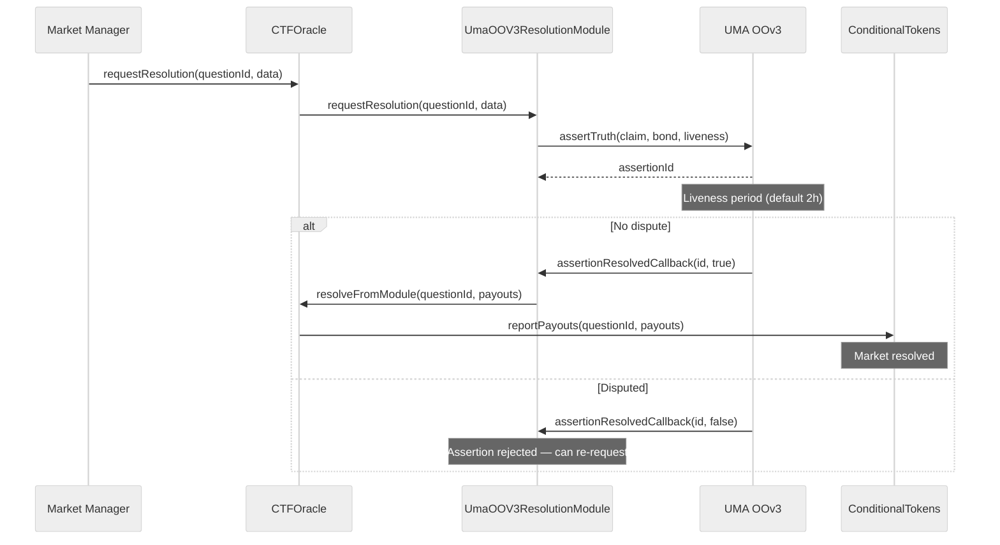

## Overview

PrometheX V2 uses **CTFOracle** as the central resolution coordinator for all prediction markets. Unlike V1 where each Prediction contract directly implemented UMA callbacks, V2 decouples resolution into a coordinator + pluggable module architecture:

- **CTFOracle** is the sole "oracle address" registered in every CTF condition — it is the _only_ contract that can call `ConditionalTokens.reportPayouts()`
- Resolution modules are **pluggable** via the `IResolutionModule` interface — swap resolution backends without redeploying markets
- CTFOracle routes resolution requests to the registered module and receives results back via `resolveFromModule()`
- A **manual fallback** path exists for owner emergency resolution (must be explicitly enabled)

<Info>
This is a significant architectural change from V1, where the Prediction contract itself was both the market and the oracle callback recipient. In V2, CTFOracle acts as a singleton coordinator that all markets share.
</Info>

---

## CTFOracle

CTFOracle is a singleton coordinator contract that bridges resolution modules to the Gnosis Conditional Token Framework. It is the oracle address encoded into all CTF `conditionId` values — making it the only contract authorized to report payouts.

<Info>
**Deployed address:** [`0x982e18db6837D55297c39926dE86ae560cd96f99`](https://sepolia.arbiscan.io/address/0x982e18db6837D55297c39926dE86ae560cd96f99) (Arbitrum Sepolia)
</Info>

### Responsibilities

1. **Prepare markets** — Register a question with the CTF (`prepareCondition`) and notify the active resolution module
2. **Route resolution requests** — Forward `requestResolution()` calls to the registered `IResolutionModule` for each question
3. **Receive resolution results** — Accept `resolveFromModule()` callbacks from modules and call `ConditionalTokens.reportPayouts()`
4. **Manual fallback** — Owner can resolve directly via `resolve()` when `manualFallbackEnabled` is true
5. **Access control** — Owner and authorized market managers can prepare and request resolution

### Key Functions

```solidity
/// @notice Prepare a market condition under this oracle and register it in the active resolution module.
/// @param questionId The question identifier used by CTF.
/// @param outcomeSlotCount Number of outcomes.
/// @param moduleData Arbitrary module config payload (module-specific encoding).
function prepareMarket(
    bytes32 questionId,
    uint256 outcomeSlotCount,
    bytes calldata moduleData
) external onlyOwnerOrManager;

/// @notice Request module-driven resolution (e.g., UMA OO assertion) for a prepared market.
function requestResolution(
    bytes32 questionId,
    bytes calldata moduleData
) external onlyOwnerOrManager;

/// @notice Module callback entrypoint to finalize payout vector on CTF.
function resolveFromModule(
    bytes32 questionId,
    uint256[] calldata payouts
) external; // only callable by the registered module for this question

/// @notice Manual resolution fallback (owner only, requires manualFallbackEnabled).
function resolve(
    bytes32 questionId,
    uint256[] calldata payouts
) external onlyOwner;

/// @notice Set the resolution module address.
function setResolutionModule(address module) external onlyOwner;

/// @notice Enable or disable manual fallback resolution.
function setManualFallbackEnabled(bool enabled) external onlyOwner;

/// @notice Authorize or revoke a market manager address.
function setMarketManager(address manager, bool allowed) external onlyOwner;
```

### State Tracking

CTFOracle maintains per-question state to enforce security invariants:

| Mapping | Purpose |
|---------|---------|
| `outcomeSlotCountByQuestion` | Validates payout array length matches the prepared condition |
| `resolutionModuleByQuestion` | Ensures only the module that prepared the market can resolve it |
| `marketManagers` | Tracks authorized callers for `prepareMarket` and `requestResolution` |

### Events

| Event | Emitted When |
|-------|-------------|
| `MarketPrepared(questionId, outcomeSlotCount)` | A new condition is prepared via `prepareMarket` |
| `ResolutionRequested(questionId)` | Resolution is requested via `requestResolution` |
| `ConditionResolvedByModule(questionId, payouts, module)` | Module resolves via `resolveFromModule` |
| `ConditionResolved(questionId, payouts)` | Owner resolves via manual fallback |
| `ResolutionModuleUpdated(oldModule, newModule)` | Resolution module address changed |
| `ManualFallbackUpdated(enabled)` | Manual fallback toggled |
| `MarketManagerUpdated(manager, allowed)` | Market manager authorization changed |

---

## IResolutionModule Interface

The V2 resolution module interface is deliberately minimal. Modules receive lifecycle notifications from CTFOracle and call back via `resolveFromModule()` when ready:

```solidity
interface IResolutionModule {
    /// @notice Called by CTFOracle when a market is prepared.
    /// @param questionId Market question identifier.
    /// @param outcomeSlotCount Number of outcome slots in the condition.
    /// @param moduleData Arbitrary module config payload.
    function onMarketPrepared(
        bytes32 questionId,
        uint256 outcomeSlotCount,
        bytes calldata moduleData
    ) external;

    /// @notice Called by CTFOracle to initiate resolution for a market.
    /// @param questionId Market question identifier.
    /// @param moduleData Module-specific resolution data (e.g., proposed outcome).
    function requestResolution(
        bytes32 questionId,
        bytes calldata moduleData
    ) external;
}
```

<Note>
This is significantly simpler than the V1 interface, which included `assertOutcome`, `resolveAssertion`, `isResolved`, and `getOutcome`. In V2, the module manages its own internal state and calls back to CTFOracle when resolution is complete — there is no need for external polling.
</Note>

---

## Resolution Flow

The V2 resolution flow routes through CTFOracle as the central coordinator:



<Steps>
  <Step title="Prepare Market">
    CTFOracle calls `CTF.prepareCondition()` to create the condition on-chain, then notifies the resolution module via `onMarketPrepared()`. The module stores any market-specific configuration (e.g., claim text for UMA assertions).
  </Step>
  <Step title="Request Resolution">
    A market manager or owner calls `CTFOracle.requestResolution()`. CTFOracle forwards the request to the registered module. For UMA, the `moduleData` encodes the proposed winning outcome index.
  </Step>
  <Step title="Module Processes">
    The module handles the resolution lifecycle internally (e.g., UMA assertion + liveness + dispute). When resolution is finalized, the module constructs a payout vector and calls `CTFOracle.resolveFromModule()`.
  </Step>
  <Step title="Payout Reported">
    CTFOracle validates the payout array (correct length, non-zero sum) and calls `ConditionalTokens.reportPayouts()`. The CTF condition is now resolved, and token holders can redeem their positions.
  </Step>
</Steps>

---

## Available Modules

<CardGroup cols={2}>
  <Card title="UMA Optimistic Oracle" icon="eye" href="/contracts/resolution/uma-oracle">
    Default resolution module for all markets. Leverages UMA's OptimisticOracleV3 for decentralized verification.
    - Bond-based economic security
    - Configurable liveness period
    - Permissionless disputes with DVM escalation
  </Card>
  <Card title="Manual Fallback" icon="shield-halved">
    Emergency resolution mechanism built into CTFOracle. The contract owner can resolve any prepared market directly by calling `resolve(questionId, payouts)`.
    - Requires `manualFallbackEnabled = true`
    - Owner-only access (Ownable2Step)
    - No liveness or dispute period
    - Intended for emergency situations only
  </Card>
</CardGroup>

### Module Comparison

| Feature | UMA Oracle | Manual Fallback |
|---------|:----------:|:---------------:|
| Decentralized | Yes | No |
| Resolution speed | 2h+ (liveness) | Immediate |
| Dispute mechanism | Economic (bonds + DVM) | None |
| Cost | Bond required | Gas only |
| Trust assumption | Economic rationality | Owner honesty |
| Best for | Public markets | Emergency recovery |

---

## Implementing a Custom Module

To create a custom resolution module for V2, implement the `IResolutionModule` interface and call back to `CTFOracle.resolveFromModule()` when your resolution logic completes:

```solidity
// SPDX-License-Identifier: MIT
pragma solidity ^0.8.20;

import {IResolutionModule} from "./IResolutionModule.sol";

interface ICTFOracleCoordinator {
    function resolveFromModule(bytes32 questionId, uint256[] calldata payouts) external;
}

contract CustomResolutionModule is IResolutionModule {
    address public immutable coordinator;

    struct MarketInfo {
        bool exists;
        uint256 outcomeSlotCount;
    }

    mapping(bytes32 => MarketInfo) public markets;

    modifier onlyCoordinator() {
        require(msg.sender == coordinator, "Only coordinator");
        _;
    }

    constructor(address _coordinator) {
        coordinator = _coordinator;
    }

    /// @notice Called by CTFOracle when a market is prepared.
    function onMarketPrepared(
        bytes32 questionId,
        uint256 outcomeSlotCount,
        bytes calldata /* moduleData */
    ) external onlyCoordinator {
        markets[questionId] = MarketInfo({
            exists: true,
            outcomeSlotCount: outcomeSlotCount
        });
    }

    /// @notice Called by CTFOracle to initiate resolution.
    function requestResolution(
        bytes32 questionId,
        bytes calldata moduleData
    ) external onlyCoordinator {
        MarketInfo memory info = markets[questionId];
        require(info.exists, "Market not prepared");

        uint256 winningOutcome = abi.decode(moduleData, (uint256));
        require(winningOutcome < info.outcomeSlotCount, "Invalid outcome");

        // --- Your resolution logic here ---
        // e.g., start a governance vote, query an external oracle, etc.

        // When resolution is finalized, construct payout vector and call back:
        uint256[] memory payouts = new uint256[](info.outcomeSlotCount);
        payouts[winningOutcome] = 1;
        ICTFOracleCoordinator(coordinator).resolveFromModule(questionId, payouts);
    }
}
```

<Warning>
Custom resolution modules are **security-critical infrastructure**. A malicious or buggy module can settle markets with incorrect payouts, resulting in irreversible loss of funds. The module is the only address that can call `resolveFromModule()` for markets it prepared. Always conduct a thorough audit before deploying a custom module to production.
</Warning>

---

## Further Reading

<CardGroup cols={3}>
  <Card title="UMA Oracle Integration" icon="eye" href="/contracts/resolution/uma-oracle">
    Full UMA OptimisticOracleV3 integration guide with bond economics, dispute flow, and code examples.
  </Card>
  <Card title="PredictionCTF" icon="chart-bar" href="/contracts/prediction-ctf">
    APMM pool contract — how markets are created, traded, and resolved.
  </Card>
  <Card title="ConditionalTokens" icon="coins" href="/contracts/conditional-tokens">
    Gnosis CTF ERC-1155 primitive — split, merge, redeem positions.
  </Card>
</CardGroup>
