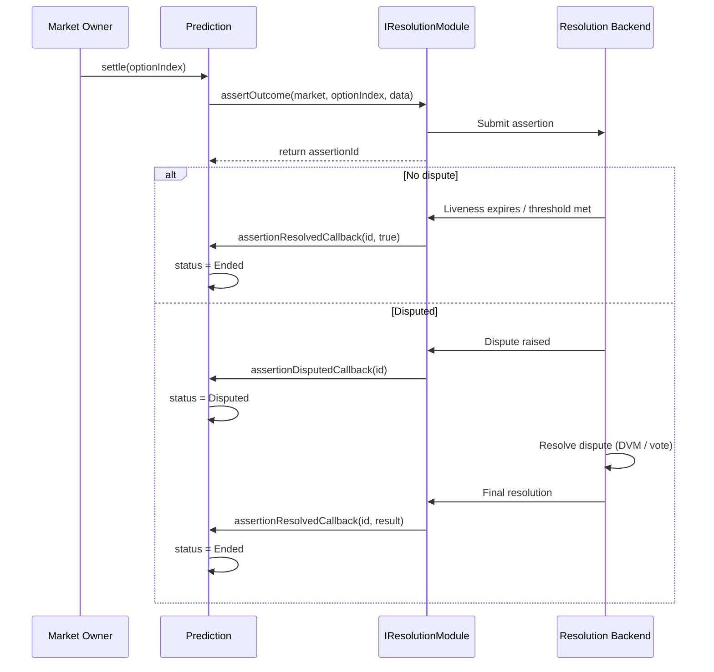

## Overview

PrometheX uses a **modular resolution architecture**. Each prediction market is configured with a resolution module at creation time. The module determines how the winning outcome is asserted, challenged, and finalized.

Any contract implementing the `IResolutionModule` interface can serve as a resolution backend — from decentralized oracles to trusted multisigs to token-weighted governance.

---

## IResolutionModule Interface

```solidity
// SPDX-License-Identifier: MIT
pragma solidity ^0.8.20;

/// @title IResolutionModule
/// @notice Interface for pluggable prediction market resolution
/// @dev Implement this interface to create a custom resolution module
interface IResolutionModule {
    /// @notice Assert that a specific option is the winning outcome
    /// @param market       Address of the Prediction market contract
    /// @param optionIndex  Index of the asserted winning option
    /// @param data         Module-specific assertion data (ABI-encoded)
    /// @return assertionId  Unique identifier for tracking this assertion
    function assertOutcome(
        address market,
        uint256 optionIndex,
        bytes calldata data
    ) external returns (bytes32 assertionId);

    /// @notice Force-resolve a pending assertion (if supported)
    /// @param assertionId  The assertion to resolve
    function resolveAssertion(bytes32 assertionId) external;

    /// @notice Check if an assertion has been resolved
    /// @param assertionId  The assertion to check
    /// @return resolved    True if the assertion has a final outcome
    function isResolved(bytes32 assertionId) external view returns (bool);

    /// @notice Get the resolved outcome for an assertion
    /// @param assertionId  The resolved assertion
    /// @return optionIndex  Index of the winning option
    /// @dev Reverts if assertion is not yet resolved
    function getOutcome(bytes32 assertionId) external view returns (uint256);
}
```

---

## Available Modules

<CardGroup cols={2}>
  <Card title="UMA Optimistic Oracle" icon="eye" href="/contracts/resolution/uma-oracle">
    Decentralized dispute resolution via UMA's OptimisticOracleV3. Default module for public markets.
    - Assertion + liveness period + DVM escalation
    - Bond-based economic security
    - Permissionless disputes
  </Card>
  <Card title="Multisig Resolution" icon="users" href="/contracts/resolution/multisig">
    N-of-M trusted resolver voting. In development.
    - Fast resolution (no liveness period)
    - Suitable for private/white-label markets
    - Configurable threshold
  </Card>
</CardGroup>

### Module Comparison

| Feature | UMA Oracle | Multisig | Token Governance (Planned) |
|---------|:----------:|:--------:|:--------------------------:|
| Decentralized | Yes | No | Yes |
| Resolution speed | 2h+ (liveness) | Minutes | Days (voting period) |
| Dispute mechanism | Economic (bonds) | Social (N-of-M) | Token-weighted vote |
| Cost | Bond required | Gas only | Gas only |
| Trust assumption | Economic rationality | Resolver honesty | Token holder alignment |
| Best for | Public markets | Private/internal | High-stakes / governance |

---

## Resolution Flow

The resolution process follows a standard pattern regardless of module:



---

## Implementing a Custom Module

To create a custom resolution module:

1. Implement `IResolutionModule`
2. Handle the assertion lifecycle (create, resolve, query)
3. Call back into the `Prediction` contract via the callback interface

```solidity
// SPDX-License-Identifier: MIT
pragma solidity ^0.8.20;

import {IResolutionModule} from "./IResolutionModule.sol";

contract CustomResolution is IResolutionModule {
    struct Assertion {
        address market;
        uint256 optionIndex;
        bool resolved;
        uint256 outcome;
    }

    mapping(bytes32 => Assertion) public assertions;
    uint256 private nonce;

    function assertOutcome(
        address market,
        uint256 optionIndex,
        bytes calldata /* data */
    ) external override returns (bytes32 assertionId) {
        assertionId = keccak256(abi.encodePacked(market, optionIndex, nonce++));
        assertions[assertionId] = Assertion({
            market: market,
            optionIndex: optionIndex,
            resolved: false,
            outcome: optionIndex
        });
    }

    function resolveAssertion(bytes32 assertionId) external override {
        Assertion storage a = assertions[assertionId];
        require(!a.resolved, "Already resolved");
        a.resolved = true;
        // Call back to market: IPrediction(a.market).assertionResolvedCallback(...)
    }

    function isResolved(bytes32 assertionId) external view override returns (bool) {
        return assertions[assertionId].resolved;
    }

    function getOutcome(bytes32 assertionId) external view override returns (uint256) {
        require(assertions[assertionId].resolved, "Not resolved");
        return assertions[assertionId].outcome;
    }
}
```

<Warning>
Custom resolution modules are security-critical. A malicious or buggy module can settle markets incorrectly. Always audit custom modules before deployment.
</Warning>

---

## Further Reading

<CardGroup cols={2}>
  <Card title="UMA Oracle Integration" icon="eye" href="/contracts/resolution/uma-oracle">
    Full UMA OptimisticOracleV3 integration guide with bond economics and code examples.
  </Card>
  <Card title="Multisig Resolution" icon="users" href="/contracts/resolution/multisig">
    N-of-M multisig resolution module — design, configuration, and use cases.
  </Card>
</CardGroup>
