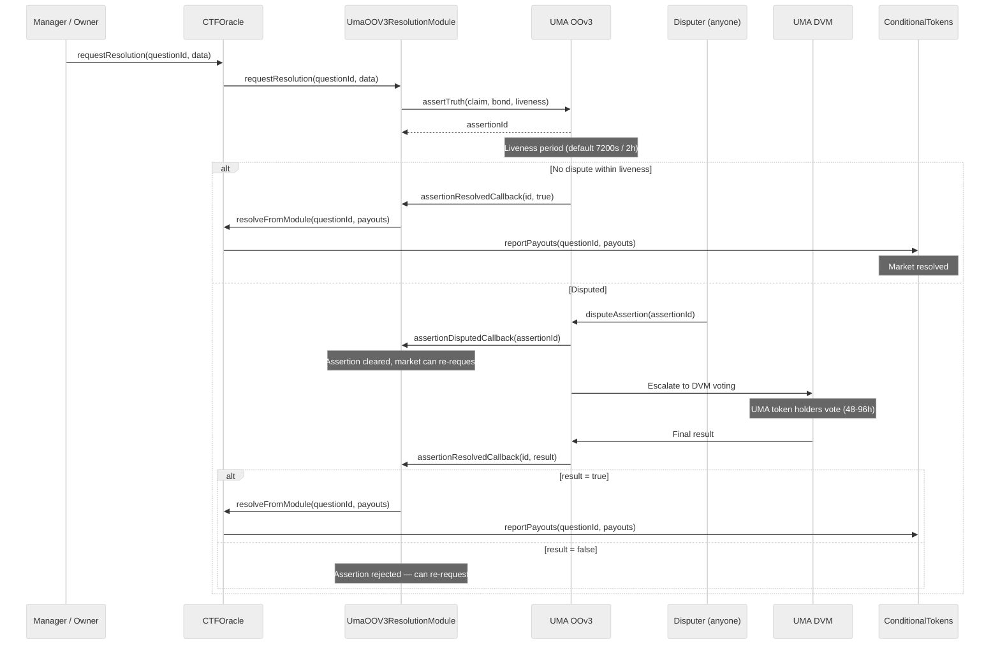

## Overview

The **UmaOOV3ResolutionModule** is the default resolution module for all PrometheX markets. It integrates UMA's [OptimisticOracleV3](https://docs.uma.xyz/protocol-overview/how-does-umas-oracle-work) to provide decentralized, permissionless verification of market outcomes through an optimistic assertion model.

The core principle: **an outcome is assumed true unless someone disputes it within a liveness period.** Economic bonds ensure honest behavior — incorrect assertions and frivolous disputes are penalized.

In V2, this module is a **singleton** that handles UMA assertions for _all_ markets. CTFOracle delegates resolution requests to it, and the module calls back `CTFOracle.resolveFromModule()` when an assertion is finalized — it never interacts with individual market contracts directly.

<Info>
**Deployed addresses (Arbitrum Sepolia):**

| Contract | Address |
|----------|---------|
| UmaOOV3ResolutionModule | [`0x4084526855cf8e6604623506dAB46A9d53941845`](https://sepolia.arbiscan.io/address/0x4084526855cf8e6604623506dAB46A9d53941845) |
| MockOptimisticOracleV3 (testnet) | [`0x0E80Ffb6D75C21b015c872923D7A6cD3e6B1Df97`](https://sepolia.arbiscan.io/address/0x0E80Ffb6D75C21b015c872923D7A6cD3e6B1Df97) |

**Mainnet:** [`0xa6147867264374F324524E30C02C331cF28aa879`](https://arbiscan.io/address/0xa6147867264374F324524E30C02C331cF28aa879) (OptimisticOracleV3 on Arbitrum One)
</Info>

---

## How It Works

### Resolution Lifecycle



<Steps>
  <Step title="Request Resolution">
    A market manager or owner calls `CTFOracle.requestResolution(questionId, moduleData)`, where `moduleData` is the ABI-encoded proposed winning outcome index (`uint256`). CTFOracle forwards the call to the UmaOOV3ResolutionModule.
  </Step>
  <Step title="UMA Assertion">
    The module constructs a claim string from the market's stored claim text and the proposed outcome index, then calls `UMA OOv3.assertTruth()`. A bond (in the configured bond currency) is posted to back the assertion. The module stores the `assertionId` and maps it to the `questionId`.
  </Step>
  <Step title="Liveness Period">
    A configurable challenge window begins (default: **7,200 seconds / 2 hours**). During this window, anyone can dispute the assertion by posting a matching counter-bond via `UMA OOv3.disputeAssertion()`.
  </Step>
  <Step title="Resolution">
    **If undisputed:** UMA calls `assertionResolvedCallback(assertionId, true)`. The module constructs a payout vector (1 for the winning outcome, 0 for all others) and calls `CTFOracle.resolveFromModule()`, which reports payouts to ConditionalTokens.

    **If disputed:** UMA calls `assertionDisputedCallback(assertionId)`. The module clears the pending assertion, allowing a new resolution request. The dispute escalates to the UMA DVM, where token holders vote on the correct outcome over 48-96 hours. The DVM result triggers `assertionResolvedCallback` with the final verdict.
  </Step>
</Steps>

---

## Bond Economics

Bonds align economic incentives with honest behavior. Both the asserter and disputer put collateral at stake.

### Payout Matrix

| Scenario | Asserter | Disputer | Oracle Fee |
|----------|----------|----------|:----------:|
| Assertion correct, no dispute | Bond returned | — | None |
| Assertion correct, dispute loses | Bond + disputer's bond - fee | Loses bond | ~2% of bond |
| Assertion wrong, dispute wins | Loses bond | Bond + asserter's bond - fee | ~2% of bond |
| Assertion wrong, no dispute | Bond returned (incorrect outcome stands) | — | None |

<Warning>
The last row highlights a critical property of optimistic oracles: **if nobody disputes an incorrect assertion, the incorrect outcome becomes final.** This is by design — the economic assumption is that rational actors will always dispute profitable-to-dispute incorrect assertions.
</Warning>

### Economic Security Threshold

A market is economically secure when:

`Bond >= MaxPayout x AttackProbability`

In practice, the bond should be large enough that the cost of a false assertion (losing the bond) exceeds the profit from manipulating the market outcome.

### Bond Configuration

| Parameter | Value | Description |
|-----------|:-----:|-------------|
| Bond amount | Minimum required by OOv3 | Collateral locked during liveness; queried via `oo.getMinimumBond(bondCurrency)` |
| Bond currency | Set at module deployment | Must be whitelisted by UMA (`bondCurrency` immutable) |
| Liveness | Set at module deployment | Challenge window in seconds (`liveness` immutable, default 7200s) |
| Identifier | Set at module deployment | UMA price identifier; defaults to `oo.defaultIdentifier()` if not specified |

<Note>
In V2, these parameters are configured at the **module level** (set once at deployment), not per-market. All markets sharing the same UmaOOV3ResolutionModule use the same bond currency, liveness period, and identifier.
</Note>

---

## Solidity Integration

### Module Architecture

UmaOOV3ResolutionModule implements two interfaces:

1. **`IResolutionModule`** — called by CTFOracle to prepare markets and request resolution
2. **`OptimisticOracleV3CallbackRecipientInterface`** — called by UMA OOv3 when assertions are resolved or disputed

```solidity
contract UmaOOV3ResolutionModule is
    IResolutionModule,
    OptimisticOracleV3CallbackRecipientInterface
{
    address public immutable coordinator;  // CTFOracle address
    OptimisticOracleV3Interface public immutable oo;
    IERC20 public immutable bondCurrency;
    uint64 public immutable liveness;
    bytes32 public immutable identifier;

    // Per-market state
    struct MarketConfig {
        bool exists;
        uint256 outcomeSlotCount;
        string claim;
        bytes32 activeAssertionId;
        uint256 proposedOutcome;
    }

    mapping(bytes32 => MarketConfig) private _markets;
    mapping(bytes32 => bytes32) public assertionToQuestionId;
}
```

### Market Preparation

When CTFOracle calls `onMarketPrepared()`, the module stores the market's outcome count and claim text:

```solidity
function onMarketPrepared(
    bytes32 questionId,
    uint256 outcomeSlotCount,
    bytes calldata moduleData
) external onlyCoordinator {
    // moduleData: ABI-encoded claim string, or empty for default
    string memory claim = moduleData.length == 0
        ? string.concat(
            "Resolve market questionId=",
            Strings.toHexString(uint256(questionId), 32),
            " with outcome index."
          )
        : abi.decode(moduleData, (string));

    _markets[questionId] = MarketConfig({
        exists: true,
        outcomeSlotCount: outcomeSlotCount,
        claim: claim,
        activeAssertionId: bytes32(0),
        proposedOutcome: 0
    });
}
```

### Resolution Request

When CTFOracle calls `requestResolution()`, the module posts a UMA assertion:

```solidity
function requestResolution(
    bytes32 questionId,
    bytes calldata moduleData
) external onlyCoordinator {
    MarketConfig storage market = _markets[questionId];
    require(market.exists, "MarketNotPrepared");
    require(market.activeAssertionId == bytes32(0), "AssertionPending");

    uint256 proposedOutcome = abi.decode(moduleData, (uint256));
    require(proposedOutcome < market.outcomeSlotCount, "InvalidOutcome");

    uint256 bond = oo.getMinimumBond(address(bondCurrency));
    bondCurrency.forceApprove(address(oo), bond);

    bytes32 assertionId = oo.assertTruth(
        claim,           // Constructed from market claim + proposed outcome
        address(this),   // asserter
        address(this),   // callbackRecipient
        address(0),      // escalationManager (none)
        liveness,        // challenge window
        bondCurrency,
        bond,
        identifier,
        bytes32(0)       // domainId
    );

    market.activeAssertionId = assertionId;
    market.proposedOutcome = proposedOutcome;
    assertionToQuestionId[assertionId] = questionId;
}
```

### UMA Callbacks

The module handles two callbacks from UMA OOv3:

**`assertionDisputedCallback`** — Called when someone disputes an assertion. The module immediately clears the pending assertion, allowing a new resolution request:

```solidity
function assertionDisputedCallback(bytes32 assertionId) external {
    require(msg.sender == address(oo), "InvalidCaller");

    bytes32 questionId = assertionToQuestionId[assertionId];
    MarketConfig storage market = _markets[questionId];
    market.activeAssertionId = bytes32(0);
    market.proposedOutcome = 0;
    delete assertionToQuestionId[assertionId];

    emit AssertionDisputed(questionId, assertionId);
}
```

**`assertionResolvedCallback`** — Called when an assertion settles (liveness expired or DVM vote completed). If asserted truthfully, constructs the payout vector and calls back to CTFOracle:

```solidity
function assertionResolvedCallback(
    bytes32 assertionId,
    bool assertedTruthfully
) external {
    require(msg.sender == address(oo), "InvalidCaller");

    bytes32 questionId = assertionToQuestionId[assertionId];
    if (questionId == bytes32(0)) return; // Already cleaned up by dispute

    MarketConfig storage market = _markets[questionId];

    // CEI: state writes before external call
    delete assertionToQuestionId[assertionId];
    market.activeAssertionId = bytes32(0);

    if (assertedTruthfully) {
        uint256[] memory payouts = new uint256[](market.outcomeSlotCount);
        payouts[market.proposedOutcome] = 1;
        ICTFOracleCoordinator(coordinator).resolveFromModule(questionId, payouts);
    }
    // If !assertedTruthfully: assertion rejected, market can re-request resolution
}
```

### Trust Chain

The callback trust chain in V2 follows a strict path:

```
UMA OOv3  →  UmaOOV3ResolutionModule  →  CTFOracle  →  ConditionalTokens
  (assertionResolvedCallback)     (resolveFromModule)    (reportPayouts)
```

Each contract in the chain validates its caller:
- Module checks `msg.sender == address(oo)`
- CTFOracle checks `msg.sender == resolutionModuleByQuestion[questionId]`
- ConditionalTokens accepts any caller as the oracle (the caller address _is_ the oracle identity encoded in `conditionId`)

---

## JavaScript Examples

### Monitor Resolution Status

Watch CTFOracle events to track resolution state across all markets:

<CodeGroup>

```typescript viem
import { createPublicClient, http, parseAbiItem } from "viem";
import { arbitrumSepolia } from "viem/chains";

const CTF_ORACLE = "0x982e18db6837D55297c39926dE86ae560cd96f99";
const UMA_MODULE = "0x4084526855cf8e6604623506dAB46A9d53941845";

const client = createPublicClient({
  chain: arbitrumSepolia,
  transport: http(),
});

// Watch for resolution requests
const unwatchRequest = client.watchContractEvent({
  address: CTF_ORACLE,
  abi: [parseAbiItem("event ResolutionRequested(bytes32 indexed questionId)")],
  eventName: "ResolutionRequested",
  onLogs(logs) {
    for (const log of logs) {
      console.log("Resolution requested for:", log.args.questionId);
    }
  },
});

// Watch for successful resolutions
const unwatchResolved = client.watchContractEvent({
  address: CTF_ORACLE,
  abi: [
    parseAbiItem(
      "event ConditionResolvedByModule(bytes32 indexed questionId, uint256[] payouts, address indexed module)"
    ),
  ],
  eventName: "ConditionResolvedByModule",
  onLogs(logs) {
    for (const log of logs) {
      console.log("Market resolved:", log.args.questionId);
      console.log("Payouts:", log.args.payouts);
      console.log("Module:", log.args.module);
    }
  },
});

// Check market state in the UMA module
const [exists, outcomeSlotCount, claim, activeAssertionId, proposedOutcome] =
  await client.readContract({
    address: UMA_MODULE,
    abi: [
      {
        name: "getMarketState",
        type: "function",
        stateMutability: "view",
        inputs: [{ name: "questionId", type: "bytes32" }],
        outputs: [
          { name: "exists", type: "bool" },
          { name: "outcomeSlotCount", type: "uint256" },
          { name: "claim", type: "string" },
          { name: "activeAssertionId", type: "bytes32" },
          { name: "proposedOutcome", type: "uint256" },
        ],
      },
    ],
    functionName: "getMarketState",
    args: [questionId],
  });

if (activeAssertionId !== "0x" + "0".repeat(64)) {
  console.log("Active UMA assertion:", activeAssertionId);
  console.log("Proposed outcome index:", proposedOutcome);
} else {
  console.log("No active assertion");
}
```

```typescript ethers.js
import { ethers } from "ethers";

const CTF_ORACLE = "0x982e18db6837D55297c39926dE86ae560cd96f99";
const UMA_MODULE = "0x4084526855cf8e6604623506dAB46A9d53941845";

const provider = new ethers.JsonRpcProvider(
  "https://sepolia-rollup.arbitrum.io/rpc"
);

const oracleAbi = [
  "event ResolutionRequested(bytes32 indexed questionId)",
  "event ConditionResolvedByModule(bytes32 indexed questionId, uint256[] payouts, address indexed module)",
];

const moduleAbi = [
  "function getMarketState(bytes32 questionId) view returns (bool exists, uint256 outcomeSlotCount, string claim, bytes32 activeAssertionId, uint256 proposedOutcome)",
];

const oracle = new ethers.Contract(CTF_ORACLE, oracleAbi, provider);
const module = new ethers.Contract(UMA_MODULE, moduleAbi, provider);

// Listen for resolution requests
oracle.on("ResolutionRequested", (questionId) => {
  console.log("Resolution requested for:", questionId);
});

// Listen for successful resolutions
oracle.on("ConditionResolvedByModule", (questionId, payouts, module) => {
  console.log("Market resolved:", questionId);
  console.log("Payouts:", payouts.map((p) => p.toString()));
});

// Check market state
const state = await module.getMarketState(questionId);
if (state.activeAssertionId !== ethers.ZeroHash) {
  console.log("Active UMA assertion:", state.activeAssertionId);
  console.log("Proposed outcome:", state.proposedOutcome.toString());
} else {
  console.log("No active assertion");
}
```

</CodeGroup>

### Check UMA Assertion

Read assertion details directly from the MockOptimisticOracleV3:

<CodeGroup>

```typescript viem
const MOCK_OOV3 = "0x0E80Ffb6D75C21b015c872923D7A6cD3e6B1Df97";

const assertion = await client.readContract({
  address: MOCK_OOV3,
  abi: [
    {
      name: "getAssertion",
      type: "function",
      stateMutability: "view",
      inputs: [{ name: "assertionId", type: "bytes32" }],
      outputs: [
        {
          name: "",
          type: "tuple",
          components: [
            { name: "expirationTime", type: "uint64" },
            { name: "settled", type: "bool" },
            { name: "settlementResolution", type: "bool" },
            { name: "asserter", type: "address" },
            { name: "disputer", type: "address" },
          ],
        },
      ],
    },
  ],
  functionName: "getAssertion",
  args: [assertionId],
});

const now = BigInt(Math.floor(Date.now() / 1000));

if (assertion.settled) {
  console.log("Assertion settled. Result:", assertion.settlementResolution);
} else if (assertion.disputer !== "0x0000000000000000000000000000000000000000") {
  console.log("Assertion disputed by:", assertion.disputer);
} else if (now >= assertion.expirationTime) {
  console.log("Liveness expired — assertion can be settled");
} else {
  const remaining = assertion.expirationTime - now;
  console.log(`${remaining} seconds remaining in liveness period`);
}
```

```typescript ethers.js
const MOCK_OOV3 = "0x0E80Ffb6D75C21b015c872923D7A6cD3e6B1Df97";

const ooAbi = [
  "function getAssertion(bytes32 assertionId) view returns (tuple(uint64 expirationTime, bool settled, bool settlementResolution, address asserter, address disputer))",
];

const oo = new ethers.Contract(MOCK_OOV3, ooAbi, provider);
const assertion = await oo.getAssertion(assertionId);
const now = Math.floor(Date.now() / 1000);

if (assertion.settled) {
  console.log("Assertion settled. Result:", assertion.settlementResolution);
} else if (assertion.disputer !== ethers.ZeroAddress) {
  console.log("Assertion disputed by:", assertion.disputer);
} else if (now >= Number(assertion.expirationTime)) {
  console.log("Liveness expired — can settle");
} else {
  console.log(
    `${Number(assertion.expirationTime) - now}s remaining in liveness`
  );
}
```

</CodeGroup>

### Dispute an Assertion

Anyone can dispute an active assertion by posting a matching bond:

<CodeGroup>

```typescript viem
const MOCK_OOV3 = "0x0E80Ffb6D75C21b015c872923D7A6cD3e6B1Df97";
const TUSDC = "0x52cb113e383c654fB78Ff56615ce3719193C6408";

// Get the bond amount from the assertion
const assertion = await client.readContract({
  address: MOCK_OOV3,
  abi: oracleAbi,
  functionName: "getAssertion",
  args: [assertionId],
});

const bondAmount = assertion.bond;

// Approve bond currency for the dispute
await walletClient.writeContract({
  address: TUSDC,
  abi: [
    {
      name: "approve",
      type: "function",
      inputs: [
        { name: "spender", type: "address" },
        { name: "amount", type: "uint256" },
      ],
      outputs: [{ name: "", type: "bool" }],
      stateMutability: "nonpayable",
    },
  ],
  functionName: "approve",
  args: [MOCK_OOV3, bondAmount],
});

// Submit the dispute
const hash = await walletClient.writeContract({
  address: MOCK_OOV3,
  abi: [
    {
      name: "disputeAssertion",
      type: "function",
      inputs: [
        { name: "assertionId", type: "bytes32" },
        { name: "disputer", type: "address" },
      ],
      outputs: [],
      stateMutability: "nonpayable",
    },
  ],
  functionName: "disputeAssertion",
  args: [assertionId, walletClient.account.address],
});

console.log("Dispute submitted:", hash);
```

```typescript ethers.js
const MOCK_OOV3 = "0x0E80Ffb6D75C21b015c872923D7A6cD3e6B1Df97";
const TUSDC = "0x52cb113e383c654fB78Ff56615ce3719193C6408";

const oo = new ethers.Contract(MOCK_OOV3, oracleAbi, signer);
const usdc = new ethers.Contract(TUSDC, erc20Abi, signer);

// Get bond amount
const assertion = await oo.getAssertion(assertionId);
const bondAmount = assertion.bond;

// Approve bond for dispute
const approveTx = await usdc.approve(MOCK_OOV3, bondAmount);
await approveTx.wait();

// Dispute the assertion
const disputeTx = await oo.disputeAssertion(assertionId, signer.address);
await disputeTx.wait();
console.log("Assertion disputed successfully");
```

</CodeGroup>

---

## Configuration Reference

### Module Parameters (Immutable)

These parameters are set at deployment time and cannot be changed:

| Parameter | Type | Description |
|-----------|------|-------------|
| `coordinator` | `address` | CTFOracle address — the only caller allowed to invoke `onMarketPrepared` and `requestResolution` |
| `oo` | `address` | UMA OptimisticOracleV3 contract address |
| `bondCurrency` | `IERC20` | Token used for assertion bonds (must be whitelisted by UMA) |
| `liveness` | `uint64` | Challenge window in seconds (applied to all assertions from this module) |
| `identifier` | `bytes32` | UMA price identifier; defaults to `oo.defaultIdentifier()` if `bytes32(0)` is passed at construction |

### Per-Market State

Each prepared market stores:

| Field | Type | Description |
|-------|------|-------------|
| `exists` | `bool` | Whether the market has been prepared |
| `outcomeSlotCount` | `uint256` | Number of outcome slots in the CTF condition |
| `claim` | `string` | Human-readable claim text used in UMA assertions |
| `activeAssertionId` | `bytes32` | Currently pending UMA assertion (zero if none) |
| `proposedOutcome` | `uint256` | Outcome index proposed in the active assertion |

### UMA DVM Escalation Timeline

| Phase | Duration | Description |
|-------|----------|-------------|
| Liveness | Configurable (default 2h) | Challenge window for disputes |
| DVM Voting | ~48h | UMA token holders commit votes |
| Reveal | ~24h | Votes revealed and tallied |
| Resolution | Immediate | Winner determined, bonds distributed |

---

## Security Considerations

<AccordionGroup>
  <Accordion title="Oracle manipulation risk">
    The optimistic oracle assumes disputes are economically rational. If bond sizes are too small relative to market value, an attacker may find it profitable to assert a false outcome and accept the bond loss. **Always ensure the bond amount is proportional to the market's total value at risk.** The bond is determined by `oo.getMinimumBond(bondCurrency)` — for high-value markets, consider deploying a separate module instance with a higher minimum bond or custom UMA configuration.
  </Accordion>

  <Accordion title="Liveness period selection">
    Short liveness periods (< 1 hour) increase the risk that disputes are not submitted in time — particularly if the assertion is posted during off-peak hours or when gas prices are elevated. Long liveness periods (> 24 hours) delay market resolution and degrade user experience. The default of **2 hours** balances speed with security for most markets. Consider longer liveness for high-stakes markets.
  </Accordion>

  <Accordion title="Callback trust chain">
    The V2 callback chain has three links: `UMA OOv3 → UmaOOV3ResolutionModule → CTFOracle → ConditionalTokens`. Each link validates its caller:
    - The module verifies `msg.sender == address(oo)`
    - CTFOracle verifies `msg.sender == resolutionModuleByQuestion[questionId]`
    - ConditionalTokens uses the caller address as the oracle identity

    If any contract in the chain is compromised, markets can be settled incorrectly. The `coordinator` and `oo` addresses are immutable in the module, preventing post-deployment tampering.
  </Accordion>

  <Accordion title="Bond currency risk">
    If the bond currency depegs or loses value, the economic security of assertions degrades — the cost of posting a false assertion drops relative to market value. USDC is the recommended bond currency for its stability. The bond currency is set at module deployment and cannot be changed.
  </Accordion>

  <Accordion title="Singleton module trust">
    In V2, a single UmaOOV3ResolutionModule instance handles resolution for **all** markets registered through the same CTFOracle. This means:
    - A vulnerability in the module affects every market simultaneously
    - The module must hold sufficient bond currency to cover concurrent assertions
    - Module upgrades require deploying a new contract and calling `CTFOracle.setResolutionModule()` — existing markets continue to use their originally-registered module (tracked in `resolutionModuleByQuestion`)

    This singleton design is a deliberate trade-off: it reduces deployment complexity and gas costs, but concentrates risk. The module has no admin functions or upgradeable state — its behavior is fully determined at deployment.
  </Accordion>

  <Accordion title="Assertion pending state">
    Only one UMA assertion can be active per market at any time. If an assertion is disputed, the `assertionDisputedCallback` immediately clears the pending state, allowing a new `requestResolution` call. However, if the DVM later resolves the disputed assertion as `true`, `assertionResolvedCallback` will see the mapping already cleaned up and return early — the market remains unresolved and must be re-requested. This is a safe-by-default design that prevents stale assertions from resolving markets.
  </Accordion>
</AccordionGroup>
