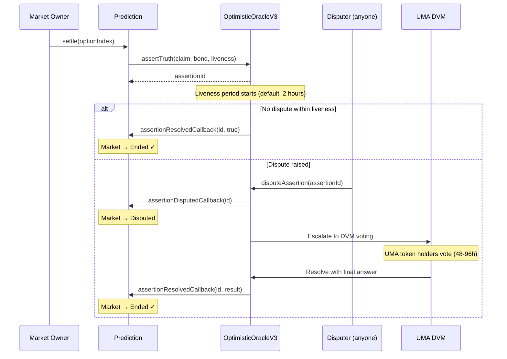

## Overview

The UMA Optimistic Oracle is the **default resolution module** for PrometheX public markets. It leverages UMA's [OptimisticOracleV3](https://docs.uma.xyz/protocol-overview/how-does-umas-oracle-work) to enable decentralized, permissionless verification of market outcomes.

The core principle: **an outcome is assumed true unless someone disputes it within a liveness period.** Economic bonds ensure honest behavior — incorrect assertions and frivolous disputes are penalized.

<Info>
**Testnet deployment:** [`0xD72b4002c472B7084A5A2D21450Ad8092b8E2FF6`](https://sepolia.arbiscan.io/address/0xD72b4002c472B7084A5A2D21450Ad8092b8E2FF6) (MockOptimisticOracleV3 on Arbitrum Sepolia)

**Mainnet:** [`0xa6147867264374F324524E30C02C331cF28aa879`](https://arbiscan.io/address/0xa6147867264374F324524E30C02C331cF28aa879) (OptimisticOracleV3 on Arbitrum One)
</Info>

---

## How It Works

### Assertion → Liveness → Resolution



<Steps>
  <Step title="Assertion">
    The market owner calls `settle(optionIndex)` on the Prediction contract. This posts a **bond** (in the bond currency, typically USDC) to the UMA OptimisticOracleV3 along with a text claim derived from the market question.
  </Step>
  <Step title="Liveness Period">
    A configurable challenge window begins (default: **7,200 seconds / 2 hours**). During this window, anyone can dispute the assertion by posting a matching counter-bond.
  </Step>
  <Step title="Resolution (No Dispute)">
    If the liveness period expires without a dispute, the oracle calls `assertionResolvedCallback(assertionId, true)` on the Prediction contract. The market transitions to **Ended** and winners can claim.
  </Step>
  <Step title="Resolution (Disputed)">
    If disputed, the oracle calls `assertionDisputedCallback(assertionId)`. The dispute escalates to the **UMA Data Verification Mechanism (DVM)**, where UMA token holders vote on the correct outcome over 48–96 hours. The DVM result is final.
  </Step>
</Steps>

---

## Bond Economics

Bonds align economic incentives with honest behavior. Both the asserter and disputer put collateral at stake.

### Payout Matrix

| Scenario | Asserter | Disputer | Oracle Fee |
|----------|----------|----------|:----------:|
| Assertion correct, no dispute | Bond returned | — | None |
| Assertion correct, dispute loses | Bond + disputer's bond - fee | Loses bond | ~2% of bond |
| Assertion wrong, dispute wins | Loses bond | Bond + asserter's bond - fee | ~2% of bond |
| Assertion wrong, no dispute | Bond returned (incorrect outcome stands) | — | None |

<Warning>
The last row highlights a critical property of optimistic oracles: **if nobody disputes an incorrect assertion, the incorrect outcome becomes final.** This is by design — the economic assumption is that rational actors will dispute profitable-to-dispute incorrect assertions.
</Warning>

### Bond Configuration

| Parameter | Default (Testnet) | Description |
|-----------|:-----------------:|-------------|
| Bond amount | Minimum required by OO | Collateral locked during liveness |
| Bond currency | USDC | Must match oracle's supported currencies |
| Liveness | 7,200 seconds (2h) | Challenge window duration |
| Oracle fee | ~2% of bond | Paid to DVM voters on dispute |

### Economic Security Threshold

A market is economically secure when:

`Bond ≥ MaxPayout × AttackProbability`

In practice, the bond should be large enough that the cost of a false assertion (losing the bond) exceeds the profit from manipulating the market outcome.

---

## Solidity Integration

### Callback Interface

The `Prediction` contract implements UMA's callback interface to receive resolution results:

```solidity
interface OptimisticOracleV3CallbackRecipientInterface {
    /// @notice Called when an assertion is resolved (liveness expired)
    function assertionResolvedCallback(
        bytes32 assertionId,
        bool assertedTruthfully
    ) external;

    /// @notice Called when an assertion is disputed
    function assertionDisputedCallback(
        bytes32 assertionId
    ) external;
}
```

### Settlement Flow in Prediction.sol

```solidity
function settle(uint256 optionIndex) external onlyOwner {
    require(status == Status.Running, "Market not running");
    require(optionIndex < options.length, "Invalid option");

    status = Status.Settling;
    settledOption = optionIndex;

    // Construct claim: "Option {optionIndex} is the correct outcome for: {question}"
    bytes memory claim = abi.encodePacked(
        "Option ", Strings.toString(optionIndex),
        " is the correct outcome for: ", question
    );

    // Approve bond token to oracle
    baseToken.approve(address(oracle), bondAmount);

    // Assert truth via UMA OOv3
    assertionId = oracle.assertTruth(
        claim,
        address(this),       // callbackRecipient
        address(0),          // escalationManager (none)
        address(0),          // escalationPolicy (none)
        liveness,            // challenge window
        address(baseToken),  // bond currency
        bondAmount,          // bond amount
        bytes32("ASSERT_TRUTH"),  // identifier
        bytes32(0)           // domainId
    );

    emit MarketSettled(optionIndex);
}

function assertionResolvedCallback(
    bytes32 _assertionId,
    bool assertedTruthfully
) external {
    require(msg.sender == address(oracle), "Only oracle");
    require(_assertionId == assertionId, "Wrong assertion");

    if (assertedTruthfully) {
        status = Status.Ended;
    } else {
        // Assertion was wrong — revert to Running
        status = Status.Running;
        assertionId = bytes32(0);
    }
}

function assertionDisputedCallback(bytes32 _assertionId) external {
    require(msg.sender == address(oracle), "Only oracle");
    require(_assertionId == assertionId, "Wrong assertion");

    status = Status.Disputed;
    emit MarketDisputed(_assertionId);
}
```

---

## JavaScript Examples

### Monitor Assertion Status

<CodeGroup>

```typescript viem
import { createPublicClient, http, parseAbiItem } from "viem";
import { arbitrumSepolia } from "viem/chains";

const OO_ADDRESS = "0xD72b4002c472B7084A5A2D21450Ad8092b8E2FF6";

const client = createPublicClient({
  chain: arbitrumSepolia,
  transport: http(),
});

// Watch for assertion events on a specific market
const unwatch = client.watchContractEvent({
  address: MARKET_ADDRESS,
  abi: predictionAbi,
  eventName: "MarketSettled",
  onLogs(logs) {
    console.log("Market settling with option:", logs[0].args.optionIndex);
  },
});

// Check if assertion has expired (can be settled)
const assertion = await client.readContract({
  address: OO_ADDRESS,
  abi: oracleAbi,
  functionName: "getAssertion",
  args: [assertionId],
});

const expirationTime = assertion.expirationTime;
const now = BigInt(Math.floor(Date.now() / 1000));

if (now >= expirationTime) {
  console.log("Liveness expired — assertion can be settled");
} else {
  const remaining = expirationTime - now;
  console.log(`${remaining} seconds remaining in liveness period`);
}
```

```typescript ethers.js
import { ethers } from "ethers";

const provider = new ethers.JsonRpcProvider("https://sepolia-rollup.arbitrum.io/rpc");
const oracle = new ethers.Contract(OO_ADDRESS, oracleAbi, provider);
const market = new ethers.Contract(MARKET_ADDRESS, predictionAbi, provider);

// Listen for settlement
market.on("MarketSettled", (optionIndex, event) => {
  console.log("Market settling with option:", optionIndex.toString());
});

// Check assertion status
const assertion = await oracle.getAssertion(assertionId);
const now = Math.floor(Date.now() / 1000);

if (now >= Number(assertion.expirationTime)) {
  console.log("Liveness expired — can settle");
} else {
  console.log(`${Number(assertion.expirationTime) - now}s remaining`);
}
```

</CodeGroup>

### Dispute an Assertion

<CodeGroup>

```typescript viem
const OO_ADDRESS = "0xD72b4002c472B7084A5A2D21450Ad8092b8E2FF6";

// Approve bond for dispute
await walletClient.writeContract({
  address: TUSDC,
  abi: erc20Abi,
  functionName: "approve",
  args: [OO_ADDRESS, bondAmount],
});

// Dispute the assertion
const hash = await walletClient.writeContract({
  address: OO_ADDRESS,
  abi: oracleAbi,
  functionName: "disputeAssertion",
  args: [assertionId, walletClient.account.address],
});

console.log("Dispute tx:", hash);
```

```typescript ethers.js
const oracle = new ethers.Contract(OO_ADDRESS, oracleAbi, signer);
const usdc = new ethers.Contract(TUSDC, erc20Abi, signer);

// Approve bond
await usdc.approve(OO_ADDRESS, bondAmount);

// Dispute
const tx = await oracle.disputeAssertion(assertionId, signer.address);
await tx.wait();
console.log("Assertion disputed");
```

</CodeGroup>

---

## Configuration Reference

### Oracle Parameters

| Parameter | Type | Description |
|-----------|------|-------------|
| `liveness` | `uint64` | Challenge window in seconds (minimum 30s, recommended 7200s) |
| `currency` | `address` | Bond token (must be whitelisted by UMA) |
| `bond` | `uint256` | Assertion bond amount in currency units |
| `identifier` | `bytes32` | UMA price identifier (typically `ASSERT_TRUTH`) |
| `callbackRecipient` | `address` | Contract receiving resolution callbacks |

### UMA DVM Escalation Timeline

| Phase | Duration | Description |
|-------|----------|-------------|
| Liveness | Configurable (default 2h) | Challenge window for disputes |
| DVM Voting | ~48h | UMA token holders commit votes |
| Reveal | ~24h | Votes revealed and tallied |
| Resolution | Immediate | Winner determined, bonds distributed |

---

## Security Considerations

<AccordionGroup>
  <Accordion title="Oracle manipulation risk">
    The optimistic oracle assumes disputes are economically rational. If bond sizes are too small relative to market value, an attacker may find it profitable to assert a false outcome and accept the bond loss. **Always set bond sizes proportional to the market's total value at risk.**
  </Accordion>
  <Accordion title="Liveness period selection">
    Short liveness periods (< 1 hour) increase the risk that disputes aren't submitted in time. Long liveness periods (> 24 hours) delay market resolution. The default of 2 hours balances speed with security for most markets.
  </Accordion>
  <Accordion title="Callback trust">
    The `assertionResolvedCallback` and `assertionDisputedCallback` functions verify `msg.sender == oracle`. If the oracle address is compromised or the wrong oracle is configured, the market can be settled incorrectly. The oracle address is set at initialization and cannot be changed.
  </Accordion>
  <Accordion title="Bond currency risk">
    If the bond currency depegs or loses value, the economic security of the assertion degrades. USDC is the recommended bond currency for its stability.
  </Accordion>
</AccordionGroup>
