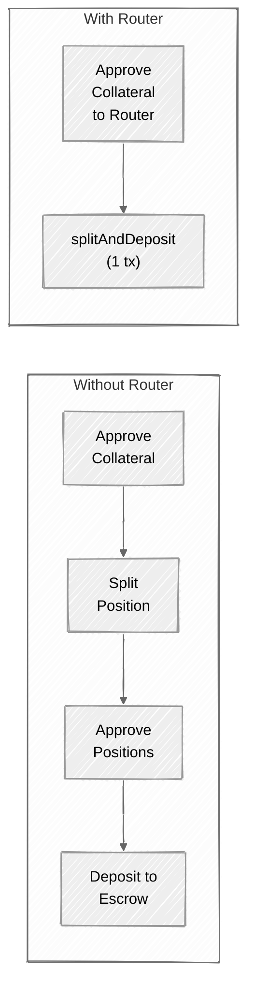

## Overview

The **CTFRouter** contract provides single-transaction convenience wrappers for common multi-step CTF operations. Instead of requiring users to send multiple transactions (approve, split, approve, deposit), the router bundles these into a single call.

Key characteristics:

- **Singleton contract** — One router instance shared across all markets.
- **ERC1155Holder** — Can receive and temporarily hold CTF position tokens during multi-step operations.
- **Escrow allowlist** — Only owner-approved escrow contracts (e.g., CTFSettlement) can be used as deposit targets, preventing routing to unauthorized contracts.
- **ReentrancyGuard** — All public operations are protected against reentrancy attacks.

## Why Use the Router?

Without the Router, common operations require multiple transactions:

<Steps>
  <Step title="Transaction 1">
    Approve collateral token to ConditionalTokens contract.
  </Step>
  <Step title="Transaction 2">
    Call `splitPosition` on ConditionalTokens.
  </Step>
  <Step title="Transaction 3">
    Approve ERC-1155 positions to CTFSettlement.
  </Step>
  <Step title="Transaction 4">
    Call `depositPosition` on CTFSettlement.
  </Step>
</Steps>

With the Router, this entire flow becomes a single transaction:

<Steps>
  <Step title="Transaction 1">
    Approve collateral to CTFRouter, then call `splitPosition()` or `splitAndDeposit()`.
  </Step>
</Steps>



## Functions

### User Operations

#### splitPosition

```solidity
function splitPosition(
    IERC20 collateralToken,
    bytes32 conditionId,
    uint256[] calldata partition,
    uint256 amount
) external nonReentrant
```

Splits collateral into CTF outcome positions in a single transaction. The router pulls collateral from the caller, approves it to the ConditionalTokens contract, performs the split, and transfers all resulting position tokens back to the caller.

- `collateralToken` — The ERC-20 collateral token (e.g., tUSDC).
- `conditionId` — The CTF condition to split on.
- `partition` — Array of index sets. For a binary market: `[1, 2]`.
- `amount` — Amount of collateral to split.

<Note>
  The caller must approve `amount` of collateral to the Router address before calling this function. The router uses `parentCollectionId = bytes32(0)` (root-level split).
</Note>

#### mergePositions

```solidity
function mergePositions(
    IERC20 collateralToken,
    bytes32 conditionId,
    uint256[] calldata partition,
    uint256 amount
) external nonReentrant
```

Merges a complete set of CTF positions back into collateral in a single transaction. The router pulls all position tokens from the caller, performs the merge on ConditionalTokens, and transfers the returned collateral back to the caller.

- The caller must hold at least `amount` of **every** position in the partition.
- The caller must approve the Router as an ERC-1155 operator via `setApprovalForAll` on the ConditionalTokens contract.

#### splitAndDeposit

```solidity
function splitAndDeposit(
    PredictionCTF pool,
    uint256 optionOut,
    uint256 delta,
    uint256 minReceive,
    uint256 deadline
) external nonReentrant returns (uint256 received)
```

Splits collateral and buys an outcome token through an APMM pool in a single transaction. The router pulls collateral from the caller, approves it to the pool, executes the deposit (buy), and transfers the received outcome tokens back to the caller.

- `pool` — The PredictionCTF APMM pool address.
- `optionOut` — Index of the outcome to buy (e.g., 0 for Yes, 1 for No).
- `delta` — Amount of collateral to spend.
- `minReceive` — Minimum outcome tokens to receive (slippage protection).
- `deadline` — Transaction deadline timestamp.
- **Returns** `received` — The actual amount of outcome tokens received.

<Tip>
  This is the recommended function for buying outcome tokens through the APMM. It handles collateral approval, the pool's internal split, and the swap in a single transaction.
</Tip>

#### depositToSettlement

```solidity
function depositToSettlement(
    CTFSettlement escrow,
    uint256 positionId,
    uint256 amount
) external nonReentrant
```

Deposits CTF position tokens into a CLOB escrow contract (CTFSettlement) in a single transaction. The router pulls positions from the caller, sets temporary ERC-1155 approval to the escrow, deposits on behalf of the caller, and revokes the approval.

- `escrow` — The CTFSettlement contract address. Must be on the allowlist.
- `positionId` — The ERC-1155 token ID to deposit.
- `amount` — Amount of tokens to deposit.

<Warning>
  The escrow address must be on the Router's allowlist. Calls to non-allowed escrows revert with `UnauthorizedEscrow`.
</Warning>

#### depositCollateralToSettlement

```solidity
function depositCollateralToSettlement(
    CTFSettlement escrow,
    uint256 amount
) external nonReentrant
```

Deposits collateral into a CLOB escrow contract, credited to the caller's escrow balance. The router pulls collateral from the caller, approves it to the escrow, and calls `depositCollateralFor`.

- `escrow` — The CTFSettlement contract address. Must be on the allowlist.
- `amount` — Amount of collateral to deposit.

#### redeemPositions

```solidity
function redeemPositions(
    IERC20 collateralToken,
    bytes32 conditionId,
    uint256[] calldata indexSets
) external nonReentrant
```

Redeems resolved positions for collateral in a single transaction. The router pulls all position tokens (only those with a non-zero balance) from the caller, redeems them on ConditionalTokens, and transfers the received collateral back to the caller.

- `collateralToken` — The ERC-20 collateral token.
- `conditionId` — The resolved condition.
- `indexSets` — Array of index sets to redeem. For a binary market: `[1, 2]`.

<Tip>
  The router automatically checks each position's balance before transferring. Positions with zero balance are skipped, so you can safely pass all index sets without worrying about which outcome won.
</Tip>

### Admin Operations

#### setAllowedEscrow

```solidity
function setAllowedEscrow(address escrow, bool allowed) external onlyOwner
```

Manages the escrow allowlist. Only escrow contracts on this list can be used with `depositToSettlement` and `depositCollateralToSettlement`. When an escrow is removed from the allowlist, its ERC-1155 approval is also revoked.

- `escrow` — The escrow contract address.
- `allowed` — `true` to allow, `false` to revoke.

#### rescueERC20

```solidity
function rescueERC20(IERC20 token, uint256 amount) external onlyOwner
```

Rescues ERC-20 tokens accidentally sent to the Router contract. Transfers `amount` of `token` to the owner.

#### rescueERC1155

```solidity
function rescueERC1155(address token, uint256 id, uint256 amount) external onlyOwner
```

Rescues ERC-1155 tokens accidentally sent to the Router contract. Transfers the specified token to the owner.

## Security

<CardGroup cols={3}>
  <Card title="ReentrancyGuard" icon="shield">
    All user-facing operations use `nonReentrant` modifier, preventing reentrancy attacks through ERC-1155 callbacks.
  </Card>
  <Card title="ERC1155Holder" icon="box">
    The Router can safely receive ERC-1155 position tokens during multi-step operations, then forward them to the caller or escrow.
  </Card>
  <Card title="Escrow Allowlist" icon="list-check">
    Only owner-approved escrow contracts can be used as deposit targets. Prevents routing funds to unauthorized or malicious contracts.
  </Card>
</CardGroup>

<Info>
  The Router holds tokens only transiently during a single transaction. No user funds should remain in the Router between transactions. The `rescueERC20` and `rescueERC1155` functions exist as a safety net for tokens sent directly to the contract by mistake.
</Info>

## Code Examples

### Split and Deposit (Buy via APMM)

<CodeGroup>

```typescript viem
import { getContract, parseUnits } from "viem";
import { publicClient, walletClient, account } from "./client";

const ROUTER_ADDRESS = "0x..."; // CTFRouter address
const TUSDC_ADDRESS = "0x52cb113e383c654fB78Ff56615ce3719193C6408";
const POOL_ADDRESS = "0x..."; // PredictionCTF pool for your market

// 1. Approve collateral to the Router
const tusdc = getContract({
  address: TUSDC_ADDRESS,
  abi: [
    {
      name: "approve",
      type: "function",
      inputs: [
        { name: "spender", type: "address" },
        { name: "amount", type: "uint256" },
      ],
      outputs: [{ type: "bool" }],
      stateMutability: "nonpayable",
    },
  ],
  client: walletClient,
});

const amount = parseUnits("100", 6); // 100 USDC
await tusdc.write.approve([ROUTER_ADDRESS, amount]);

// 2. Split and deposit in one transaction
const router = getContract({
  address: ROUTER_ADDRESS,
  abi: ctfRouterAbi,
  client: walletClient,
});

const optionOut = 0n; // Buy Yes tokens
const minReceive = parseUnits("90", 6); // Accept up to ~10% slippage
const deadline = BigInt(Math.floor(Date.now() / 1000) + 300); // 5 min deadline

const received = await router.write.splitAndDeposit([
  POOL_ADDRESS,
  optionOut,
  amount,
  minReceive,
  deadline,
]);
```

```typescript ethers.js
import { ethers } from "ethers";

const ROUTER_ADDRESS = "0x..."; // CTFRouter address
const TUSDC_ADDRESS = "0x52cb113e383c654fB78Ff56615ce3719193C6408";
const POOL_ADDRESS = "0x..."; // PredictionCTF pool for your market

const signer = await provider.getSigner();

// 1. Approve collateral to the Router
const tusdc = new ethers.Contract(
  TUSDC_ADDRESS,
  ["function approve(address spender, uint256 amount) returns (bool)"],
  signer
);

const amount = ethers.parseUnits("100", 6); // 100 USDC
await tusdc.approve(ROUTER_ADDRESS, amount);

// 2. Split and deposit in one transaction
const router = new ethers.Contract(ROUTER_ADDRESS, ctfRouterAbi, signer);

const optionOut = 0n; // Buy Yes tokens
const minReceive = ethers.parseUnits("90", 6); // Accept up to ~10% slippage
const deadline = BigInt(Math.floor(Date.now() / 1000) + 300); // 5 min deadline

const tx = await router.splitAndDeposit(
  POOL_ADDRESS,
  optionOut,
  amount,
  minReceive,
  deadline
);
const receipt = await tx.wait();
```

</CodeGroup>

### Redeem Resolved Positions

<CodeGroup>

```typescript viem
import { getContract } from "viem";

const ROUTER_ADDRESS = "0x..."; // CTFRouter address
const CTF_ADDRESS = "0xf5E0891F0f5ba4C2b6034720b444eb79926e1DF0";
const TUSDC_ADDRESS = "0x52cb113e383c654fB78Ff56615ce3719193C6408";

// 1. Approve Router as ERC-1155 operator (one-time)
const ctf = getContract({
  address: CTF_ADDRESS,
  abi: [
    {
      name: "setApprovalForAll",
      type: "function",
      inputs: [
        { name: "operator", type: "address" },
        { name: "approved", type: "bool" },
      ],
      outputs: [],
      stateMutability: "nonpayable",
    },
  ],
  client: walletClient,
});
await ctf.write.setApprovalForAll([ROUTER_ADDRESS, true]);

// 2. Redeem all positions for the resolved condition
const router = getContract({
  address: ROUTER_ADDRESS,
  abi: ctfRouterAbi,
  client: walletClient,
});

const conditionId = "0x...";
const indexSets = [1n, 2n]; // Both Yes and No — only winning positions have value

await router.write.redeemPositions([
  TUSDC_ADDRESS,
  conditionId,
  indexSets,
]);
// Collateral is transferred back to the caller
```

```typescript ethers.js
import { ethers } from "ethers";

const ROUTER_ADDRESS = "0x..."; // CTFRouter address
const CTF_ADDRESS = "0xf5E0891F0f5ba4C2b6034720b444eb79926e1DF0";
const TUSDC_ADDRESS = "0x52cb113e383c654fB78Ff56615ce3719193C6408";

const signer = await provider.getSigner();

// 1. Approve Router as ERC-1155 operator (one-time)
const ctf = new ethers.Contract(
  CTF_ADDRESS,
  ["function setApprovalForAll(address operator, bool approved)"],
  signer
);
await ctf.setApprovalForAll(ROUTER_ADDRESS, true);

// 2. Redeem all positions for the resolved condition
const router = new ethers.Contract(ROUTER_ADDRESS, ctfRouterAbi, signer);

const conditionId = "0x...";
const indexSets = [1n, 2n]; // Both Yes and No — only winning positions have value

await router.redeemPositions(TUSDC_ADDRESS, conditionId, indexSets);
// Collateral is transferred back to the caller
```

</CodeGroup>
