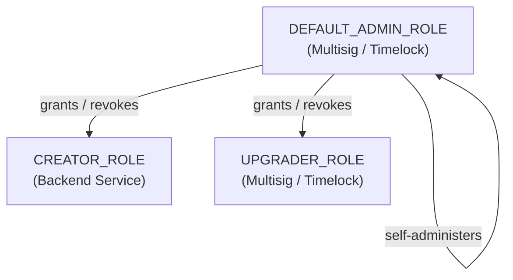
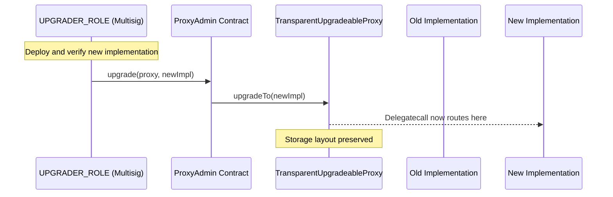

## Overview

PrometheX's smart contract security is built on three pillars: **role-based access control**, **upgradeable proxy architecture**, and **oracle-backed resolution**. This page documents the security model, trust assumptions, and key management practices.

---

## Access Control

### Role Hierarchy

PrometheX uses OpenZeppelin's `AccessControlUpgradeable` for granular permissions on the `PredictionFactory`:



| Role | Granted To | Capabilities | Risk Level |
|------|-----------|-------------|:----------:|
| `DEFAULT_ADMIN_ROLE` | Multisig / Timelock | Grant/revoke all roles, whitelist tokens | Critical |
| `CREATOR_ROLE` | Backend service account | Deploy new prediction markets | Medium |
| `UPGRADER_ROLE` | Multisig / Timelock | Upgrade factory implementation | Critical |

### Per-Market Ownership

Each `Prediction` clone has an independent owner (set during `initialize`), managed by `Ownable2StepUpgradeable`:

| Action | Who Can Do It |
|--------|--------------|
| `settle(optionIndex)` | Market owner only |
| `deposit` / `withdraw` | Any user |
| `addLiquidity` / `removeLiquidity` | Any user |
| `claimAll` | Any user (after market ends) |
| Transfer ownership | Current owner (two-step: propose + accept) |

<Note>
Two-step ownership transfer prevents accidental or malicious single-transaction transfers. The new owner must explicitly accept ownership.
</Note>

---

## Proxy Upgrade Process

### Factory Upgrade

The `PredictionFactory` uses OpenZeppelin's `TransparentUpgradeableProxy`:



### Upgrade Safety Checklist

<AccordionGroup>
  <Accordion title="1. Storage layout compatibility">
    New implementations must preserve the storage layout of the previous version. Adding new state variables at the end of the contract is safe; reordering, removing, or changing types of existing variables corrupts storage. Use OpenZeppelin's `@openzeppelin/upgrades-core` storage layout check.
  </Accordion>
  <Accordion title="2. Initializer protection">
    Upgraded implementations must not re-run initializers. Use `reinitializer(version)` for post-upgrade setup instead of `initializer`. Verify that `_disableInitializers()` is called in the constructor of the implementation.
  </Accordion>
  <Accordion title="3. Clone isolation">
    Upgrading the factory does **not** upgrade existing Prediction clones. Clones delegate to the Prediction implementation, not the factory. To upgrade market logic, deploy a new Prediction implementation and update the factory's stored reference. Only new markets use the new logic.
  </Accordion>
  <Accordion title="4. Timelock (recommended)">
    For mainnet, the UPGRADER_ROLE should be behind a timelock (e.g., 48h delay). This gives users time to exit positions before an upgrade takes effect.
  </Accordion>
  <Accordion title="5. Multi-signature requirement">
    Critical roles (DEFAULT_ADMIN_ROLE, UPGRADER_ROLE) should require multiple signers. Recommended: 3-of-5 multisig minimum for mainnet.
  </Accordion>
</AccordionGroup>

---

## Oracle Security Model

### UMA Optimistic Oracle

The UMA oracle provides **economic security** — honesty is enforced through bonds, not trust.

| Threat | Mitigation |
|--------|-----------|
| **False assertion** | Disputer posts counter-bond; if asserter is wrong, asserter loses bond |
| **Missed dispute window** | Monitor assertions via off-chain bots; set liveness period long enough for human review |
| **DVM manipulation** | Requires >50% of UMA token voting power; cost of attack scales with UMA market cap |
| **Oracle contract compromise** | Oracle address is immutable per market; Prediction contract verifies `msg.sender == oracle` |
| **Bond currency depeg** | Use stablecoins (USDC) as bond currency; monitor depeg risk |

### Economic Security Guarantee

The oracle is secure when the cost of a successful attack exceeds the profit:

`Bond > MarketValue / NumberOfMonitors`

As long as at least one rational actor is monitoring the market, incorrect assertions will be disputed.

### MultisigResolution (Planned)

The multisig module has a **trust-based** security model:

| Threat | Mitigation |
|--------|-----------|
| **Resolver collusion** | High threshold (e.g., 4-of-7); distribute keys across independent parties |
| **Key compromise** | Hardware wallets; key rotation procedures |
| **Resolver inactivity** | Voting period timeout with plurality resolution |

---

## Reentrancy Protection

All state-modifying functions in `Prediction` use OpenZeppelin's `ReentrancyGuardUpgradeable`:

```solidity
function deposit(uint256 optionIndex, uint256 amount, uint256 minReceive)
    external
    nonReentrant  // Prevents reentrant calls
    returns (uint256 received)
{
    // State changes before external calls (CEI pattern)
    // ...
}
```

Protected functions:
- `deposit` / `withdraw`
- `addLiquidity` / `removeLiquidity`
- `claimAll`

---

## Slippage Protection

All trading functions include `minReceive` parameters to protect against:

- **Sandwich attacks** — MEV bots front-running trades to extract value
- **Price manipulation** — Large trades moving the price before execution
- **Stale quotes** — UI quotes becoming outdated before transaction confirms

```solidity
function deposit(
    uint256 optionIndex,
    uint256 amount,
    uint256 minReceive    // Revert if output < minReceive
) external returns (uint256 received) {
    // ...
    require(received >= minReceive, "Slippage exceeded");
}
```

<Warning>
Users should always set `minReceive` to a reasonable value (e.g., 99% of the quoted amount). Setting it to 0 exposes the trade to unlimited slippage.
</Warning>

---

## Key Management

### Recommended Production Setup

| Component | Recommendation |
|-----------|---------------|
| `DEFAULT_ADMIN_ROLE` | 3-of-5 multisig (e.g., Gnosis Safe) behind 48h timelock |
| `UPGRADER_ROLE` | Same multisig + timelock as admin |
| `CREATOR_ROLE` | Backend service account (hot wallet with limited scope) |
| Market ownership | Backend-controlled initially; transferable to DAO |
| Resolver keys (Multisig) | Hardware wallets distributed across independent parties |

### Key Rotation

- `DEFAULT_ADMIN_ROLE` can revoke and re-grant any role
- Market ownership uses two-step transfer: `transferOwnership()` → `acceptOwnership()`
- Multisig resolvers can be updated per-market via module configuration

---

## Threat Model Summary

| Attack Vector | Severity | Mitigation | Status |
|--------------|:--------:|-----------|:------:|
| Unauthorized market creation | Medium | `CREATOR_ROLE` gating | Active |
| Malicious factory upgrade | Critical | `UPGRADER_ROLE` + multisig + timelock | Active |
| False oracle assertion | High | UMA bond mechanism + disputes | Active |
| Reentrancy attack | High | `nonReentrant` on all state-modifying functions | Active |
| Sandwich / MEV attack | Medium | `minReceive` slippage protection | Active |
| Storage collision on upgrade | Critical | OpenZeppelin storage layout checks | Process |
| Admin key compromise | Critical | Multisig + hardware wallets | Recommended |
| Oracle contract compromise | Critical | Immutable oracle reference per market | Active |
| Front-running settlement | Low | `onlyOwner` on `settle()` | Active |
| LP token manipulation | Medium | Proportional minting; no flash-loan-exploitable pricing | Active |

---

## Invariants

The following invariants should always hold and are checked by the test suite:

1. **APMM invariant**: `∏ rᵢʷⁱ = k` after every trade (within rounding tolerance)
2. **Conservation**: `sum(all_option_supply[i] * price[i]) + fees_collected <= baseToken.balanceOf(market)`
3. **LP share proportionality**: LP tokens minted/burned are proportional to reserves added/removed
4. **Settlement finality**: Once `status == Ended`, no further state transitions are possible
5. **Exclusive minting**: Option tokens can only be minted/burned by their parent Prediction contract
6. **Non-zero reserves**: Reserves never reach zero (prevented by initialization with non-zero liquidity)
