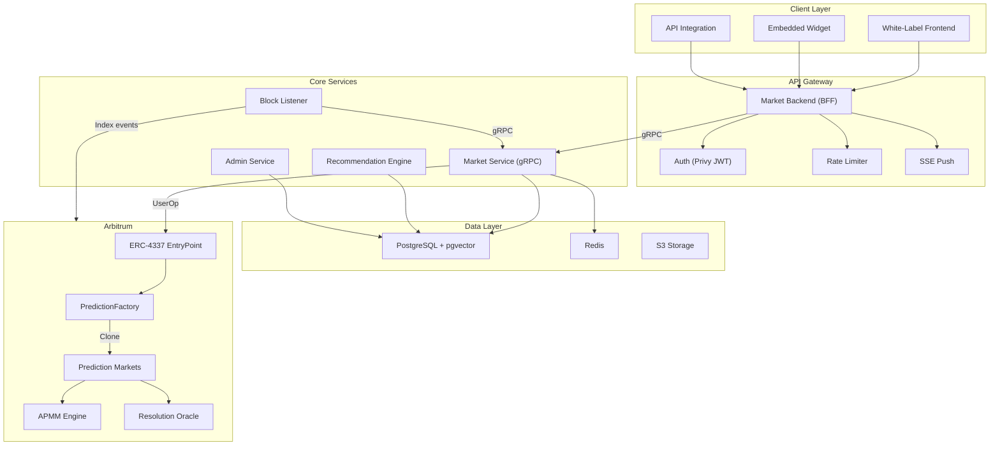
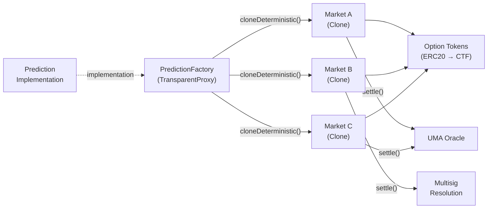
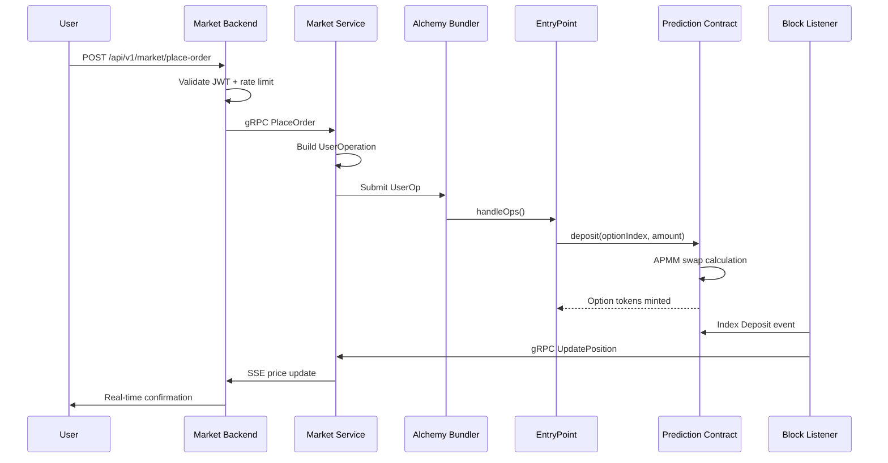
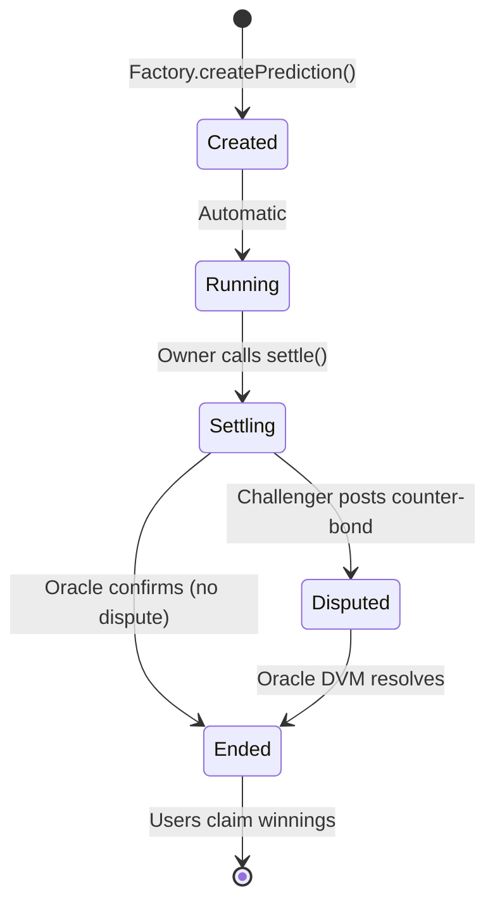

## System Overview

PrometheX is a modular platform composed of backend microservices, a smart contract layer on Arbitrum, and client-facing APIs. Every component is designed for multi-tenant operation and horizontal scaling.

## Service Architecture

PrometheX follows a backend-for-frontend (BFF) pattern. The API gateway is the only service exposed to the internet. Internal services communicate via gRPC.

### Request Flow

<Steps>
  <Step title="Client sends request">
    A user action (place trade, browse markets, check positions) hits the Market Backend via REST API. White-label frontends, embedded widgets, and API integrations all use the same endpoints.
  </Step>
  <Step title="Authentication & rate limiting">
    The BFF validates the Privy JWT token, applies rate limiting (BBR adaptive algorithm), and routes the request to the appropriate internal service.
  </Step>
  <Step title="Business logic execution">
    The Market Service processes the request — querying PostgreSQL for market data, computing prices via APMM math, or preparing an on-chain transaction.
  </Step>
  <Step title="On-chain execution">
    For trading operations, the Market Service constructs an ERC-4337 UserOperation and submits it to the Alchemy bundler. The bundler executes the transaction through the EntryPoint contract, with gas sponsored by the Paymaster.
  </Step>
  <Step title="Event indexing">
    The Block Listener continuously scans Arbitrum blocks for contract events (trades, settlements, disputes). When it detects a relevant event, it updates the database via gRPC calls to the Market Service.
  </Step>
  <Step title="Real-time push">
    State changes trigger SSE events pushed to connected clients — live price updates, trade confirmations, and market state transitions.
  </Step>
</Steps>

## Service Breakdown

| Service | Tech | Protocol | Role |
|---------|------|----------|------|
| **Market Backend** | Go / Kratos | HTTP (port 8000) | API gateway, auth, rate limiting, SSE |
| **Market Service** | Go / Kratos | gRPC (port 9000) | Core business logic, trading, positions |
| **Block Listener** | Go | Daemon | On-chain event indexer |
| **Recommendation** | Python | gRPC (port 50051) | Semantic search, trending rankings |
| **Admin Service** | Go / Fiber | HTTP (port 8080) | Market management, content, RBAC |

## Smart Contract Layer

The on-chain layer follows a **factory-clone** pattern for gas-efficient market deployment.

Each market is an isolated clone with its own APMM state, option tokens, and resolution module. The factory manages creation, token whitelisting, and access control.

## Data Flow

### Trading Flow

### Market Lifecycle

## Multi-Tenant Design

Every tenant (partner) gets logically isolated resources while sharing the same infrastructure.

| Resource | Isolation Model |
|----------|----------------|
| **Markets** | Tenant-scoped, separate market pools |
| **Users** | Separate user pools per tenant |
| **Configuration** | Independent feature flags, fees, branding |
| **Admin access** | RBAC scoped to tenant |
| **Smart contracts** | Shared factory, isolated market clones |
| **Data** | Logical separation in PostgreSQL (tenant_id) |

<Info>
Multi-tenant isolation is enforced at the API layer, admin layer, and database layer. Each tenant's data is logically partitioned — a tenant admin can only see and manage their own markets and users.
</Info>

## Next Steps

<CardGroup cols={2}>
  <Card title="Integration Models" icon="puzzle-piece" href="/platform/integration/integration-overview">
    Choose how to connect to this architecture.
  </Card>
  <Card title="Security Model" icon="shield-halved" href="/platform/security/security-model">
    Understand access control, upgrades, and oracle security.
  </Card>
</CardGroup>
