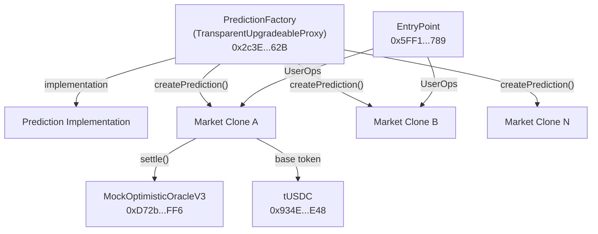

## Arbitrum Sepolia (Testnet)

<Info>
The CTF (Conditional Token Framework) migration is in progress. The PredictionFactory currently uses ERC20 option tokens. The CTF upgrade to ERC1155 conditional tokens is targeted for Q1 2026.
</Info>

### Core Contracts

| Contract | Address | Status |
|----------|---------|:------:|
| **PredictionFactory** (Proxy) | [`0x2c3E6717C1CC3787dBf420985188e2562F1aE62B`](https://sepolia.arbiscan.io/address/0x2c3E6717C1CC3787dBf420985188e2562F1aE62B) | Active |
| **MockOptimisticOracleV3** | [`0xD72b4002c472B7084A5A2D21450Ad8092b8E2FF6`](https://sepolia.arbiscan.io/address/0xD72b4002c472B7084A5A2D21450Ad8092b8E2FF6) | Active |
| **ConditionalTokens** (CTF) | — | Pending |
| **MultisigResolution** | — | Pending |

### Token Contracts

| Token | Address | Decimals | Status |
|-------|---------|:--------:|:------:|
| **Test USDC** (tUSDC) | [`0x934E616cA9538397E3f9a12895C40ea2E8C45E48`](https://sepolia.arbiscan.io/address/0x934E616cA9538397E3f9a12895C40ea2E8C45E48) | 6 | Active |
| **Test USDC** (Admin) | [`0x1A8da4723A4f7aD0A965cb3dBC31c72435b1B490`](https://sepolia.arbiscan.io/address/0x1A8da4723A4f7aD0A965cb3dBC31c72435b1B490) | 6 | Active |

### Infrastructure Contracts

| Contract | Address | Purpose |
|----------|---------|---------|
| **ERC-4337 EntryPoint** | [`0x5FF137D4b0FDCD49DcA30c7CF57E578a026d2789`](https://sepolia.arbiscan.io/address/0x5FF137D4b0FDCD49DcA30c7CF57E578a026d2789) | Account abstraction entry point (Alchemy) |
| **MultiCall** | [`0xcA11bde05977b3631167028862bE2a173976CA11`](https://sepolia.arbiscan.io/address/0xcA11bde05977b3631167028862bE2a173976CA11) | Batch contract reads |

### Network Details

| Property | Value |
|----------|-------|
| **Chain** | Arbitrum Sepolia |
| **Chain ID** | `421614` |
| **RPC** | `https://sepolia-rollup.arbitrum.io/rpc` |
| **Explorer** | [sepolia.arbiscan.io](https://sepolia.arbiscan.io/) |

## Arbitrum One (Mainnet)

<Info>
Mainnet deployment is planned for Q2 2026, after staging validation and audit completion.
</Info>

| Contract | Address | Status |
|----------|---------|:------:|
| **PredictionFactory** | — | Not deployed |
| **ConditionalTokens** | — | Not deployed |
| **UMA OptimisticOracleV3** | Existing UMA deployment | Available |
| **USDC** | [`0xaf88d065e77c8cC2239327C5EDb3A432268e5831`](https://arbiscan.io/address/0xaf88d065e77c8cC2239327C5EDb3A432268e5831) | Native USDC |

### Network Details

| Property | Value |
|----------|-------|
| **Chain** | Arbitrum One |
| **Chain ID** | `42161` |
| **RPC** | `https://arb1.arbitrum.io/rpc` |
| **Explorer** | [arbiscan.io](https://arbiscan.io/) |

## Key External Contracts

These are third-party contracts that PrometheX integrates with:

| Contract | Network | Address | Purpose |
|----------|---------|---------|---------|
| **ERC-4337 EntryPoint** | Arbitrum Sepolia | [`0x5FF137D4b0FDCD49DcA30c7CF57E578a026d2789`](https://sepolia.arbiscan.io/address/0x5FF137D4b0FDCD49DcA30c7CF57E578a026d2789) | Gasless transaction processing via account abstraction |
| **UMA OptimisticOracleV3** | Arbitrum One | [UMA Docs](https://docs.uma.xyz/) | Decentralized dispute resolution oracle |
| **Gnosis ConditionalTokens** | Arbitrum | — | ERC1155 conditional token framework (pending deployment) |

## Contract Architecture Reference

<Tip>
All PrometheX core contracts use OpenZeppelin's upgradeable patterns. The PredictionFactory is behind a TransparentUpgradeableProxy, and individual markets are deterministic clones. See [Security Model](/platform/security/security-model) for upgrade governance details.
</Tip>

## Verifying Contracts

All contracts on Arbitrum Sepolia are verified on Arbiscan. You can:

1. **Read contract state** — Use the "Read Contract" tab on Arbiscan to query market prices, reserves, and configuration
2. **View source code** — All contract source code is verified and viewable on Arbiscan
3. **Trace transactions** — Use Arbiscan's transaction tracer to inspect UserOp execution

## Next Steps

<CardGroup cols={2}>
  <Card title="Contract Overview" icon="file-contract" href="/contracts/overview">
    Deep dive into smart contract architecture and functions.
  </Card>
  <Card title="Security Model" icon="shield-halved" href="/platform/security/security-model">
    Understand upgrade mechanisms and access control.
  </Card>
</CardGroup>
