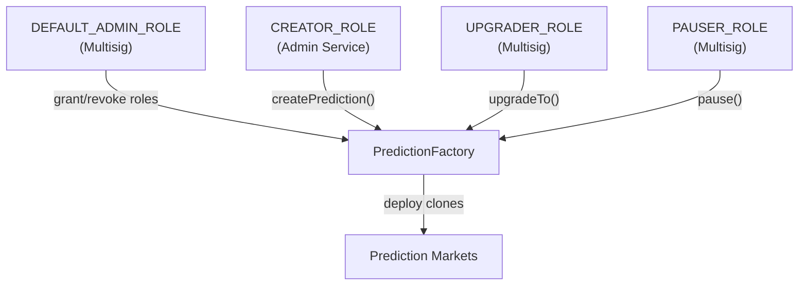
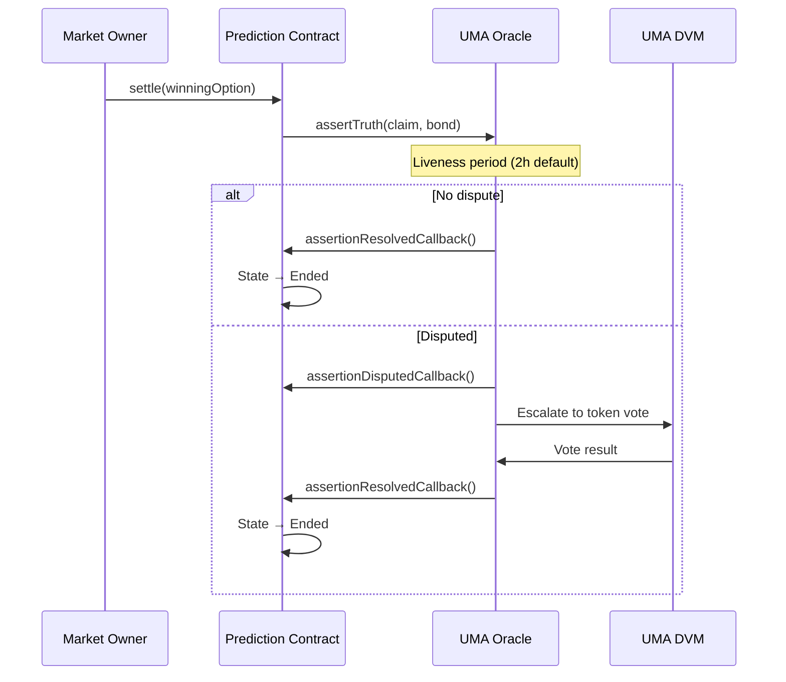

## Security Philosophy

PrometheX follows a defense-in-depth approach. Smart contracts enforce economic rules on-chain. The API layer enforces authentication, authorization, and rate limiting. The admin layer enforces tenant isolation and RBAC. No single layer is solely responsible for security.

## Smart Contract Security

### Access Control

PrometheX smart contracts use **OpenZeppelin's AccessControl** for role-based permissions. Each role governs a specific set of operations.

| Role | Granted To | Permissions |
|------|-----------|-------------|
| `DEFAULT_ADMIN_ROLE` | PrometheX multisig | Grant/revoke roles, emergency operations |
| `CREATOR_ROLE` | Admin service | Create new prediction markets via factory |
| `UPGRADER_ROLE` | PrometheX multisig | Upgrade factory implementation |
| `PAUSER_ROLE` | PrometheX multisig | Pause factory operations in emergencies |



### Upgrade Mechanism

The PredictionFactory uses OpenZeppelin's **TransparentUpgradeableProxy** pattern:

- **Proxy** — Stores state, delegates calls to implementation
- **Implementation** — Contains logic, can be upgraded
- **ProxyAdmin** — Separate contract controlling upgrade permissions

<Steps>
  <Step title="New implementation deployed">
    A new Prediction implementation contract is deployed with updated logic.
  </Step>
  <Step title="Upgrade proposed">
    The `UPGRADER_ROLE` holder (multisig) submits an upgrade transaction.
  </Step>
  <Step title="Multisig approval">
    Required signers approve the upgrade transaction.
  </Step>
  <Step title="Proxy updated">
    The ProxyAdmin updates the implementation address. Existing state is preserved.
  </Step>
</Steps>

<Note>
Individual market clones are **not** independently upgradeable. When the factory implementation is upgraded, new markets use the updated logic. Existing markets continue running on their original implementation — this provides immutability guarantees for active markets.
</Note>

### Market Isolation

Each prediction market is an isolated clone with its own:

- **Liquidity reserves** — APMM state is per-market
- **Option tokens** — Separate token contracts per market
- **Resolution state** — Independent settlement lifecycle
- **Owner** — Market creator controls settlement

A vulnerability or exploit in one market cannot affect the reserves, tokens, or state of another market. The factory-clone pattern provides **economic isolation** by design.

## Oracle Security

### UMA Optimistic Oracle

The primary resolution mechanism uses UMA's Optimistic Oracle V3 — a battle-tested decentralized oracle with an economic security model:

| Property | Value |
|----------|-------|
| **Assertion bond** | Configurable per market (denominated in base token) |
| **Liveness period** | Configurable (default: 2 hours) |
| **Dispute mechanism** | Counter-bond → escalation to UMA DVM token holder vote |
| **Track record** | Securing $1B+ in DeFi protocols |



### Multisig Resolution

For markets requiring editorial control (internal governance, private events), the multisig resolution module provides:

- **M-of-N signing** — Configurable threshold (e.g., 3-of-5 signers)
- **Designated resolvers** — Specific addresses authorized to vote on outcomes
- **Time-bounded** — Resolution must occur within a configurable window
- **Transparent** — All votes are recorded on-chain

### Resolution Module Interface

Partners can implement custom resolution modules by conforming to the `IResolutionModule` interface:

```solidity
interface IResolutionModule {
    function resolve(address market, uint256 winningOption) external;
    function isResolved(address market) external view returns (bool);
    function getWinningOption(address market) external view returns (uint256);
}
```

<Info>
Custom resolution modules undergo security review before deployment. Contact the PrometheX team to discuss custom resolution requirements.
</Info>

## API Layer Security

### Authentication

| Method | Mechanism | Use Case |
|--------|-----------|----------|
| **Privy JWT** | Bearer token in `Authorization` header | User-facing operations (trading, positions) |
| **API Key** | `X-API-Key` header | Server-to-server, read operations |
| **Admin JWT** | Bearer token with role claims | Admin dashboard operations |

All JWT tokens are validated on every request. Expired or malformed tokens are rejected with `401 Unauthorized`.

### Rate Limiting

The API gateway uses a **BBR adaptive rate limiting** algorithm:

| Tier | Limit | Scope |
|------|:-----:|-------|
| Public reads | 100 req/min | Per API key |
| Authenticated reads | 60 req/min | Per user |
| Write operations | 20 req/min | Per user |
| SSE connections | 5 concurrent | Per user |

Rate limit headers are included in every response:
```
X-RateLimit-Limit: 100
X-RateLimit-Remaining: 95
X-RateLimit-Reset: 1708300800
```

### Input Validation

- All request parameters are validated against strict schemas
- SQL injection, XSS, and path traversal are prevented at the framework level
- Transaction amounts are validated against minimum/maximum bounds
- Market addresses are verified against the factory registry

## Tenant Isolation

Multi-tenant security is enforced at multiple layers:

| Layer | Isolation Mechanism |
|-------|-------------------|
| **Database** | Tenant ID column on all tables, enforced in every query |
| **API** | Tenant context derived from JWT, scoped to all operations |
| **Admin** | RBAC roles scoped to tenant, cross-tenant access denied |
| **Smart Contracts** | Markets are on-chain, tenant association is off-chain metadata |
| **Storage** | S3 bucket prefixes per tenant |

<Tip>
Tenant isolation is enforced at the query layer, not just the application layer. Even if an application bug bypasses a check, the database query will still filter by tenant ID.
</Tip>

## Gasless Transaction Security (ERC-4337)

The Paymaster sponsors gas for user transactions, introducing a potential abuse vector. Protections include:

| Protection | Description |
|------------|-------------|
| **Allowlisted operations** | Paymaster only sponsors calls to whitelisted contract functions (deposit, withdraw, claim) |
| **Per-user limits** | Daily gas sponsorship cap per user |
| **Rate limiting** | Transaction frequency limits at the bundler level |
| **Signature verification** | Every UserOp is signed by the user's smart account |

## Incident Response

| Mechanism | Description |
|-----------|-------------|
| **Factory pause** | `PAUSER_ROLE` can pause the factory, preventing new market creation |
| **Market pause** | Individual markets can be paused by the market owner |
| **Block Listener alerts** | Anomalous on-chain events trigger alerts to the operations team |
| **Admin monitoring** | Transaction queue and on-chain operation status visible in admin dashboard |

## Next Steps

<CardGroup cols={2}>
  <Card title="Audit Status" icon="clipboard-check" href="/platform/security/audits">
    Current audit status and security practices.
  </Card>
  <Card title="Contract Architecture" icon="file-contract" href="/contracts/overview">
    Deep dive into smart contract implementation.
  </Card>
</CardGroup>
